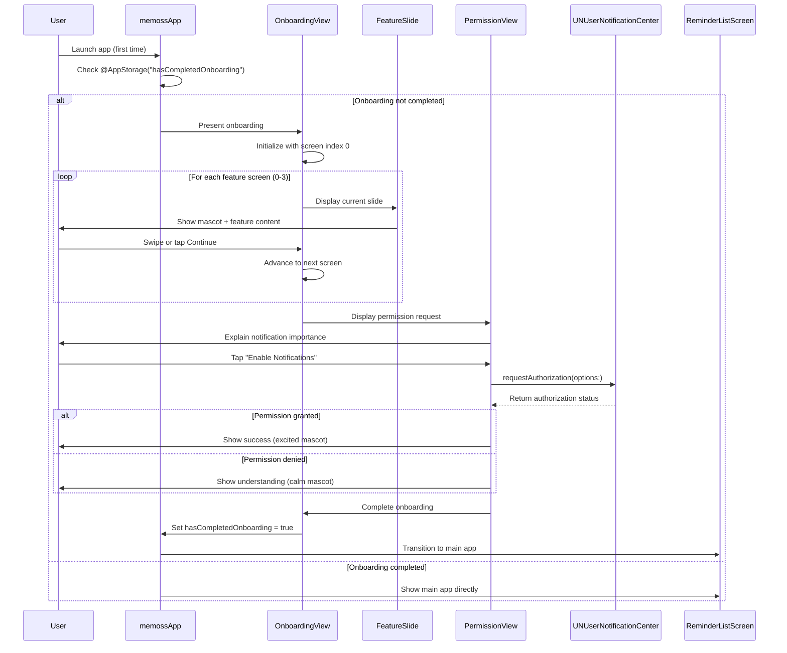

# Memoss Onboarding Screen Implementation Plan

**Date:** 2026-01-21
**Feature:** Onboarding Screen for memoss — your reminder
**Platform:** iOS (SwiftUI) - iOS 26+
**Type:** Enhancement
**Status:** Draft

---

## Overview

Implement a polished, nature-inspired onboarding experience for the memoss reminder app that introduces users to the brand identity and core features while optimizing notification permission acceptance rates.

## Problem Statement

First-time users need to:
1. Understand the app's unique value proposition (custom snoozing, recurring reminders, cross-device sync)
2. Connect emotionally with the brand through the Moss mascot
3. Grant notification permissions (critical for a reminder app)
4. Get started quickly without frustration

Research shows 77% of users stop using an app within the first 3 days, and poorly-timed permission requests cause 25% of users to abandon apps after a single session.

## Proposed Solution

A 5-screen carousel-style onboarding flow with progressive value demonstration before requesting notification permissions:

1. **Welcome Screen** - Brand identity, mascot introduction
2. **Custom Snooze Screen** - Key differentiator feature
3. **Recurring Reminders Screen** - Power user feature
4. **Cross-Device Sync Screen** - Reliability promise
5. **Notification Permission Screen** - Contextual permission request

---

## Architecture Flow



---

## Technical Approach

### File Structure

```
Memoss/
├── App/
│   └── MemossApp.swift              # App entry point (modify)
├── Features/
│   └── Onboarding/
│       ├── OnboardingView.swift           # Main container view
│       ├── OnboardingSlideView.swift      # Individual slide component
│       ├── OnboardingPageControl.swift    # Custom page indicator
│       ├── NotificationPermissionView.swift # Permission request screen
│       └── OnboardingViewModel.swift      # State management
├── DesignSystem/
│   ├── Theme/
│   │   ├── Colors.swift             # Design tokens from JSX
│   │   ├── Typography.swift         # Font definitions
│   │   └── Spacing.swift            # Spacing tokens
│   ├── Components/
│   │   ├── MossMascot.swift         # SVG mascot as SwiftUI Shape
│   │   ├── PrimaryButton.swift      # Button component
│   │   └── Card.swift               # Card component
│   └── Theme.swift                  # Unified theme access
└── Extensions/
    └── Color+Hex.swift              # Hex color extension
```

### Design System Translation (from JSX to SwiftUI)

#### Colors.swift
```swift
// Based on memoss-design-system.jsx lines 8-63
import SwiftUI

enum MemossColors {
    enum Primary {
        static let shade50 = Color(hex: "#F0F9F4")
        static let shade100 = Color(hex: "#DCFCE7")
        static let shade200 = Color(hex: "#BBF7D0")
        static let shade300 = Color(hex: "#86EFAC")
        static let shade400 = Color(hex: "#4ADE80")
        static let shade500 = Color(hex: "#22C55E") // Main brand color
        static let shade600 = Color(hex: "#16A34A")
        static let shade700 = Color(hex: "#15803D")
        static let shade800 = Color(hex: "#166534")
        static let shade900 = Color(hex: "#14532D")
    }

    enum Neutral {
        static let shade0 = Color(hex: "#FFFFFF")
        static let shade50 = Color(hex: "#FDFCFA")
        static let shade100 = Color(hex: "#F9F7F3")
        static let shade500 = Color(hex: "#A8A298")
        static let shade800 = Color(hex: "#3D3A36")
        static let shade900 = Color(hex: "#252320")
        static let shade950 = Color(hex: "#1A1816")
    }

    enum Accent {
        static let shade500 = Color(hex: "#EAB308") // Golden
    }
}
```

#### OnboardingView.swift
```swift
import SwiftUI

struct OnboardingView: View {
    @StateObject private var viewModel = OnboardingViewModel()
    @AppStorage("hasCompletedOnboarding") private var hasCompletedOnboarding = false

    var body: some View {
        ZStack(alignment: .bottom) {
            TabView(selection: $viewModel.currentPage) {
                ForEach(viewModel.slides.indices, id: \.self) { index in
                    OnboardingSlideView(slide: viewModel.slides[index])
                        .tag(index)
                }

                NotificationPermissionView(onComplete: completeOnboarding)
                    .tag(viewModel.slides.count)
            }
            .tabViewStyle(.page(indexDisplayMode: .never))
            .animation(.easeInOut(duration: 0.3), value: viewModel.currentPage)

            VStack(spacing: 24) {
                OnboardingPageControl(
                    totalPages: viewModel.totalPages,
                    currentPage: viewModel.currentPage
                )

                HStack {
                    if viewModel.currentPage < viewModel.slides.count {
                        Button("Skip") {
                            viewModel.skipToPermission()
                        }
                        .foregroundStyle(MemossColors.Neutral.shade500)
                    }

                    Spacer()

                    if viewModel.currentPage < viewModel.slides.count {
                        Button("Continue") {
                            viewModel.nextPage()
                        }
                        .buttonStyle(MemossPrimaryButtonStyle())
                    }
                }
                .padding(.horizontal, 24)
            }
            .padding(.bottom, 48)
        }
        .background(
            LinearGradient(
                colors: [MemossColors.Neutral.shade100, MemossColors.Primary.shade50],
                startPoint: .top,
                endPoint: .bottom
            )
        )
    }

    private func completeOnboarding() {
        hasCompletedOnboarding = true
    }
}
```

### Onboarding Content

| Screen | Title | Description | Mascot Mood | Visual Element |
|--------|-------|-------------|-------------|----------------|
| 0 | Welcome to memoss | Your friendly reminder companion | happy | Mascot center, large |
| 1 | Snooze Your Way | Custom snooze times right from the notification. "22 minutes? Sure!" | excited | Notification mockup |
| 2 | Smart Recurring | Hourly, weekly, or every 3rd Tuesday. Your schedule, your rules. | excited | Calendar icon |
| 3 | Sync Everywhere | Dismiss on one device, gone on all. True cross-device peace. | happy | Device icons |
| 4 | Stay Reminded | Enable notifications to never miss a reminder | happy | Bell icon |

---

## Implementation Phases

### Phase 1: Design System Foundation
**Scope:** Create SwiftUI design tokens and base components

**Files to create:**
- `Memoss/DesignSystem/Theme/Colors.swift`
- `Memoss/DesignSystem/Theme/Typography.swift`
- `Memoss/DesignSystem/Theme/Spacing.swift`
- `Memoss/DesignSystem/Components/MossMascot.swift`
- `Memoss/Extensions/Color+Hex.swift`

**Acceptance Criteria:**
- [ ] All color tokens from JSX design system available in SwiftUI
- [ ] Typography with Nunito font family configured
- [ ] MossMascot renders with all 4 moods (happy, excited, calm, sleepy)
- [ ] Mascot supports `animate` parameter for idle animation
- [ ] Preview works in Xcode canvas

**Dependencies:** None

---

### Phase 2: Onboarding Container & Navigation
**Scope:** Build the main onboarding flow structure

**Files to create:**
- `Memoss/Features/Onboarding/OnboardingView.swift`
- `Memoss/Features/Onboarding/OnboardingViewModel.swift`
- `Memoss/Features/Onboarding/OnboardingSlideView.swift`
- `Memoss/Features/Onboarding/OnboardingPageControl.swift`

**Acceptance Criteria:**
- [ ] TabView with PageTabViewStyle shows slides
- [ ] Swipe gesture navigates between screens
- [ ] "Continue" button advances to next screen
- [ ] "Skip" button jumps to permission screen
- [ ] Custom page indicator shows current position
- [ ] Animation between slides is smooth (300ms ease)

**Dependencies:** Phase 1

---

### Phase 3: Notification Permission Flow
**Scope:** Implement the notification permission request with proper handling

**Files to create:**
- `Memoss/Features/Onboarding/NotificationPermissionView.swift`
- `Memoss/Services/NotificationService.swift`

**Acceptance Criteria:**
- [ ] Pre-permission screen explains value before system prompt
- [ ] System notification dialog appears on "Enable" tap
- [ ] Handles .authorized → success screen with excited mascot
- [ ] Handles .denied → graceful fallback with calm mascot
- [ ] Handles .notDetermined → shows request flow
- [ ] Already authorized users skip permission screen
- [ ] Button to open Settings if previously denied

**Dependencies:** Phase 2

---

### Phase 4: App Integration & Polish
**Scope:** Integrate onboarding into app lifecycle and add polish

**Files to modify:**
- `Memoss/MemossApp.swift`
- `Memoss/ContentView.swift`

**Files to create:**
- `Memoss/DesignSystem/Components/PrimaryButton.swift`

**Acceptance Criteria:**
- [ ] App shows onboarding on first launch
- [ ] App skips onboarding if already completed
- [ ] Smooth transition from onboarding to main app
- [ ] @AppStorage persists completion state
- [ ] Haptic feedback on button taps
- [ ] Reduced motion respects system settings

**Dependencies:** Phase 3

---

### Phase 5: Accessibility & Testing
**Scope:** Ensure full accessibility compliance and add tests

**Files to create:**
- `MemossTests/OnboardingViewModelTests.swift`
- `MemossUITests/OnboardingFlowUITests.swift`

**Acceptance Criteria:**
- [ ] VoiceOver reads all content correctly
- [ ] Dynamic Type scales text appropriately
- [ ] Color contrast meets WCAG AA (4.5:1)
- [ ] Reduced Motion disables animations
- [ ] Unit tests for OnboardingViewModel
- [ ] UI tests for happy path flow

**Dependencies:** Phase 4

---

## Acceptance Criteria

### Functional Requirements

- [ ] First-time app launch displays onboarding
- [ ] Subsequent launches skip onboarding
- [ ] User can swipe between onboarding screens
- [ ] User can tap "Continue" to advance
- [ ] User can tap "Skip" to go directly to permission request
- [ ] Notification permission is requested after feature screens
- [ ] Permission granted shows success celebration
- [ ] Permission denied shows graceful handling
- [ ] Onboarding completion transitions to main app

### Non-Functional Requirements

- [ ] Page transitions complete within 300ms
- [ ] Touch targets are minimum 44pt
- [ ] Text is readable at all Dynamic Type sizes
- [ ] Works in both light and dark mode
- [ ] Mascot animations are smooth (60fps)

### Quality Gates

- [ ] All unit tests pass
- [ ] All UI tests pass
- [ ] No accessibility warnings in Xcode
- [ ] Memory usage stays under 50MB
- [ ] No crashes in Instruments profiling

---

## Success Metrics

| Metric | Target | Measurement |
|--------|--------|-------------|
| Onboarding completion rate | > 80% | Analytics |
| Notification permission grant rate | > 65% | Analytics |
| Average time to complete onboarding | < 90 seconds | Analytics |
| Skip rate | < 30% | Analytics |
| Accessibility audit score | 100% | Xcode Accessibility Inspector |

---

## Dependencies & Prerequisites

### Technical Dependencies
- iOS 26 SDK
- Xcode 26.1+
- SwiftUI framework
- UserNotifications framework

### Design Assets Needed
- Nunito font family (bundle with app or use system fallback)
- Feature illustration assets (notification mockup, calendar, devices)

### External Services
- None for MVP (analytics integration deferred)

---

## Risk Analysis & Mitigation

| Risk | Likelihood | Impact | Mitigation |
|------|------------|--------|------------|
| Notification permission denied at high rate | Medium | High | Value-first approach, clear explanation |
| Mascot rendering performance | Low | Medium | Use SwiftUI Shape instead of complex SVG |
| Font loading failure | Low | Low | Fallback to system-ui |
| Users skip without understanding value | Medium | Medium | Make skip less prominent, show value quickly |

---

## Future Considerations

1. **Analytics Integration** - Track screen views, skip rates, permission results
2. **A/B Testing** - Test different copy, mascot positions, skip button visibility
3. **Localization** - Prepare for multi-language support
4. **App Update Onboarding** - Show new features when app updates
5. **Re-engage Flow** - Offer to re-request notifications if denied

---

## Unit Test Plan

### OnboardingViewModel Tests

| Test Name | Scenario | Expected Outcome | Priority |
|-----------|----------|------------------|----------|
| `test_initialState_startsAtPageZero` | Fresh initialization | `currentPage == 0` | P1 |
| `test_nextPage_incrementsPage` | Call nextPage() | `currentPage == 1` | P1 |
| `test_nextPage_stopsAtLastSlide` | Call nextPage() at last slide | `currentPage == slides.count` | P1 |
| `test_skipToPermission_jumpsToEnd` | Call skipToPermission() | `currentPage == slides.count` | P1 |
| `test_totalPages_includesPermissionScreen` | Check totalPages | `totalPages == slides.count + 1` | P2 |

### NotificationService Tests

| Test Name | Scenario | Expected Outcome | Priority |
|-----------|----------|------------------|----------|
| `test_requestPermission_grantsAccess` | User grants permission | Returns .authorized | P1 |
| `test_checkCurrentStatus_returnsCorrectState` | Check notification status | Returns current UNAuthorizationStatus | P1 |

---

## References & Research

### Internal References
- Design System: `memoss-design-system.jsx` (lines 1-600)
- Current ContentView: `Memoss/ContentView.swift` (lines 1-24)
- App Entry: `Memoss/MemossApp.swift` (lines 1-17)

### External References
- [Apple SwiftUI TabView Documentation](https://developer.apple.com/documentation/swiftui/tabview)
- [PageTabViewStyle](https://developer.apple.com/documentation/swiftui/pagetabviewstyle)
- [UNUserNotificationCenter](https://developer.apple.com/documentation/usernotifications/unusernotificationcenter)
- [NN/g Mobile App Onboarding](https://www.nngroup.com/articles/mobile-app-onboarding/)
- [WCAG 2.2 Mobile Guidelines](https://www.w3.org/TR/wcag2mobile-22/)

### Best Practices Applied
- Progressive disclosure pattern (reveal features step-by-step)
- Value-first approach (show benefits before asking for permissions)
- Skippable onboarding (respect user agency)
- Pre-permission priming (explain before system dialog)
- 44pt minimum touch targets
- Support for accessibility settings (VoiceOver, Dynamic Type, Reduced Motion)

---

## Appendix: Design System Color Reference

From `memoss-design-system.jsx` lines 8-63:

| Color | Hex | Usage |
|-------|-----|-------|
| Primary 500 | #22C55E | Main brand green |
| Primary 100 | #DCFCE7 | Light backgrounds |
| Accent 500 | #EAB308 | Golden highlights |
| Neutral 0 | #FFFFFF | White |
| Neutral 50 | #FDFCFA | Off-white background |
| Neutral 800 | #3D3A36 | Dark text |
| Neutral 950 | #1A1816 | Near-black |

### Typography

| Token | Value | Usage |
|-------|-------|-------|
| Display | Nunito | Headings |
| Body | Nunito Sans | Body text |
| Font size 4xl | 2.25rem (36pt) | Large headings |
| Font size base | 1rem (16pt) | Body text |
| Font weight extrabold | 800 | Display headings |

---

*Plan created: 2026-01-21*
*Last updated: 2026-01-21*
