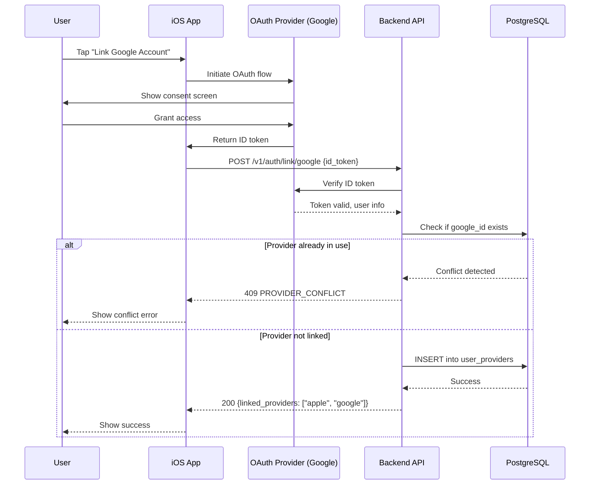

# feat: Account Linking for Cross-Platform Sync

**Created:** 2026-01-23
**Status:** Draft
**Type:** Enhancement

## Overview

Allow users to link multiple authentication providers (Apple Sign-In + Google Sign-In) to a single Memoss account, enabling cross-device sync between iOS and Android devices.

### Problem Statement

Currently, each auth provider creates a separate account:
- User signs in with Apple on iOS → User A
- Same user signs in with Google on Android → User B
- **Result:** Two separate accounts with separate data, no cross-device sync

### Proposed Solution

Implement account linking where:
1. User authenticates with one provider (e.g., Apple on iOS)
2. User links additional provider (e.g., Google) from Settings
3. Both providers now authenticate to the same account
4. User can sign in from any device with either provider

---

## Architecture Flow



---

## Technical Approach

### Database Schema Changes

**New Table: `user_providers`**

```sql
-- migrations/000005_create_user_providers.up.sql
CREATE TABLE user_providers (
    id UUID PRIMARY KEY DEFAULT gen_random_uuid(),
    user_id UUID NOT NULL REFERENCES users(id) ON DELETE CASCADE,
    provider VARCHAR(20) NOT NULL,
    provider_id VARCHAR(255) NOT NULL,
    email VARCHAR(255),

    UNIQUE(provider, provider_id),
    UNIQUE(user_id, provider)
);

CREATE INDEX idx_user_providers_user_id ON user_providers(user_id);
CREATE INDEX idx_user_providers_lookup ON user_providers(provider, provider_id);

-- Migrate existing users to new schema
INSERT INTO user_providers (user_id, provider, provider_id, email)
SELECT id, provider, provider_id, email
FROM users
WHERE provider IS NOT NULL;

-- Remove old columns from users table (no production data, clean migration)
ALTER TABLE users DROP COLUMN IF EXISTS provider;
ALTER TABLE users DROP COLUMN IF EXISTS provider_id;
```

### API Endpoints

| Method | Path | Description | Auth Required |
|--------|------|-------------|---------------|
| POST | `/v1/auth/link/{provider}` | Link new provider | Yes |
| DELETE | `/v1/auth/link/{provider}` | Unlink provider | Yes |

**Note:** Linked providers are returned in existing auth responses (sign-in, refresh) via a `linked_providers` array. No dedicated GET endpoint needed.

**POST /v1/auth/link/{provider}**

```json
// Request
{
  "id_token": "eyJhbGciOiJSUzI1NiIsInR5cCI6IkpXVCJ9..."
}

// Response 200
{
  "linked_providers": ["apple", "google"],
  "message": "Google account linked successfully"
}

// Response 409 - Conflict (provider in use by another user OR already linked to this user)
{
  "error": {
    "code": "PROVIDER_CONFLICT",
    "message": "This account is already in use"
  }
}
```

**DELETE /v1/auth/link/{provider}**

```json
// Response 200
{
  "linked_providers": ["apple"],
  "message": "Google account unlinked"
}

// Response 400 - Last provider
{
  "error": {
    "code": "CANNOT_UNLINK_ONLY_PROVIDER",
    "message": "Cannot unlink your only authentication method"
  }
}
```

### Error Codes

| Code | HTTP | Description |
|------|------|-------------|
| `PROVIDER_CONFLICT` | 409 | Provider account already in use |
| `CANNOT_UNLINK_ONLY_PROVIDER` | 400 | Must keep at least one provider |
| `INVALID_PROVIDER_TOKEN` | 401 | ID token verification failed |
| `UNSUPPORTED_PROVIDER` | 400 | Provider not apple/google |

---

## iOS Implementation

### Dependencies

Add Google Sign-In SDK via SPM:
```swift
// Package.swift or Xcode SPM
.package(url: "https://github.com/google/GoogleSignIn-iOS", from: "8.0.0")
```

**Info.plist additions:**
```xml
<key>GIDClientID</key>
<string>YOUR_GOOGLE_CLIENT_ID.apps.googleusercontent.com</string>
<key>CFBundleURLTypes</key>
<array>
  <dict>
    <key>CFBundleURLSchemes</key>
    <array>
      <string>com.googleusercontent.apps.YOUR_CLIENT_ID</string>
    </array>
  </dict>
</array>
```

### AuthService Changes

Add to existing `AuthService.swift`:

```swift
// Add to AuthService class
@Published private(set) var linkedProviders: [String] = []

struct LinkedProvider: Codable {
    let provider: String
    let email: String?
}

// MARK: - Link Provider

func linkGoogle() async throws {
    let idToken = try await performGoogleSignIn()
    try await linkProvider("google", idToken: idToken)
}

private func linkProvider(_ provider: String, idToken: String) async throws {
    struct LinkRequest: Encodable { let idToken: String }
    struct LinkResponse: Decodable { let linkedProviders: [String] }

    let endpoint = Endpoint(
        path: "/v1/auth/link/\(provider)",
        method: .POST,
        body: LinkRequest(idToken: idToken)
    )
    let response: LinkResponse = try await apiClient.request(endpoint)
    linkedProviders = response.linkedProviders
}

// MARK: - Unlink Provider

func unlinkProvider(_ provider: String) async throws {
    guard linkedProviders.count > 1 else {
        throw AuthError.cannotUnlinkOnlyProvider
    }
    struct UnlinkResponse: Decodable { let linkedProviders: [String] }

    let response: UnlinkResponse = try await apiClient.request(
        Endpoint(path: "/v1/auth/link/\(provider)", method: .DELETE)
    )
    linkedProviders = response.linkedProviders
}
```

Add `cannotUnlinkOnlyProvider` case to `AuthError` enum.

### Settings UI Changes

Add to existing `SettingsView.swift` in `signedInCard`:

```swift
// Add after existing provider display in signedInCard

// Linked accounts section
if authService.linkedProviders.count > 0 {
    Divider()

    VStack(alignment: .leading, spacing: 8) {
        Text("Linked Accounts")
            .font(.caption)
            .foregroundStyle(MemossColors.textSecondary)

        ForEach(authService.linkedProviders, id: \.self) { provider in
            HStack {
                Image(systemName: provider == "apple" ? "apple.logo" : "g.circle.fill")
                Text(provider.capitalized)
                    .font(.subheadline)
                Spacer()
                if authService.linkedProviders.count > 1 {
                    Button("Unlink") {
                        Task { try? await authService.unlinkProvider(provider) }
                    }
                    .font(.caption)
                    .foregroundStyle(MemossColors.warning)
                }
            }
        }
    }
}

// Link another account button
if !authService.linkedProviders.contains("google") {
    Button {
        Task { try? await authService.linkGoogle() }
    } label: {
        HStack {
            Image(systemName: "g.circle.fill")
            Text("Link Google Account")
        }
        .font(.subheadline.weight(.medium))
        .foregroundStyle(MemossColors.brandPrimary)
        .frame(maxWidth: .infinity)
        .padding(.vertical, 12)
        .background(MemossColors.brandPrimary.opacity(0.1))
        .clipShape(RoundedRectangle(cornerRadius: 12))
    }
}
```

No separate component files needed - UI is simple enough to inline.

---

## Acceptance Criteria

### AC1: Link Google Account (Happy Path)

**Given** user is signed in with Apple
**When** user taps "Link Google Account" and completes Google OAuth
**Then** Google account is linked and shows in Settings

**Validation Steps:**
1. [ ] Sign in with Apple on iOS
2. [ ] Navigate to Settings → Linked Accounts
3. [ ] Tap "Link Another Account" → Select Google
4. [ ] Complete Google sign-in flow
5. [ ] Verify Google appears in linked accounts list
6. [ ] Verify synced reminders accessible from both providers

### AC2: Link Apple Account from Google

**Given** user is signed in with Google (future Android scenario)
**When** user links Apple account
**Then** Apple account is linked and shows in Settings

**Validation Steps:**
1. [ ] Sign in with Google
2. [ ] Navigate to Settings → Linked Accounts
3. [ ] Tap "Link Another Account" → Select Apple
4. [ ] Complete Apple sign-in flow
5. [ ] Verify Apple appears in linked accounts list

### AC3: Conflict Detection

**Given** user A is signed in with Apple
**And** user B exists with Google account
**When** user A tries to link user B's Google account
**Then** error is shown: "This account is already in use"

**Validation Steps:**
1. [ ] Create User A with Apple
2. [ ] Create User B with Google (separate account)
3. [ ] As User A, attempt to link User B's Google
4. [ ] Verify 409 error with PROVIDER_CONFLICT code
5. [ ] Verify user-friendly error alert displayed

### AC4: Cannot Unlink Only Provider

**Given** user has only Apple linked
**When** user attempts to unlink Apple
**Then** error is shown: "Cannot unlink your only authentication method"

**Validation Steps:**
1. [ ] Sign in with Apple only
2. [ ] Navigate to Settings → Linked Accounts
3. [ ] Verify unlink button is disabled or shows error on tap
4. [ ] Verify clear error message explaining why

### AC5: Cross-Device Sync After Linking

**Given** user has Apple + Google linked
**When** user signs in with Google on new device
**Then** all reminders from Apple device are synced

**Validation Steps:**
1. [ ] Create reminders on iOS (signed in with Apple)
2. [ ] Link Google account
3. [ ] Sign out
4. [ ] Sign in with Google on same or different device
5. [ ] Verify all reminders are present
6. [ ] Verify tags are present

---

## Unit Test Plan

### AuthService Tests

| Test Name | Scenario | Expected Outcome | Priority |
|-----------|----------|------------------|----------|
| `test_linkProvider_success` | Valid Google token | Provider added to linkedProviders | P1 |
| `test_linkProvider_conflict` | Token for existing user | Throws PROVIDER_CONFLICT | P1 |
| `test_unlinkProvider_success` | Has multiple providers | Provider removed | P1 |
| `test_unlinkProvider_lastProvider` | Only one provider | Throws cannotUnlinkOnlyProvider | P1 |
| `test_refreshLinkedProviders` | Authenticated | Updates linkedProviders array | P2 |

### Backend Repository Tests

| Test Name | Scenario | Expected Outcome | Priority |
|-----------|----------|------------------|----------|
| `TestLinkProvider_Success` | New provider | Row inserted in user_providers | P1 |
| `TestLinkProvider_Conflict` | Provider already in use | Returns ErrProviderConflict | P1 |
| `TestUnlinkProvider_Success` | Multiple providers | Row deleted | P1 |
| `TestUnlinkProvider_Last` | Single provider | Returns ErrCannotUnlinkLast | P1 |
| `TestGetLinkedProviders` | User with 2 providers | Returns both providers | P2 |

---

## Implementation Phases

### Phase 1: Backend (Go) ✅ COMPLETED

**Completed:** 2026-01-24
**Branch:** `feat/account-linking-backend`

**Tasks:**
- [x] Create migration `000005_create_user_providers.{up,down}.sql`
- [x] Add `UserProviderRepository` with CRUD operations
- [x] Add `LinkProviderHandler` for POST /v1/auth/link/{provider}
- [x] Add `UnlinkProviderHandler` for DELETE /v1/auth/link/{provider}
- [x] Update auth handlers to use `user_providers` table exclusively
- [x] Include `linked_providers` array in sign-in and refresh responses
- [x] Add PROVIDER_CONFLICT error code
- [ ] Add backend unit tests for repository and handlers (deferred - no test infrastructure in project)

**Notes:**
- Created `user_providers` table with proper unique constraints
- Modified `User` model to remove provider fields (now in `UserProvider`)
- Updated `AuthService` to return `AuthResult` with `LinkedProviders` array
- All existing auth flows (Apple, Google, Refresh) now return linked providers

**Depends on:** None

### Phase 2: iOS ✅ COMPLETED

**Completed:** 2026-01-24
**Branch:** `feat/account-linking-ios`

**Tasks:**
- [x] Add GoogleSignIn SPM dependency
- [x] Configure Info.plist with Google client ID and URL scheme
- [x] Add `linkGoogle()` and `unlinkProvider()` to AuthService
- [x] Add `linkedProviders` state to AuthService
- [x] Add linked accounts UI to existing SettingsView (inline, ~50 lines)
- [x] Handle conflict errors with user-friendly alert
- [ ] Add iOS unit tests for AuthService linking methods (deferred - no test infrastructure)
- [ ] Test cross-device sync scenario (manual testing required)

**Notes:**
- Added GoogleSignIn-iOS SPM package (v8.0.0+)
- Created Info.plist with GOOGLE_CLIENT_ID and GOOGLE_REVERSED_CLIENT_ID build settings
- AuthService now tracks `linkedProviders` array and persists to UserDefaults
- SettingsView shows linked accounts with unlink buttons and "Link Google Account" option
- Client-side validation prevents unlinking the last provider

**Depends on:** Phase 1 (backend API)

---

## Phase Status

| Phase | Description | Status | Branch |
|-------|-------------|--------|--------|
| 1 | Backend | ✅ COMPLETED | feat/account-linking-backend |
| 2 | iOS | ✅ COMPLETED | feat/account-linking-ios |

---

## Security Considerations

1. **Token Verification** - Always verify ID tokens server-side with provider
2. **Nonce for Apple** - Generate and verify nonce for Apple Sign-In
3. **Email Matching** - Different emails are allowed (common scenario: personal iCloud + work Google)
4. **Rate Limiting** - 5 link attempts per hour per user
5. **Session Continuity** - Don't invalidate sessions on link, require re-auth on unlink

---

## References

### Internal Files
- `/Users/viniciuscardoso/Developer/memoss-ios/Memoss/Services/AuthService.swift` - Current auth implementation
- `/Users/viniciuscardoso/Developer/memoss-ios/Memoss/Services/APIClient.swift` - HTTP client
- `/Users/viniciuscardoso/Developer/memoss-ios/Memoss/Features/Settings/SettingsView.swift` - Settings UI
- `/Users/viniciuscardoso/Developer/memoss-ios/plans/feat-go-backend-sync.md` - Backend architecture

### External Documentation
- [Apple Sign-In Best Practices](https://developer.apple.com/sign-in-with-apple/)
- [Google Sign-In iOS SDK](https://developers.google.com/identity/sign-in/ios)
- [OAuth 2.0 PKCE](https://oauth.net/2/pkce/)
- [Better Auth Account Linking](https://better-auth.com/docs/concepts/users-accounts)
