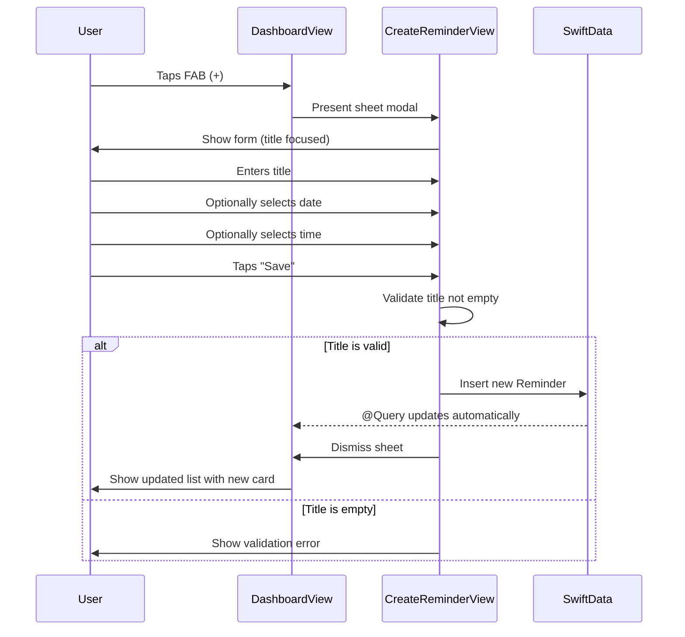

# feat: Create Reminder Screen

**Date:** 2026-01-22
**Status:** Implementation Complete
**Type:** Enhancement
**Priority:** Critical Path (completes core CRUD flow)

---

## Overview

Implement the Create Reminder screen - a modal form that appears when the user taps the FAB (+) button. This allows users to add new reminders with title, date, and time. This is the most critical missing feature as it completes the basic reminder workflow.

The screen features:
- Title input field (required)
- Date selector card (defaults to today)
- Time selector card (defaults to next 15-minute interval)
- Cancel (X) and Save actions
- Native iOS picker presentation

---

## Problem Statement / Motivation

The FAB button on the dashboard currently does nothing (`DashboardView.swift:84-87`). Users cannot create reminders through the app - the only way to add test data is via SwiftData in previews. This blocks the core value proposition of the app.

**User Story:** As a user, I want to add new reminders so that I can be reminded of tasks at specific times.

---

## Architecture Flow



---

## Technical Approach

### State Management (iOS 17+)

Use `@State` for local form state - no need for separate ViewModel for this simple form:

```swift
// CreateReminderView.swift
struct CreateReminderView: View {
    @Environment(\.modelContext) private var modelContext
    @Environment(\.dismiss) private var dismiss

    @State private var title = ""
    @State private var scheduledDate = Date()
    @State private var showDatePicker = false
    @State private var showTimePicker = false

    @FocusState private var isTitleFocused: Bool
}
```

### View Architecture

```
Features/CreateReminder/
└── CreateReminderView.swift           # Complete form with inline components
```

This follows the codebase pattern where simple screens are self-contained (see `ReminderCard.swift` at 78 lines). Components are extracted only when reused across multiple screens.

### Design Tokens (from MemossColors.swift)

| Token | Usage |
|-------|-------|
| `cardBackground` (#FFFFFF) | Card backgrounds for date/time selectors |
| `textPrimary` (#252320) | Title input text, card primary text |
| `textSecondary` (#A8A298) | Placeholder text, card secondary text |
| `brandPrimary` (#22C55E) | Save button, card icons accent |
| `backgroundStart/End` | Modal background gradient |
| `error` (#F43F5E) | Validation error state |

### Input Validation Rules

| Rule | Behavior |
|------|----------|
| Empty title | Save button disabled; show inline error on tap |
| Whitespace-only | Trim and treat as empty |
| Max length | 255 characters (soft limit with counter) |
| Past dates | Allowed (user may be logging completed tasks) |
| Special characters | Allow emojis and unicode |

### Time Rounding Algorithm

Default time rounds UP to next 15-minute interval:
```swift
func roundToNext15Minutes(_ date: Date) -> Date {
    let calendar = Calendar.current
    let minutes = calendar.component(.minute, from: date)
    let remainder = minutes % 15
    let roundUp = remainder == 0 ? 0 : (15 - remainder)
    return calendar.date(byAdding: .minute, value: roundUp, to: date) ?? date
}

// Examples:
// 9:00 -> 9:00 (already on interval)
// 9:01 -> 9:15
// 9:14 -> 9:15
// 9:15 -> 9:15
// 9:16 -> 9:30
```

---

## Implementation Phases

| Phase | Title | Dependencies | Status |
|-------|-------|--------------|--------|
| 1 | Form Shell with Title Input | None | ✅ COMPLETED |
| 2 | Date & Time Pickers + Save | Phase 1 | ✅ COMPLETED |
| 3 | Keyboard Handling & Polish | Phase 2 | ✅ COMPLETED |

Accessibility is integrated per-phase, not deferred.

### Phase 1: Form Shell with Title Input

**Goal:** Create the modal structure with title input, wire FAB to present it

**Files to create:**
- `Memoss/Features/CreateReminder/CreateReminderView.swift`

**Files to modify:**
- `Memoss/Features/Dashboard/DashboardView.swift` - Add sheet presentation

**DashboardView changes:**

```swift
// DashboardView.swift - Add state and sheet modifier
struct DashboardView: View {
    // ... existing code ...
    @State private var showingCreateReminder = false

    var body: some View {
        ZStack(alignment: .bottomTrailing) {
            // ... existing content ...

            FloatingActionButton {
                showingCreateReminder = true
            }
            .padding(24)
        }
        .sheet(isPresented: $showingCreateReminder) {
            CreateReminderView()
        }
    }
}
```

**CreateReminderView (complete for Phase 1):**

```swift
// CreateReminderView.swift
import SwiftUI
import SwiftData

struct CreateReminderView: View {
    @Environment(\.modelContext) private var modelContext
    @Environment(\.dismiss) private var dismiss

    @State private var title = ""
    @FocusState private var isTitleFocused: Bool

    private var isTitleValid: Bool {
        !title.trimmingCharacters(in: .whitespaces).isEmpty
    }

    var body: some View {
        NavigationStack {
            ScrollView {
                VStack(alignment: .leading, spacing: 20) {
                    // Title Input Section
                    VStack(alignment: .leading, spacing: 8) {
                        Text("What do you need to remember?")
                            .font(.system(size: 14, weight: .semibold, design: .rounded))
                            .foregroundStyle(MemossColors.textSecondary)

                        TextField("e.g., Water the plants, call mom", text: $title)
                            .font(.system(size: 16, weight: .regular, design: .rounded))
                            .foregroundStyle(MemossColors.textPrimary)
                            .focused($isTitleFocused)
                            .padding(20)
                            .background(MemossColors.cardBackground)
                            .clipShape(RoundedRectangle(cornerRadius: 24))
                            .shadow(color: MemossColors.brandPrimary.opacity(0.08), radius: 12, y: 4)
                            .accessibilityLabel("Reminder title")
                            .accessibilityHint("Enter what you need to remember")
                    }

                    // Date & Time pickers (Phase 2)
                }
                .padding(.horizontal, 20)
                .padding(.top, 24)
            }
            .background(
                LinearGradient(
                    colors: [MemossColors.backgroundStart, MemossColors.backgroundEnd],
                    startPoint: .top,
                    endPoint: .bottom
                )
                .ignoresSafeArea()
            )
            .navigationTitle("New Reminder")
            .navigationBarTitleDisplayMode(.inline)
            .toolbar {
                ToolbarItem(placement: .cancellationAction) {
                    Button {
                        dismiss()
                    } label: {
                        Image(systemName: "xmark")
                            .font(.system(size: 16, weight: .semibold))
                            .foregroundStyle(MemossColors.textSecondary)
                    }
                    .accessibilityLabel("Cancel")
                    .accessibilityHint("Dismiss without saving")
                }
                ToolbarItem(placement: .confirmationAction) {
                    Button("Save") {
                        // Implement in Phase 2
                    }
                    .font(.system(size: 17, weight: .bold, design: .rounded))
                    .foregroundStyle(isTitleValid ? MemossColors.brandPrimary : MemossColors.textSecondary)
                    .disabled(!isTitleValid)
                    .accessibilityLabel(isTitleValid ? "Save reminder" : "Save, disabled until title entered")
                }
            }
            .interactiveDismissDisabled(!title.isEmpty)
        }
        .onAppear {
            isTitleFocused = true
        }
    }
}
```

**Acceptance Criteria:**
- [ ] FAB tap presents modal sheet
- [ ] Modal shows "New Reminder" title in navigation bar
- [ ] X button dismisses modal
- [ ] Title input field renders with card styling
- [ ] Title field auto-focuses on appear
- [ ] Save button disabled when title empty
- [ ] Sheet drag-to-dismiss disabled when title has content
- [ ] All elements have accessibility labels

**Validation Steps:**
1. Launch app, complete onboarding if needed
2. Tap FAB button
3. Verify modal slides up with title input
4. Verify keyboard appears automatically
5. Enable VoiceOver, verify all elements announced
6. Tap X, verify modal dismisses

---

### Phase 2: Date & Time Pickers + Save

**Goal:** Add date/time selection using native compact DatePicker and implement save functionality

**Files to modify:**
- `Memoss/Features/CreateReminder/CreateReminderView.swift` - Add date/time state, pickers, and save logic

**Why Native DatePicker:** SwiftUI's `DatePicker(.compact)` provides the same "tap to expand" UX as custom cards but with ~1/4 the code. It handles all edge cases (localization, 12h/24h, accessibility) automatically.

**Updated CreateReminderView:**

```swift
struct CreateReminderView: View {
    @Environment(\.modelContext) private var modelContext
    @Environment(\.dismiss) private var dismiss

    @State private var title = ""
    @State private var scheduledDate = Date()
    @State private var hasAttemptedSave = false
    @FocusState private var isTitleFocused: Bool

    private var isTitleValid: Bool {
        !title.trimmingCharacters(in: .whitespaces).isEmpty
    }

    private var showTitleError: Bool {
        hasAttemptedSave && !isTitleValid
    }

    // Round to next 15-minute interval
    private static func roundedTime() -> Date {
        let calendar = Calendar.current
        let now = Date()
        let minutes = calendar.component(.minute, from: now)
        let remainder = minutes % 15
        let roundUp = remainder == 0 ? 0 : (15 - remainder)
        return calendar.date(byAdding: .minute, value: roundUp, to: now) ?? now
    }

    init() {
        _scheduledDate = State(initialValue: Self.roundedTime())
    }

    var body: some View {
        NavigationStack {
            ScrollView {
                VStack(alignment: .leading, spacing: 20) {
                    // Title Input Section
                    titleInputSection

                    // Date Picker Card
                    datePickerCard

                    // Time Picker Card
                    timePickerCard
                }
                .padding(.horizontal, 20)
                .padding(.top, 24)
            }
            .background(
                LinearGradient(
                    colors: [MemossColors.backgroundStart, MemossColors.backgroundEnd],
                    startPoint: .top,
                    endPoint: .bottom
                )
                .ignoresSafeArea()
            )
            .navigationTitle("New Reminder")
            .navigationBarTitleDisplayMode(.inline)
            .toolbar {
                ToolbarItem(placement: .cancellationAction) {
                    Button {
                        dismiss()
                    } label: {
                        Image(systemName: "xmark")
                            .font(.system(size: 16, weight: .semibold))
                            .foregroundStyle(MemossColors.textSecondary)
                    }
                    .accessibilityLabel("Cancel")
                }
                ToolbarItem(placement: .confirmationAction) {
                    Button("Save") {
                        saveReminder()
                    }
                    .font(.system(size: 17, weight: .bold, design: .rounded))
                    .foregroundStyle(isTitleValid ? MemossColors.brandPrimary : MemossColors.textSecondary)
                    .disabled(!isTitleValid)
                    .accessibilityLabel(isTitleValid ? "Save reminder" : "Save, enter title first")
                }
            }
            .interactiveDismissDisabled(!title.isEmpty)
        }
        .onAppear {
            isTitleFocused = true
        }
    }

    // MARK: - Subviews

    private var titleInputSection: some View {
        VStack(alignment: .leading, spacing: 8) {
            Text("What do you need to remember?")
                .font(.system(size: 14, weight: .semibold, design: .rounded))
                .foregroundStyle(MemossColors.textSecondary)

            TextField("e.g., Water the plants, call mom", text: $title)
                .font(.system(size: 16, weight: .regular, design: .rounded))
                .foregroundStyle(MemossColors.textPrimary)
                .focused($isTitleFocused)
                .padding(20)
                .background(MemossColors.cardBackground)
                .clipShape(RoundedRectangle(cornerRadius: 24))
                .overlay(
                    RoundedRectangle(cornerRadius: 24)
                        .stroke(showTitleError ? MemossColors.error : Color.clear, lineWidth: 2)
                )
                .shadow(color: MemossColors.brandPrimary.opacity(0.08), radius: 12, y: 4)
                .accessibilityLabel("Reminder title")

            if showTitleError {
                Text("Please enter a reminder title")
                    .font(.system(size: 12, weight: .medium, design: .rounded))
                    .foregroundStyle(MemossColors.error)
            }
        }
        .animation(.easeInOut(duration: 0.2), value: showTitleError)
    }

    private var datePickerCard: some View {
        HStack(spacing: 16) {
            ZStack {
                RoundedRectangle(cornerRadius: 12)
                    .fill(MemossColors.brandPrimary.opacity(0.1))
                    .frame(width: 44, height: 44)
                Image(systemName: "calendar")
                    .font(.system(size: 20))
                    .foregroundStyle(MemossColors.brandPrimary)
            }

            VStack(alignment: .leading, spacing: 2) {
                Text("Date")
                    .font(.system(size: 14, design: .rounded))
                    .foregroundStyle(MemossColors.textSecondary)

                DatePicker("", selection: $scheduledDate, displayedComponents: .date)
                    .datePickerStyle(.compact)
                    .labelsHidden()
                    .tint(MemossColors.brandPrimary)
                    .accessibilityLabel("Select date")
            }

            Spacer()
        }
        .padding(20)
        .background(MemossColors.cardBackground)
        .clipShape(RoundedRectangle(cornerRadius: 24))
        .shadow(color: MemossColors.brandPrimary.opacity(0.08), radius: 12, y: 4)
    }

    private var timePickerCard: some View {
        HStack(spacing: 16) {
            ZStack {
                RoundedRectangle(cornerRadius: 12)
                    .fill(MemossColors.accent.opacity(0.1))
                    .frame(width: 44, height: 44)
                Image(systemName: "clock")
                    .font(.system(size: 20))
                    .foregroundStyle(MemossColors.accent)
            }

            VStack(alignment: .leading, spacing: 2) {
                Text("Time")
                    .font(.system(size: 14, design: .rounded))
                    .foregroundStyle(MemossColors.textSecondary)

                DatePicker("", selection: $scheduledDate, displayedComponents: .hourAndMinute)
                    .datePickerStyle(.compact)
                    .labelsHidden()
                    .tint(MemossColors.brandPrimary)
                    .accessibilityLabel("Select time")
            }

            Spacer()
        }
        .padding(20)
        .background(MemossColors.cardBackground)
        .clipShape(RoundedRectangle(cornerRadius: 24))
        .shadow(color: MemossColors.brandPrimary.opacity(0.08), radius: 12, y: 4)
    }

    // MARK: - Actions

    private func saveReminder() {
        hasAttemptedSave = true
        guard isTitleValid else { return }

        let reminder = Reminder(
            title: title.trimmingCharacters(in: .whitespaces),
            scheduledDate: scheduledDate
        )

        modelContext.insert(reminder)
        UIImpactFeedbackGenerator(style: .light).impactOccurred()
        dismiss()
    }
}
```

**Acceptance Criteria:**
- [ ] Date picker card shows calendar icon with brand tint background
- [ ] Tapping compact date picker opens native calendar popover
- [ ] Time picker card shows clock icon with accent tint background
- [ ] Tapping compact time picker opens native time picker
- [ ] Default time is rounded to next 15-minute interval
- [ ] Save button creates Reminder in SwiftData
- [ ] Validation prevents saving with empty title
- [ ] Error state shows red border and message on invalid save attempt
- [ ] Haptic feedback on successful save
- [ ] Modal dismisses after save
- [ ] New reminder appears in dashboard list

**Validation Steps:**
1. Open create reminder modal
2. Verify date and time pickers use compact style
3. Tap date picker, verify native calendar popover appears
4. Select different date, verify it updates
5. Tap time picker, verify native time picker appears
6. Verify default time is rounded (e.g., at 9:07, default shows 9:15)
7. Tap Save without title, verify error appears
8. Enter title and save, verify haptic and dismiss
9. Check dashboard shows new reminder

---

### Phase 3: Keyboard Handling & Polish

**Goal:** Add keyboard toolbar and reduce motion support for final polish

**Files to modify:**
- `Memoss/Features/CreateReminder/CreateReminderView.swift` - Add keyboard toolbar

**Keyboard handling additions:**

```swift
// Add to CreateReminderView body, inside NavigationStack toolbar
.toolbar {
    // ... existing cancel/save items ...

    ToolbarItemGroup(placement: .keyboard) {
        Spacer()
        Button("Done") {
            isTitleFocused = false
        }
    }
}
```

**Reduced motion support:**

```swift
@Environment(\.accessibilityReduceMotion) private var reduceMotion

// Update any animations to respect this setting
.animation(reduceMotion ? .none : .easeInOut(duration: 0.2), value: showTitleError)
```

**Acceptance Criteria:**
- [ ] Keyboard has "Done" button in toolbar to dismiss
- [ ] Tapping Done dismisses keyboard
- [ ] Animations respect Reduce Motion accessibility setting
- [ ] Dynamic Type scales text appropriately (inherent from .rounded design)
- [ ] VoiceOver navigates all elements (labels added in Phase 1-2)
- [ ] All buttons meet 44pt minimum tap target

**Validation Steps:**
1. Open modal, verify keyboard shows Done button
2. Tap Done, verify keyboard dismisses
3. Enable Reduce Motion in Settings
4. Verify error animation is instant, not animated
5. Enable VoiceOver, verify complete navigation
6. Test with Dynamic Type at XXL size

---

## Deferred to v1.1

| Feature | Reason | Notes |
|---------|--------|-------|
| Tags selection | Design shows it, but adds model complexity | Will need Reminder model update |
| Recurring reminders | Requires recurrence rule logic | Significant feature |
| Success screen | Design has it, but adds friction | Consider for v1.1 polish |
| Priority indicator | Model doesn't support yet | Add to Reminder model first |
| Notes/description | Keep MVP simple | Single title field for now |
| Draft preservation | Edge case | Low priority for v1.0 |

---

## Alternative Approaches Considered

### Modal Presentation

| Approach | Pros | Cons | Decision |
|----------|------|------|----------|
| **Sheet (.medium/.large)** | Native iOS feel, familiar | Can be accidentally dismissed | **Selected** with `.interactiveDismissDisabled` |
| Full screen cover | More immersive | Feels heavy for simple form | Rejected |
| Navigation push | Maintains context | Requires NavigationStack refactor | Rejected |

### Date/Time Picker Style

| Approach | Pros | Cons | Decision |
|----------|------|------|----------|
| **Native DatePicker(.compact)** | Minimal code (~80 LOC), handles localization/accessibility | Less design control | **Selected** |
| Custom expanding cards | Exact design match | 4x code, duplicate accessibility work | Rejected for MVP |
| Wheel picker in sheet | Standard iOS | Extra modal layer | Rejected |

### Form State Management

| Approach | Pros | Cons | Decision |
|----------|------|------|----------|
| **@State in View** | Simple, local to form | Can't unit test easily | **Selected** for MVP |
| @Observable ViewModel | Testable | Overkill for simple form | Consider for v1.1 |

---

## Success Metrics

| Metric | Target | Measurement |
|--------|--------|-------------|
| Save success rate | 100% | No SwiftData errors in console |
| Time to create reminder | < 10 seconds | User testing |
| Form completion rate | > 90% | Track cancel vs save ratio |
| Accessibility audit | Pass all | Xcode Accessibility Inspector |

---

## Dependencies & Prerequisites

### Technical Dependencies
- SwiftData container already configured (`MemossApp.swift:23`)
- Reminder model exists (`Models/Reminder.swift`)
- FAB component exists with action closure (`FloatingActionButton.swift`)
- MemossColors design tokens exist (`Extensions/MemossColors.swift`)

### No External Dependencies
- Uses only native iOS frameworks (SwiftUI, SwiftData)
- No third-party libraries required

---

## Risk Analysis & Mitigation

| Risk | Impact | Probability | Mitigation |
|------|--------|-------------|------------|
| SwiftData save failure | High | Low | Show error alert, keep modal open |
| Keyboard obscures form | Medium | Medium | ScrollView with keyboard avoidance |
| Time rounding confusion | Low | Medium | Show exact selected time in card |
| Accidental dismiss | Medium | Medium | Consider confirmation for unsaved changes |

---

## Unit Test Plan

### Validation Tests

| Test Name | Scenario | Expected | Priority |
|-----------|----------|----------|----------|
| `test_title_validation_empty` | Empty string | Invalid | P1 |
| `test_title_validation_whitespace_only` | "   " | Invalid | P1 |
| `test_title_validation_valid` | "Call mom" | Valid | P1 |
| `test_title_validation_with_emoji` | "Water plants 🌱" | Valid | P2 |

### Integration Tests

| Test Name | Scenario | Expected | Priority |
|-----------|----------|----------|----------|
| `test_save_creates_reminder` | Valid form submit | Reminder in SwiftData | P1 |
| `test_reminder_has_correct_fields` | Save and verify | Title and date match | P1 |
| `test_cancel_does_not_save` | Tap X | No new reminder | P1 |
| `test_default_time_rounded` | Open form | Time rounded to 15-min interval | P2 |

---

## References & Research

### Internal References
- `Memoss/Features/Dashboard/DashboardView.swift:84-87` - FAB action placeholder
- `Memoss/Features/Dashboard/Components/FloatingActionButton.swift` - FAB implementation
- `Memoss/Features/Dashboard/Components/ReminderCard.swift:45-48` - Card styling reference
- `Memoss/Models/Reminder.swift:11-24` - Data model
- `Memoss/Extensions/MemossColors.swift:10-31` - Design tokens
- `Memoss/Features/Onboarding/OnboardingView.swift:604-633` - Button style reference
- `memoss-design-system.jsx:403-455` - Create screen design reference

### External References
- [SwiftUI DatePicker Documentation](https://developer.apple.com/documentation/swiftui/datepicker)
- [SwiftUI FocusState](https://developer.apple.com/documentation/swiftui/focusstate)
- [SwiftUI Sheet Presentation](https://developer.apple.com/documentation/swiftui/view/sheet(ispresented:ondismiss:content:))
- [SwiftData Insert Pattern](https://developer.apple.com/documentation/swiftdata/modelcontext/insert(_:))

### Design System Reference
- `memoss-design-system.jsx` - Full reference design
  - CreateReminderScreen: Lines 403-455
  - Input component: Lines 201-210
  - Card component: Lines 213-222
  - Color tokens: Lines 8-63
  - Typography: Lines 64-85

---

## Open Questions (Resolved)

### Resolved for MVP

1. **Picker presentation style:** Inline expanding cards (not separate sheets)
2. **Past date handling:** Allow past dates (user may log completed tasks)
3. **Cancel confirmation:** No confirmation needed (standard iOS pattern)
4. **Success feedback:** Haptic only, no success screen (reduces friction)
5. **Tags section:** Hidden for v1.0 (not greyed out)

### Decide During Implementation

6. **Swipe-to-dismiss:** Enable with `.interactiveDismissDisabled` when form has data?
7. **Character counter:** Show when approaching 255 limit?

---

## Checklist

### Phase 1: Form Shell with Title Input
- [x] CreateReminderView.swift created with title input
- [x] DashboardView.swift updated with sheet presentation
- [x] FAB tap presents modal
- [x] X button dismisses modal
- [x] Title field auto-focuses
- [x] Save button disabled when title empty
- [x] Accessibility labels on title input and buttons

### Phase 2: Date & Time Pickers + Save
- [x] Date picker card with compact DatePicker
- [x] Time picker card with compact DatePicker
- [x] Default time rounds to next 15 minutes
- [x] Save creates Reminder in SwiftData
- [x] Validation prevents empty title
- [x] Error state shows red border and message
- [x] Haptic feedback on save
- [x] Modal dismisses after save
- [x] New reminder appears in dashboard

### Phase 3: Keyboard Handling & Polish
- [x] Keyboard toolbar with Done button
- [x] Reduce Motion setting respected
- [x] VoiceOver navigation verified
- [x] Dynamic Type scaling verified
- [x] 44pt minimum tap targets verified
