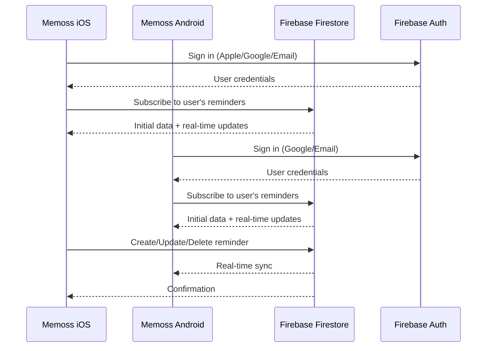

# feat: Cross-Device Sync for Memoss

**Status:** Ready for Review
**Created:** 2026-01-23
**Challenge Context:** Mrwhosetheboss reminder app challenge

---

## Challenge Requirements Gap Analysis

The Mrwhosetheboss challenge requires a **"beautiful fully functional reminders app that works properly on both iOS and Android"** with four key features:

| Requirement | Status | Implementation |
|-------------|--------|----------------|
| **Custom Snoozing** | COMPLETE | Text input 1-180 min from notification (`NotificationService.swift:157-163`) |
| **Recurring Reminders** | COMPLETE | Daily, hourly, weekly, monthly (`RecurrenceRule.swift:10-15`) |
| **Cross-Device Sync** | NOT STARTED | Currently local SwiftData only |
| **Beautiful UI** | COMPLETE | MemossColors design system, haptics, accessibility |

---

## Problem Statement

Memoss is currently **iOS-only with local storage**. The challenge explicitly requires:

> "If I dismiss a reminder on one phone, it should disappear everywhere. I don't want old phones exploding with missed notifications."

> "A beautiful fully functional reminders app that **works properly on both iOS and Android**."

This means we need:
1. **Cross-device sync** - Changes on one device reflect everywhere
2. **Cross-platform** - iOS AND Android support

---

## Strategic Options

### Option A: CloudKit (Apple Ecosystem Only)

**Scope:** Sync across iPhone, iPad, Mac, Apple Watch
**Effort:** Low (SwiftData has built-in CloudKit support)
**Limitation:** Does NOT solve Android requirement

```swift
// Current local-only container (MemossApp.swift:16-22)
let container = try ModelContainer(for: Reminder.self, Tag.self)

// CloudKit-enabled container (single line change!)
let container = try ModelContainer(
    for: Reminder.self, Tag.self,
    configurations: ModelConfiguration(cloudKitDatabase: .automatic)
)
```

**Required Changes:**
1. Enable iCloud capability in Xcode
2. Add CloudKit container identifier
3. Update `ModelConfiguration` to use `.automatic` CloudKit database
4. Make all model properties optional or have defaults (already done)

**Pros:**
- Minimal code changes
- Free for users (iCloud storage)
- Seamless Apple ID authentication
- Automatic conflict resolution

**Cons:**
- Apple ecosystem only
- Does NOT fulfill "iOS and Android" requirement
- No public sharing capabilities

---

### Option B: Firebase Firestore (Cross-Platform)

**Scope:** iOS, Android, Web
**Effort:** High (new architecture, authentication, data layer)
**Fulfills:** Full challenge requirement

**Architecture:**



**Required Work:**
1. Firebase SDK integration
2. User authentication system (Firebase Auth)
3. Firestore data model design
4. Sync service layer (replace SwiftData for remote, keep local cache)
5. Conflict resolution strategy
6. Android app development (NEW CODEBASE)

**Pros:**
- Cross-platform (iOS + Android + Web)
- Excellent offline support
- Real-time sync
- Well-documented

**Cons:**
- Significant implementation effort
- Requires Android development (separate codebase)
- Firebase costs at scale
- User account requirement

---

### Option C: Supabase + PowerSync (Advanced Cross-Platform)

**Scope:** iOS, Android, Web with offline-first
**Effort:** Very High
**Trade-off:** More control, more complexity

Not recommended for MVP due to Swift SDK maturity concerns.

---

## Recommended Approach: Phased Implementation

### Phase 1: CloudKit (Ship Apple Ecosystem First)
**Timeline:** 1-2 days
**Deliverable:** Sync across all Apple devices

This is the minimum viable sync that demonstrates the capability with minimal effort.

### Phase 2: Firebase (Full Cross-Platform) - Future
**Timeline:** 2-3 weeks
**Deliverable:** iOS + Android apps with real-time sync

This requires significant new work including an Android app.

---

## Phase 1: CloudKit Implementation Plan

### Prerequisites

- [ ] Apple Developer account with iCloud capability
- [ ] Xcode project configured for iCloud

### Implementation Steps

#### Step 1: Enable iCloud Capability

**File:** `Memoss.xcodeproj` (Signing & Capabilities)

1. Select Memoss target
2. Add "iCloud" capability
3. Check "CloudKit"
4. Create container: `iCloud.com.stack4nerds.memoss`

#### Step 2: Update Model Configuration

**File:** `Memoss/MemossApp.swift:16-38`

```swift
// BEFORE (local-only)
let container = try ModelContainer(for: Reminder.self, Tag.self)

// AFTER (CloudKit-enabled)
let config = ModelConfiguration(
    cloudKitDatabase: .automatic
)
let container = try ModelContainer(
    for: Reminder.self, Tag.self,
    configurations: config
)
```

#### Step 3: Verify Model Compatibility

**File:** `Memoss/Models/Reminder.swift`

CloudKit requires:
- [ ] All relationships are optional (already done: `tags: [Tag]?`)
- [ ] No unique constraints on synced properties
- [ ] Default values for non-optional properties

Current model analysis:
```swift
@Model
final class Reminder {
    var id: UUID = UUID()                    // OK: has default
    var title: String = ""                   // OK: has default
    var scheduledDate: Date = Date()         // OK: has default
    var isCompleted: Bool = false            // OK: has default
    var completedDate: Date?                 // OK: optional
    var recurrenceRuleData: Data?            // OK: optional
    var recurrenceEndDate: Date?             // OK: optional
    var lastScheduledDate: Date?             // OK: optional

    @Relationship(deleteRule: .nullify, inverse: \Tag.reminders)
    var tags: [Tag]? = []                    // OK: optional with default
}
```

**File:** `Memoss/Models/Tag.swift`

```swift
@Model
final class Tag {
    var id: UUID = UUID()                    // OK: has default
    var name: String = ""                    // OK: has default
    var colorHex: String = "#22C55E"         // OK: has default

    @Relationship(deleteRule: .nullify)
    var reminders: [Reminder]? = []          // OK: optional with default
}
```

Both models are CloudKit-compatible.

#### Step 4: Handle First Launch with CloudKit

**File:** `Memoss/MemossApp.swift:41-58`

The `seedDefaultTags()` function needs adjustment for CloudKit:
- Default tags will sync from cloud if user has existing data
- Only seed if both local AND cloud are empty (first time ever)

```swift
private func seedDefaultTags() {
    // Check if tags already exist (local or synced from cloud)
    let descriptor = FetchDescriptor<Tag>()
    let existingTags = (try? modelContext.fetch(descriptor)) ?? []

    guard existingTags.isEmpty else { return }

    // ... existing seeding logic
}
```

#### Step 5: Test Sync Behavior

**Validation:**
1. [ ] Install app on Device A, create reminder
2. [ ] Install app on Device B with same Apple ID
3. [ ] Verify reminder appears on Device B
4. [ ] Complete reminder on Device A
5. [ ] Verify completion syncs to Device B
6. [ ] Test offline changes sync when back online

---

## Acceptance Criteria

### AC1: CloudKit Sync - Happy Path
**Given** user has iCloud signed in on two devices
**When** they create a reminder on Device A
**Then** it appears on Device B within seconds

**Validation Steps:**
1. [ ] Enable iCloud on both test devices
2. [ ] Create reminder "Test Sync" on Device A
3. [ ] Open Memoss on Device B
4. [ ] Verify "Test Sync" reminder appears
5. [ ] Complete reminder on Device B
6. [ ] Verify completion reflects on Device A

### AC2: Offline Resilience
**Given** user is offline
**When** they create/edit reminders
**Then** changes sync when connectivity returns

### AC3: Existing Data Migration
**Given** user has existing local reminders
**When** CloudKit sync is enabled
**Then** local data uploads to cloud without loss

---

## Unit Test Plan

### CloudKit Sync Tests

| Test Name | Scenario | Expected Outcome | Priority |
|-----------|----------|------------------|----------|
| `test_model_cloudkit_compatible` | Verify models meet CloudKit requirements | All properties have defaults or are optional | P1 |
| `test_container_cloudkit_enabled` | Verify container configuration | CloudKit database is `.automatic` | P1 |
| `test_reminder_syncs_to_cloud` | Create reminder, verify cloud record | Record exists in CloudKit | P1 |
| `test_tag_relationship_syncs` | Reminder with tags syncs | Tags relationship preserved | P1 |

---

## Risk Analysis

| Risk | Likelihood | Impact | Mitigation |
|------|------------|--------|------------|
| iCloud not signed in | Medium | User sees local-only data | Show onboarding prompt for iCloud |
| Sync conflicts | Low | Duplicate reminders | SwiftData handles via last-writer-wins |
| Storage quota | Low | Sync fails | Reminders are small, unlikely to hit quota |
| Schema migration | Medium | Breaking changes | Test thoroughly before production |

---

## Future Considerations (Phase 2)

For full Android support, consider:

1. **Firebase Migration Path**
   - Keep CloudKit for Apple users
   - Add Firebase for cross-platform users
   - User chooses sync provider in settings

2. **Android App Development**
   - Kotlin Multiplatform or native Kotlin/Compose
   - Share business logic, platform-specific UI
   - Firebase Auth + Firestore

3. **Web Dashboard (Optional)**
   - React/Next.js web app
   - Same Firebase backend
   - View/manage reminders from browser

---

## References

### Internal
- `Memoss/MemossApp.swift:16-38` - Current ModelContainer configuration
- `Memoss/Models/Reminder.swift:1-71` - Reminder model (CloudKit-ready)
- `Memoss/Models/Tag.swift:1-27` - Tag model (CloudKit-ready)
- `plans/feat-main-dashboard.md:321` - CloudKit-ready note

### External
- [Hacking with Swift: Syncing SwiftData with CloudKit](https://www.hackingwithswift.com/books/ios-swiftui/syncing-swiftdata-with-cloudkit)
- [Apple: Setting Up Core Data with CloudKit](https://developer.apple.com/documentation/CoreData/setting-up-core-data-with-cloudkit)
- [Firebase Firestore iOS Quickstart](https://firebase.google.com/docs/firestore/quickstart)
- [Kodeco: CloudKit Support in SwiftData (March 2025)](https://www.kodeco.com/ios/paths/continuing-swiftui/45123174-data-persistence-with-swiftdata/04-extending-swiftdata-apps-cloudkit-support/02)
