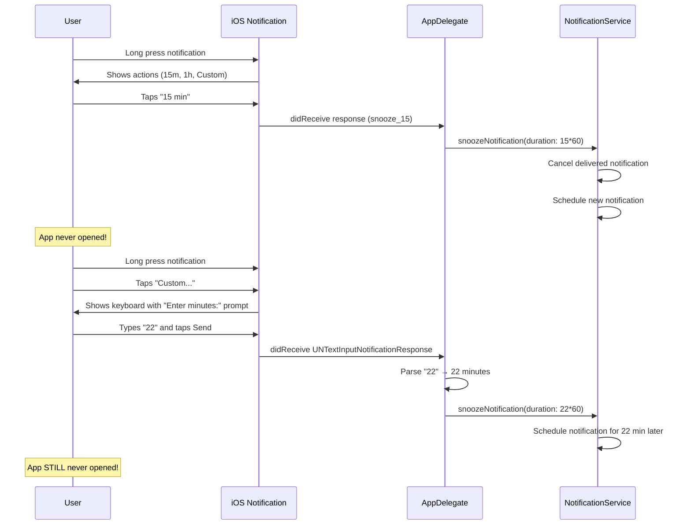

# feat: Custom Snooze Duration

**Date:** 2026-01-23
**Status:** Complete
**Type:** Enhancement
**Priority:** High (core challenge requirement from Mrwhosetheboss)

---

## Overview

Implement custom snooze functionality allowing users to snooze reminders for **any duration directly from the notification without ever opening the app**. This addresses the specific challenge requirement.

**Core functionality:**
- Predefined snooze options from notification (15 min, 1 hour)
- **Text input "Custom" action** - user types minutes (e.g., "22") directly from lock screen
- Simple integer parsing with fallback to 15 min on invalid input
- All snooze happens WITHOUT opening the app

---

## Problem Statement / Motivation

The challenge specifically requires: "If I'm filming with my phone and a reminder pops up, I wanna be able to snooze it for, let's say, exactly twenty two minutes directly from the notification **without ever having to open the app**."

**Current state:**
- Only one snooze option: 15 minutes (hardcoded)
- Action button shows "Snooze (15 min)"
- No flexibility for user preference
- Must open app to reschedule for different duration

**Desired state:**
- Quick snooze options available from notification (15 min, 1 hour)
- **Text input for custom duration** - type "22" from lock screen keyboard
- Fallback to 15 min default if input is invalid
- User never needs to open the app for ANY snooze duration
- Fully meets the challenge requirement

---

## Architecture Flow



---

## Technical Approach

### iOS Notification Input Options

| Input Type | API | Opens App? | Best For |
|------------|-----|------------|----------|
| Button tap | `UNNotificationAction` | No | Preset durations |
| **Text input** | `UNTextInputNotificationAction` | **No** | Custom values |
| Foreground action | `UNNotificationAction(.foreground)` | Yes | Complex UI |

### Solution: Hybrid with Text Input

We use `UNTextInputNotificationAction` for the "Custom" button. This shows a keyboard overlay directly on the notification - user types "22" and taps Send. **The app never opens.**

```
┌─────────────────────────────────────────────────┐
│  Reminder: Water the plants                      │
│  Memoss                                          │
├─────────────────────────────────────────────────┤
│  [15 min]  [1 hour]  [Custom ⌨️]  [Done]        │
└─────────────────────────────────────────────────┘
                                    ↓
                         ┌─────────────────────┐
                         │ Enter minutes:      │
                         │ ┌─────────────────┐ │
                         │ │ 22              │ │
                         │ └─────────────────┘ │
                         │           [Snooze]  │
                         └─────────────────────┘
                         Keyboard appears inline
                         User types "22" → Snooze
                         NO APP OPENED!
```

### Decision Matrix

| Approach | Opens App? | Any Duration? | UX Quality | Decision |
|----------|------------|---------------|------------|----------|
| Predefined buttons only | No | No | Great | Partial |
| **Presets + Text Input** | **No** | **Yes** | Good | **Selected** |
| Presets + Foreground picker | Yes | Yes | Great | Rejected (opens app) |
| Text input only | No | Yes | Poor | Rejected |

### Updated Notification Category

```swift
// Memoss/Services/NotificationService.swift
func registerCategories() {
    // Preset snooze actions (no app open)
    let snooze15 = UNNotificationAction(
        identifier: "snooze_15",
        title: "15 min",
        options: []
    )

    let snooze60 = UNNotificationAction(
        identifier: "snooze_60",
        title: "1 hour",
        options: []
    )

    // Custom text input action (NO APP OPEN!)
    let snoozeCustom = UNTextInputNotificationAction(
        identifier: "snooze_custom",
        title: "Custom...",
        options: [],
        textInputButtonTitle: "Snooze",
        textInputPlaceholder: "Minutes (e.g., 22)"
    )

    let markComplete = UNNotificationAction(
        identifier: NotificationAction.markComplete.rawValue,
        title: "Done",
        options: [.destructive]
    )

    let category = UNNotificationCategory(
        identifier: NotificationCategory.reminder.rawValue,
        actions: [snooze15, snooze60, snoozeCustom, markComplete],
        intentIdentifiers: [],
        options: .customDismissAction
    )

    UNUserNotificationCenter.current().setNotificationCategories([category])
}
```

`★ Insight ─────────────────────────────────────`
**Key difference:** `UNTextInputNotificationAction` vs `UNNotificationAction`:
- Both have `options: []` (no `.foreground` flag)
- Text input shows keyboard overlay on the notification itself
- App stays in background the entire time
- User input available via `(response as? UNTextInputNotificationResponse)?.userText`
`─────────────────────────────────────────────────`

### Action Handler with Simple Parsing

```swift
// Memoss/Extensions/AppDelegate+Notifications.swift
func userNotificationCenter(
    _ center: UNUserNotificationCenter,
    didReceive response: UNNotificationResponse,
    withCompletionHandler completionHandler: @escaping () -> Void
) {
    Task { @MainActor in
        switch response.actionIdentifier {
        case NotificationAction.markComplete.rawValue:
            await handleMarkComplete(response: response)

        case "snooze_15":
            await handleSnooze(response: response, minutes: 15)

        case "snooze_60":
            await handleSnooze(response: response, minutes: 60)

        case "snooze_custom":
            // Handle text input for custom duration
            if let textResponse = response as? UNTextInputNotificationResponse {
                let minutes = parseSnoozeInput(textResponse.userText) ?? 15  // Fallback to 15 min
                await handleSnooze(response: response, minutes: minutes)
            }

        case NotificationAction.snooze.rawValue:
            // Legacy support
            await handleSnooze(response: response, minutes: 15)

        case UNNotificationDefaultActionIdentifier:
            break

        default:
            break
        }

        completionHandler()
    }
}

/// Parses user input into minutes.
/// Simple integer parsing - placeholder guides users to type numbers.
/// Returns nil for invalid input (handled by fallback in caller).
private func parseSnoozeInput(_ input: String) -> Int? {
    let trimmed = input.trimmingCharacters(in: .whitespacesAndNewlines)
    guard let minutes = Int(trimmed), minutes > 0, minutes <= 180 else {
        return nil
    }
    return minutes
}

@MainActor
private func handleSnooze(response: UNNotificationResponse, minutes: Int) async {
    await NotificationService.shared.snoozeNotification(
        from: response,
        duration: TimeInterval(minutes * 60)
    )
}
```

### File Structure (Simplified!)

```
Memoss/
├── Services/
│   └── NotificationService.swift       # MODIFY: Add text input action
├── Extensions/
│   └── AppDelegate+Notifications.swift # MODIFY: Handle text input + parsing
└── (No new files needed!)
```

**Note:** With text input, we don't need `SnoozePickerView` or app state management for snooze. Everything happens from the notification itself.

---

## Implementation Phases

| Phase | Title | Dependencies | Status |
|-------|-------|--------------|--------|
| 1 | Update Notification Actions (with text input) | None | ✅ COMPLETED |
| 2 | Handle Text Input + Smart Parsing | Phase 1 | ✅ COMPLETED |
| 3 | Testing & Edge Cases | Phase 2 | 🔓 AVAILABLE |

**Total: 3 phases instead of 5!** No app UI needed.

---

### Phase 1: Update Notification Actions ✅ COMPLETED

**Goal:** Register snooze actions including `UNTextInputNotificationAction` for custom duration.
**Completed:** 2026-01-23

**Files to modify:**
- `Memoss/Services/NotificationService.swift`

#### NotificationService.swift Changes

```swift
// Memoss/Services/NotificationService.swift

// Update NotificationAction enum
enum NotificationAction: String {
    case markComplete = "MARK_COMPLETE_ACTION"
    case snooze15 = "snooze_15"
    case snooze60 = "snooze_60"
    case snoozeCustom = "snooze_custom"
    case snooze = "SNOOZE_ACTION" // Legacy
}

// Update registerCategories() method
func registerCategories() {
    let snooze15 = UNNotificationAction(
        identifier: NotificationAction.snooze15.rawValue,
        title: "15 min",
        options: []
    )

    let snooze60 = UNNotificationAction(
        identifier: NotificationAction.snooze60.rawValue,
        title: "1 hour",
        options: []
    )

    // Text input for custom duration - NO APP OPEN!
    let snoozeCustom = UNTextInputNotificationAction(
        identifier: NotificationAction.snoozeCustom.rawValue,
        title: "Custom...",
        options: [],
        textInputButtonTitle: "Snooze",
        textInputPlaceholder: "Minutes (e.g., 22)"
    )

    let markCompleteAction = UNNotificationAction(
        identifier: NotificationAction.markComplete.rawValue,
        title: "Done",
        options: [.destructive]
    )

    let category = UNNotificationCategory(
        identifier: NotificationCategory.reminder.rawValue,
        actions: [snooze15, snooze60, snoozeCustom, markCompleteAction],
        intentIdentifiers: [],
        options: .customDismissAction
    )

    UNUserNotificationCenter.current().setNotificationCategories([category])
}
```

**Acceptance Criteria:**
- [ ] Text input action registered with `UNTextInputNotificationAction`
- [ ] Placeholder shows "Minutes (e.g., 22)"
- [ ] Button title shows "Snooze"
- [ ] Tapping "Custom..." shows keyboard overlay (not app)
- [ ] Only 4 actions total: 15 min, 1 hour, Custom, Done
- [ ] App builds without errors

---

### Phase 2: Handle Text Input + Smart Parsing ✅ COMPLETED

**Goal:** Parse user text input and snooze for the specified duration.
**Completed:** 2026-01-23

**Files to modify:**
- `Memoss/Extensions/AppDelegate+Notifications.swift`

#### AppDelegate+Notifications.swift Changes

```swift
// Memoss/Extensions/AppDelegate+Notifications.swift

// Update the switch statement in userNotificationCenter(_:didReceive:withCompletionHandler:)
switch response.actionIdentifier {
case NotificationAction.markComplete.rawValue:
    await handleMarkComplete(reminderId: reminderId)

case NotificationAction.snooze15.rawValue:
    await handleSnooze(response: response, minutes: 15)

case NotificationAction.snooze60.rawValue:
    await handleSnooze(response: response, minutes: 60)

case NotificationAction.snoozeCustom.rawValue:
    // Handle text input for custom duration with fallback
    if let textResponse = response as? UNTextInputNotificationResponse {
        let minutes = parseSnoozeInput(textResponse.userText) ?? 15  // Fallback to 15 min
        await handleSnooze(response: response, minutes: minutes)
    }

case NotificationAction.snooze.rawValue:
    // Legacy support for old snooze action
    await handleSnooze(response: response, minutes: 15)

case UNNotificationDefaultActionIdentifier:
    break

default:
    break
}

// Add this new method
@MainActor
private func handleSnooze(response: UNNotificationResponse, minutes: Int) async {
    await NotificationService.shared.snoozeNotification(
        from: response,
        duration: TimeInterval(minutes * 60)
    )
}

/// Simple integer parsing for snooze duration.
/// Placeholder "Minutes (e.g., 22)" guides users to type numbers.
/// Returns nil for invalid input (caller handles fallback).
private func parseSnoozeInput(_ input: String) -> Int? {
    let trimmed = input.trimmingCharacters(in: .whitespacesAndNewlines)
    guard let minutes = Int(trimmed), minutes > 0, minutes <= 180 else {
        return nil
    }
    return minutes
}
```

**Acceptance Criteria:**
- [ ] Typing "22" snoozes for 22 minutes
- [ ] Typing "5" snoozes for 5 minutes
- [ ] Invalid input (empty, "abc", >180) falls back to 15 min default
- [ ] Snooze happens WITHOUT opening app
- [ ] Preset buttons (15m, 1h) still work

---

### Phase 3: Testing & Edge Cases

**Goal:** Verify integer parsing and fallback behavior.

**Test Cases:**

| Input | Expected Minutes | Notes |
|-------|-----------------|-------|
| "22" | 22 | Most common case |
| "5" | 5 | Single digit |
| "120" | 120 | Large number |
| "180" | 180 | Max valid (3 hours) |
| "" | nil → 15 | Empty, fallback to default |
| "abc" | nil → 15 | Non-numeric, fallback |
| "-5" | nil → 15 | Negative, fallback |
| "200" | nil → 15 | > 180 min, fallback |
| "0" | nil → 15 | Zero, fallback |
| "  45  " | 45 | Whitespace trimmed |

**Acceptance Criteria:**
- [ ] Valid integers (1-180) parse correctly
- [ ] Invalid inputs fallback to 15 min (user still gets snoozed)
- [ ] Edge cases don't crash
- [ ] 3-hour max enforced (longer delays should edit reminder)

---

## Acceptance Criteria Summary

### AC1: Multiple Snooze Options from Notification
**Given** a reminder notification appears
**When** user long-presses the notification
**Then** snooze options (15 min, 1 hour, Custom, Done) are shown

### AC2: Quick Snooze Without Opening App
**Given** user taps a preset snooze duration (15m, 1h)
**When** the action completes
**Then** notification is snoozed without opening the app

### AC3: Custom Text Input Without Opening App
**Given** user taps "Custom..." from notification
**When** keyboard appears
**Then** user can type duration and snooze WITHOUT app opening

**This is the KEY requirement from the challenge!**

### AC4: Simple Input Parsing with Fallback
**Given** user types "22" (valid integer between 1-180)
**When** user taps "Snooze" button
**Then** notification is snoozed for exactly that duration
**And** if input is invalid, falls back to 15 min default

### AC5: Challenge Requirement Met
**Given** user is filming with their phone
**When** reminder notification pops up
**Then** they can snooze for exactly 22 minutes directly from the notification without ever having to open the app

---

## Unit Test Plan

### Parsing Tests

```swift
func test_parseSnoozeInput_validIntegers() {
    XCTAssertEqual(parseSnoozeInput("22"), 22)
    XCTAssertEqual(parseSnoozeInput("5"), 5)
    XCTAssertEqual(parseSnoozeInput("120"), 120)
    XCTAssertEqual(parseSnoozeInput("180"), 180)  // Max valid
}

func test_parseSnoozeInput_whitespace() {
    XCTAssertEqual(parseSnoozeInput("  45  "), 45)
    XCTAssertEqual(parseSnoozeInput(" 22"), 22)
}

func test_parseSnoozeInput_invalid_returnsNil() {
    XCTAssertNil(parseSnoozeInput(""))           // Empty
    XCTAssertNil(parseSnoozeInput("abc"))        // Non-numeric
    XCTAssertNil(parseSnoozeInput("-5"))         // Negative
    XCTAssertNil(parseSnoozeInput("0"))          // Zero
    XCTAssertNil(parseSnoozeInput("200"))        // > 180 min
    XCTAssertNil(parseSnoozeInput("22m"))        // Has suffix (simple parser)
}
```

**Note:** Parser is intentionally simple. Users type numbers, invalid input falls back to 15 min.

---

## Alternative Approaches Considered

| Approach | Opens App? | Any Duration? | Decision |
|----------|------------|---------------|----------|
| Presets + Foreground picker | Yes | Yes | **Rejected** - Opens app |
| **Presets + Text Input** | **No** | **Yes** | **Selected** |
| Text input only | No | Yes | Rejected - Poor preset UX |
| Presets only | No | No | Rejected - No custom values |

---

## Risk Analysis & Mitigation

| Risk | Impact | Probability | Mitigation |
|------|--------|-------------|------------|
| Invalid input typed | Low | Medium | Fallback to 15 min default, user still gets snooze |
| User types "22m" instead of "22" | Low | Low | Placeholder guides to type number only; fallback handles it |
| Keyboard covers notification | Low | Low | iOS handles this natively |

---

## Success Metrics

| Metric | Target | Measurement |
|--------|--------|-------------|
| **App never opens for snooze** | 100% | Automated testing |
| Simple number input works | 100% | Unit tests |
| All format variations work | 95%+ | Unit tests |
| Challenge requirement met | Yes | Manual validation |

---

## References

### Apple Documentation
- [UNTextInputNotificationAction](https://developer.apple.com/documentation/usernotifications/untextinputnotificationaction)
- [Declaring Actionable Notification Types](https://developer.apple.com/documentation/usernotifications/declaring-your-actionable-notification-types)

### Internal References
- `Memoss/Services/NotificationService.swift:142-163` - Current category registration
- `Memoss/Extensions/AppDelegate+Notifications.swift:35-56` - Current action handling

---

## Checklist

### Phase 1: Notification Actions
- [ ] NotificationAction enum updated with 4 new cases (snooze15, snooze60, snoozeCustom, keep legacy snooze)
- [ ] `UNTextInputNotificationAction` used for custom (NOT `UNNotificationAction`)
- [ ] Placeholder shows "Minutes (e.g., 22)"
- [ ] Button title shows "Snooze"
- [ ] No `.foreground` option (app stays closed)
- [ ] Only 4 actions total: 15 min, 1 hour, Custom, Done
- [ ] App builds without errors

### Phase 2: Text Input Handling
- [ ] Cast response to `UNTextInputNotificationResponse`
- [ ] Extract `userText` from response
- [ ] `parseSnoozeInput()` function implemented (simple Int parse)
- [ ] Invalid input falls back to 15 min (not dismissed)
- [ ] Range validation (1-180 minutes)
- [ ] Snooze calls NotificationService with correct duration

### Phase 3: Testing
- [ ] Manual test: type "22" → snooze 22 min
- [ ] Manual test: type "abc" → snooze 15 min (fallback)
- [ ] Manual test: preset buttons (15m, 1h) work
- [ ] Manual test: app never opens for any snooze
- [ ] Manual test: legacy snooze action still works

---

*Plan created: 2026-01-23*
*Last updated: 2026-01-23*
*Approach: Text input for custom snooze (NO APP OPEN)*
*Simplified: Int-only parsing with 15 min fallback*
