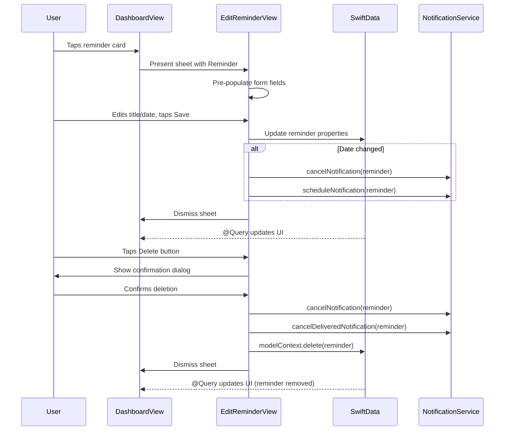

# feat: Implement Edit & Delete Reminders

**Date:** 2026-01-22
**Status:** Planning
**Type:** Enhancement
**Priority:** High (completes CRUD lifecycle)

---

## Overview

Add the ability to view, edit, and delete existing reminders. This feature completes the full reminder lifecycle - users can now create, read, update, and delete reminders (CRUD). Currently, tapping a reminder card only toggles completion; there's no way to modify the title, date, or remove reminders entirely.

**Core functionality:**
- Tap reminder card to open edit sheet
- Edit title and scheduled date/time
- Delete reminder with confirmation dialog
- Update notification when date changes
- Cancel notification when deleting

---

## Problem Statement / Motivation

Users create reminders but have **no way to modify or remove them**:

**Current state:**
- User creates "Buy milk" reminder for 9:00 AM
- User realizes it should be "Buy groceries" at 10:00 AM
- No way to fix this - must complete the wrong reminder and create a new one

**Desired state:**
- User taps the reminder card to open details
- User edits title to "Buy groceries" and time to 10:00 AM
- User can also delete reminders they no longer need

This is a critical usability gap - every reminder app needs edit and delete functionality.

---

## Architecture Flow



---

## Technical Approach

### Navigation Pattern

Use the existing modal sheet pattern from `CreateReminderView`:

```swift
// DashboardView.swift
@State private var selectedReminder: Reminder?

// Present edit sheet
.sheet(item: $selectedReminder) { reminder in
    EditReminderView(reminder: reminder)
}
```

**Key decision:** Use `sheet(item:)` with optional `Reminder` rather than `sheet(isPresented:)` - this is cleaner for passing data and follows Apple's recommended pattern. The sheet automatically dismisses when `selectedReminder` is set to `nil`.

### Local State with Explicit Save

Following the same pattern as `CreateReminderView`, use local `@State` properties with explicit save:

```swift
// EditReminderView.swift
let reminder: Reminder  // Reference, not @Bindable
@State private var title: String
@State private var scheduledDate: Date

init(reminder: Reminder) {
    self.reminder = reminder
    _title = State(initialValue: reminder.title)
    _scheduledDate = State(initialValue: reminder.scheduledDate)
}
```

**Why not @Bindable?** Using `@Bindable` auto-persists changes as the user types. With local `@State`, users can cancel without saving - consistent with CreateReminderView's edit-then-commit pattern.

### Confirmation Dialog for Delete

Use SwiftUI's `confirmationDialog` (not `alert`) for destructive actions:

```swift
.confirmationDialog(
    "Delete Reminder?",
    isPresented: $showingDeleteConfirmation,
    titleVisibility: .visible
) {
    Button("Delete", role: .destructive) {
        deleteReminder()
    }
    Button("Cancel", role: .cancel) { }
} message: {
    Text("This cannot be undone.")
}
```

**Note:** All actions in a `confirmationDialog` automatically dismiss the dialog after running. The `.cancel` role button replaces the default dismiss action - no manual dismiss handling needed. (See: [Apple confirmationDialog docs](https://developer.apple.com/documentation/swiftui/view/confirmationdialog))

### File Structure

```
Memoss/
├── Features/
│   ├── EditReminder/                          # CREATE: New feature folder
│   │   └── EditReminderView.swift             # CREATE: Edit form with delete
│   └── Dashboard/
│       ├── DashboardView.swift                # MODIFY: Add sheet presentation
│       └── Components/
│           └── ReminderCard.swift             # MODIFY: Add tap callback
└── Services/
    └── NotificationService.swift              # NO CHANGE: Already has needed methods
```

### Notification Handling

Use existing `NotificationService` methods:

| Action | Service Methods |
|--------|-----------------|
| Edit (date unchanged) | None needed - SwiftData auto-saves |
| Edit (date changed) | `cancelNotification()` then `scheduleNotification()` |
| Delete | `cancelNotification()` + `cancelDeliveredNotification()` |

---

## Implementation Phases

| Phase | Title | Dependencies | Status |
|-------|-------|--------------|--------|
| 1 | Card Tap + Sheet Presentation | None | COMPLETED |
| 2 | EditReminderView Form | Phase 1 | COMPLETED |
| 3 | Delete with Confirmation | Phase 2 | COMPLETED |
| 4 | Notification Updates + Polish | Phase 3 | COMPLETED |

---

### Phase 1: Card Tap + Sheet Presentation

**Goal:** Make reminder cards tappable and present edit sheet

**Files to modify:**
- `Memoss/Features/Dashboard/Components/ReminderCard.swift` - Add onTap callback
- `Memoss/Features/Dashboard/DashboardView.swift` - Add sheet state, presentation, and update TaskSection to propagate onTap

#### ReminderCard.swift Changes

```swift
// Add onTap parameter alongside existing onToggle
struct ReminderCard: View {
    let reminder: Reminder
    let onToggle: () -> Void
    var onTap: (() -> Void)? = nil  // New: optional tap handler

    var body: some View {
        HStack(alignment: .center, spacing: 16) {
            // Checkbox button (existing)
            Button(action: onToggle) {
                Image(systemName: reminder.isCompleted ? "checkmark.circle.fill" : "circle")
                // ...
            }

            // Content area - now tappable
            VStack(alignment: .leading, spacing: 4) {
                Text(reminder.title)
                // ...
            }
            .contentShape(Rectangle())  // Expand tap area to full VStack bounds
            .onTapGesture {
                UIImpactFeedbackGenerator(style: .light).impactOccurred()
                onTap?()
            }

            Spacer()
        }
        // ...
    }
}
```

#### DashboardView.swift Changes

```swift
// Add state for selected reminder
@State private var selectedReminder: Reminder?

// In body, update ReminderCard usage
ReminderCard(
    reminder: reminder,
    onToggle: { toggleCompletion(reminder) },
    onTap: { selectedReminder = reminder }  // New
)

// Add sheet presentation
.sheet(item: $selectedReminder) { reminder in
    EditReminderView(reminder: reminder)
}
```

#### TaskSection Modification (Critical)

The `TaskSection` private struct (lines 113-139) must also be updated to propagate the tap callback:

```swift
private struct TaskSection: View {
    let title: String
    let icon: String
    let iconColor: Color
    let reminders: [Reminder]
    let onToggle: (Reminder) -> Void
    let onSelect: (Reminder) -> Void  // Add this

    var body: some View {
        VStack(alignment: .leading, spacing: 12) {
            // Header unchanged...

            ForEach(reminders, id: \.id) { reminder in
                ReminderCard(
                    reminder: reminder,
                    onToggle: { onToggle(reminder) },
                    onTap: { onSelect(reminder) }  // Add this
                )
            }
        }
    }
}

// Update TaskSection usage in body:
TaskSection(
    title: "To Do",
    icon: "leaf.fill",
    iconColor: MemossColors.brandPrimary,
    reminders: incompleteReminders,
    onToggle: toggleCompletion,
    onSelect: { selectedReminder = $0 }  // Add this
)
```

**Acceptance Criteria:**
- [ ] Tapping reminder content area opens edit sheet
- [ ] Tapping checkbox still toggles completion (doesn't open sheet)
- [ ] Sheet presents with slide-up animation
- [ ] Dismiss by swipe down or cancel button
- [ ] Sheet works for both incomplete and completed reminders

**Validation Steps:**
1. Tap on reminder title/time area - sheet should open
2. Tap on checkbox - should toggle without opening sheet
3. Swipe down on sheet - should dismiss
4. Verify with VoiceOver enabled

---

### Phase 2: EditReminderView Form

**Goal:** Create edit form pre-populated with reminder data

**Files to create:**
- `Memoss/Features/EditReminder/EditReminderView.swift`

#### EditReminderView.swift

```swift
// Memoss/Features/EditReminder/EditReminderView.swift
import SwiftUI
import SwiftData

struct EditReminderView: View {
    @Environment(\.dismiss) private var dismiss
    @Environment(\.modelContext) private var modelContext
    @Environment(\.accessibilityReduceMotion) private var reduceMotion

    let reminder: Reminder

    @State private var title: String
    @State private var scheduledDate: Date
    @State private var hasAttemptedSave = false
    @FocusState private var isTitleFocused: Bool

    init(reminder: Reminder) {
        self.reminder = reminder
        _title = State(initialValue: reminder.title)
        _scheduledDate = State(initialValue: reminder.scheduledDate)
    }

    private var isTitleValid: Bool {
        !title.trimmingCharacters(in: .whitespaces).isEmpty
    }

    private var showError: Bool {
        hasAttemptedSave && !isTitleValid
    }

    var body: some View {
        NavigationStack {
            ScrollView {
                VStack(spacing: 20) {
                    // Title Field
                    titleField

                    // Date Picker
                    datePickerCard

                    // Time Picker
                    timePickerCard

                    Spacer(minLength: 20)

                    // Delete Button
                    deleteButton
                }
                .padding(.horizontal, 20)
                .padding(.top, 20)
            }
            .background(
                LinearGradient(
                    colors: [MemossColors.backgroundStart, MemossColors.backgroundEnd],
                    startPoint: .top,
                    endPoint: .bottom
                )
                .ignoresSafeArea()
            )
            .navigationTitle("Edit Reminder")
            .navigationBarTitleDisplayMode(.inline)
            .toolbar {
                ToolbarItem(placement: .cancellationAction) {
                    Button {
                        dismiss()
                    } label: {
                        Image(systemName: "xmark")
                            .font(.system(size: 16, weight: .semibold))
                            .foregroundStyle(MemossColors.textSecondary)
                    }
                    .accessibilityLabel("Cancel")
                }

                ToolbarItem(placement: .confirmationAction) {
                    Button("Save") {
                        saveChanges()
                    }
                    .font(.system(size: 16, weight: .semibold, design: .rounded))
                    .foregroundStyle(MemossColors.brandPrimary)
                }
            }
        }
        .interactiveDismissDisabled(hasUnsavedChanges)
    }
    // **Note:** `.interactiveDismissDisabled()` prevents accidental dismissal via swipe when form has changes.
    // Users must explicitly tap Cancel or Save. (See: Apple interactiveDismissDisabled docs)

    // MARK: - Subviews

    private var titleField: some View {
        VStack(alignment: .leading, spacing: 8) {
            Text("What do you need to remember?")
                .font(.system(size: 14, weight: .medium, design: .rounded))
                .foregroundStyle(MemossColors.textSecondary)

            TextField("Reminder title", text: $title)
                .font(.system(size: 16, weight: .regular, design: .rounded))
                .foregroundStyle(MemossColors.textPrimary)
                .focused($isTitleFocused)
                .submitLabel(.done)
                .padding(20)
                .background(MemossColors.cardBackground)
                .clipShape(RoundedRectangle(cornerRadius: 24))
                .overlay(
                    RoundedRectangle(cornerRadius: 24)
                        .stroke(showError ? MemossColors.error : Color.clear, lineWidth: 2)
                )
                .shadow(color: MemossColors.brandPrimary.opacity(0.08), radius: 12, y: 4)
                .accessibilityLabel("Reminder title")
                .accessibilityValue(title.isEmpty ? "Empty" : title)
                .accessibilityHint("Enter what you need to remember")

            if showError {
                Text("Please enter a title")
                    .font(.system(size: 12, weight: .medium, design: .rounded))
                    .foregroundStyle(MemossColors.error)
            }
        }
    }

    private var datePickerCard: some View {
        HStack {
            ZStack {
                RoundedRectangle(cornerRadius: 12)
                    .fill(MemossColors.brandPrimary.opacity(0.1))
                    .frame(width: 44, height: 44)
                Image(systemName: "calendar")
                    .font(.system(size: 20))
                    .foregroundStyle(MemossColors.brandPrimary)
            }

            VStack(alignment: .leading, spacing: 2) {
                Text("Date")
                    .font(.system(size: 14, weight: .medium, design: .rounded))
                    .foregroundStyle(MemossColors.textSecondary)
                DatePicker(
                    "",
                    selection: $scheduledDate,
                    displayedComponents: .date
                )
                .labelsHidden()
                .tint(MemossColors.brandPrimary)
                .accessibilityLabel("Select date")
            }

            Spacer()
        }
        .padding(16)
        .background(MemossColors.cardBackground)
        .clipShape(RoundedRectangle(cornerRadius: 24))
        .shadow(color: MemossColors.brandPrimary.opacity(0.08), radius: 12, y: 4)
        .accessibilityElement(children: .combine)
    }

    private var timePickerCard: some View {
        HStack {
            ZStack {
                RoundedRectangle(cornerRadius: 12)
                    .fill(MemossColors.accent.opacity(0.1))
                    .frame(width: 44, height: 44)
                Image(systemName: "clock")
                    .font(.system(size: 20))
                    .foregroundStyle(MemossColors.accent)
            }

            VStack(alignment: .leading, spacing: 2) {
                Text("Time")
                    .font(.system(size: 14, weight: .medium, design: .rounded))
                    .foregroundStyle(MemossColors.textSecondary)
                DatePicker(
                    "",
                    selection: $scheduledDate,
                    displayedComponents: .hourAndMinute
                )
                .labelsHidden()
                .tint(MemossColors.accent)
                .accessibilityLabel("Select time")
            }

            Spacer()
        }
        .padding(16)
        .background(MemossColors.cardBackground)
        .clipShape(RoundedRectangle(cornerRadius: 24))
        .shadow(color: MemossColors.brandPrimary.opacity(0.08), radius: 12, y: 4)
        .accessibilityElement(children: .combine)
    }

    private var deleteButton: some View {
        Button(role: .destructive) {
            // Delete confirmation will be added in Phase 3
        } label: {
            HStack {
                Image(systemName: "trash")
                Text("Delete Reminder")
            }
            .font(.system(size: 16, weight: .semibold, design: .rounded))
            .foregroundStyle(MemossColors.error)
            .frame(maxWidth: .infinity)
            .padding(.vertical, 16)
        }
        .accessibilityLabel("Delete this reminder")
        .accessibilityHint("Double tap to delete this reminder permanently")
    }

    // MARK: - Computed Properties

    private var hasUnsavedChanges: Bool {
        title != reminder.title || scheduledDate != reminder.scheduledDate
    }

    // MARK: - Actions

    private func saveChanges() {
        hasAttemptedSave = true
        guard isTitleValid else { return }

        // Update model
        reminder.title = title.trimmingCharacters(in: .whitespaces)
        reminder.scheduledDate = scheduledDate

        // Handle notification update (Phase 4)

        UIImpactFeedbackGenerator(style: .light).impactOccurred()
        dismiss()
    }
}
```

**Acceptance Criteria:**
- [ ] Form pre-populates with existing reminder data
- [ ] Title field validates (non-empty)
- [ ] Error state shown on empty title after save attempt
- [ ] Date picker shows current scheduled date
- [ ] Time picker shows current scheduled time
- [ ] Save button updates reminder in SwiftData
- [ ] Changes reflect immediately on dashboard after dismiss
- [ ] Toolbar matches CreateReminderView style
- [ ] Card styling matches existing design system

**Validation Steps:**
1. Open edit sheet for a reminder
2. Verify title, date, and time are pre-filled correctly
3. Change title, tap Save - verify update on dashboard
4. Change date/time, tap Save - verify update on dashboard
5. Try to save empty title - verify error message

---

### Phase 3: Delete with Confirmation

**Goal:** Add delete functionality with confirmation dialog

**Files to modify:**
- `Memoss/Features/EditReminder/EditReminderView.swift` - Add delete logic

#### Add to EditReminderView.swift

```swift
// Add state for confirmation dialog
@State private var showingDeleteConfirmation = false

// Update deleteButton to show confirmation
private var deleteButton: some View {
    Button(role: .destructive) {
        showingDeleteConfirmation = true
    } label: {
        HStack {
            Image(systemName: "trash")
            Text("Delete Reminder")
        }
        .font(.system(size: 16, weight: .semibold, design: .rounded))
        .foregroundStyle(MemossColors.error)
        .frame(maxWidth: .infinity)
        .padding(.vertical, 16)
    }
    .accessibilityLabel("Delete this reminder")
    .accessibilityHint("Double tap to show delete confirmation")
}

// Add confirmation dialog modifier to body
.confirmationDialog(
    "Delete Reminder?",
    isPresented: $showingDeleteConfirmation,
    titleVisibility: .visible
) {
    Button("Delete", role: .destructive) {
        deleteReminder()
    }
    Button("Cancel", role: .cancel) { }
} message: {
    Text("This cannot be undone.")
}

// Add delete function
private func deleteReminder() {
    // Cancel notifications BEFORE deleting to prevent orphan notifications
    NotificationService.shared.cancelNotification(for: reminder)
    NotificationService.shared.cancelDeliveredNotification(for: reminder)

    // Delete from SwiftData - @Query in DashboardView auto-updates
    modelContext.delete(reminder)

    // Success haptic for destructive confirmation
    UINotificationFeedbackGenerator().notificationOccurred(.success)

    // Dismiss sheet - SwiftData changes persist automatically
    dismiss()
}
```

**Acceptance Criteria:**
- [ ] Delete button shows confirmation dialog
- [ ] Dialog has "Delete" (destructive) and "Cancel" options
- [ ] Cancel dismisses dialog without action
- [ ] Delete removes reminder from SwiftData
- [ ] Delete cancels any pending notifications
- [ ] Delete removes any delivered notifications from Notification Center
- [ ] Sheet dismisses after deletion
- [ ] Dashboard updates immediately (reminder gone)
- [ ] Haptic feedback on successful delete

**Validation Steps:**
1. Open edit sheet, tap Delete
2. Verify confirmation dialog appears
3. Tap Cancel - dialog should dismiss, reminder unchanged
4. Tap Delete - sheet should dismiss, reminder gone from list
5. Create reminder for future, open edit, delete - verify no notification fires

---

### Phase 4: Notification Updates + Polish

**Goal:** Update notifications when reminder is saved, add accessibility polish

**Files to modify:**
- `Memoss/Features/EditReminder/EditReminderView.swift` - Add notification logic

#### Update saveChanges() in EditReminderView.swift

```swift
private func saveChanges() {
    hasAttemptedSave = true
    guard isTitleValid else { return }

    // Update model
    reminder.title = title.trimmingCharacters(in: .whitespaces)
    reminder.scheduledDate = scheduledDate

    // Always reschedule notification (OS handles idempotency)
    if !reminder.isCompleted {
        NotificationService.shared.cancelNotification(for: reminder)
        Task {
            await NotificationService.shared.scheduleNotification(for: reminder)
        }
    }

    UIImpactFeedbackGenerator(style: .light).impactOccurred()
    dismiss()
}
```

**Why always reschedule?** The `UNUserNotificationCenter` handles re-adding the same notification ID by replacing it. There's no performance benefit to tracking whether the date changed - the OS efficiently handles this. Simpler code, same result.

#### Accessibility Enhancements

Accessibility modifiers are already integrated inline in the Phase 2 code above. Key patterns used:

```swift
// TextField - provide label, value, and hint for VoiceOver
.accessibilityLabel("Reminder title")
.accessibilityValue(title.isEmpty ? "Empty" : title)
.accessibilityHint("Enter what you need to remember")

// DatePicker cards - combine children for single swipe navigation
.accessibilityElement(children: .combine)

// Delete button - clear role and hint for destructive action
.accessibilityLabel("Delete this reminder")
.accessibilityHint("Double tap to show delete confirmation")
```

**VoiceOver navigation order:** NavigationStack ensures logical top-to-bottom order. Title field → Date picker → Time picker → Delete button.

**Acceptance Criteria:**
- [ ] Notification rescheduled when reminder is saved (incomplete reminders only)
- [ ] Completed reminders don't trigger notification reschedule
- [ ] All elements have accessibility labels
- [ ] VoiceOver navigation works correctly
- [ ] Dynamic Type supported throughout
- [ ] Reduce motion respected for animations
- [ ] Minimum 44pt touch targets maintained

**Validation Steps:**
1. Edit reminder time to 2 minutes from now, save
2. Wait - verify notification fires at updated time
3. Test with VoiceOver - verify all elements announced correctly
4. Test with large Dynamic Type - verify layout doesn't break

---

## Acceptance Criteria Summary

### AC1: Edit Reminder - Happy Path
**Given** a reminder exists on the dashboard
**When** user taps the reminder card (not checkbox)
**Then** edit sheet opens with pre-filled data

**Validation Steps:**
1. [ ] Create a reminder
2. [ ] Tap on the reminder title/time area
3. [ ] Verify sheet opens with correct title, date, time
4. [ ] Edit the title
5. [ ] Tap Save
6. [ ] Verify dashboard shows updated title

### AC2: Delete Reminder - With Confirmation
**Given** edit sheet is open for a reminder
**When** user taps Delete and confirms
**Then** reminder is removed and notifications cancelled

**Validation Steps:**
1. [ ] Open edit sheet for any reminder
2. [ ] Tap "Delete Reminder" button
3. [ ] Verify confirmation dialog appears
4. [ ] Tap "Delete"
5. [ ] Verify sheet dismisses
6. [ ] Verify reminder no longer appears on dashboard
7. [ ] Verify no orphan notifications fire

### AC3: Notification Update on Save
**Given** a reminder with future notification
**When** user saves changes to the reminder
**Then** notification is rescheduled

**Validation Steps:**
1. [ ] Create reminder for 5 minutes from now
2. [ ] Open edit, change to 2 minutes from now
3. [ ] Save changes
4. [ ] Wait - verify notification fires at new time

### AC4: Error Handling - Empty Title
**Given** edit sheet is open
**When** user clears title and taps Save
**Then** error message shown, reminder not updated

**Validation Steps:**
1. [ ] Open edit sheet
2. [ ] Delete all title text
3. [ ] Tap Save
4. [ ] Verify red border and error message appear
5. [ ] Verify reminder unchanged on dashboard

---

## Unit Test Plan

### EditReminderView Tests

| Test Name | Scenario | Expected | Priority |
|-----------|----------|----------|----------|
| `test_form_prepopulates_with_reminder_data` | Open edit with existing reminder | Fields match reminder | P1 |
| `test_save_updates_reminder_title` | Change title, save | Reminder title updated | P1 |
| `test_save_updates_reminder_date` | Change date, save | Reminder date updated | P1 |
| `test_save_with_empty_title_shows_error` | Clear title, save | Error displayed, no save | P1 |
| `test_delete_removes_reminder` | Confirm delete | Reminder deleted | P1 |
| `test_delete_cancels_notification` | Delete reminder | Notification cancelled | P1 |
| `test_save_reschedules_notification` | Save changes | Notification rescheduled | P1 |
| `test_cancel_dismisses_without_saving` | Make changes, cancel | Original values preserved | P2 |

### Integration Tests

| Test Name | Scenario | Expected | Priority |
|-----------|----------|----------|----------|
| `test_tap_card_opens_edit_sheet` | Tap reminder card | Edit sheet presented | P1 |
| `test_tap_checkbox_toggles_not_opens` | Tap checkbox | Completion toggles, no sheet | P1 |
| `test_dashboard_updates_after_edit` | Save edit | Dashboard reflects changes | P1 |
| `test_dashboard_updates_after_delete` | Delete reminder | Reminder removed from list | P1 |

---

## Alternative Approaches Considered

### Edit UI Pattern

| Approach | Pros | Cons | Decision |
|----------|------|------|----------|
| **Separate EditReminderView** | Clear separation, dedicated UX | Some code duplication | **Selected** |
| Reuse CreateReminderView | Less code, single form | Mode complexity, confusing | Rejected |
| Inline editing on card | Quick edits | Limited space, accessibility issues | Rejected |

### Card Tap Behavior

| Approach | Pros | Cons | Decision |
|----------|------|------|----------|
| **Tap content opens edit** | Clear, expected behavior | Checkbox needs separate tap | **Selected** |
| Long press opens edit | Preserves tap for toggle | Discoverability issue | Rejected |
| Context menu | Multiple actions | Extra step, iOS-specific | Consider v2 |
| Swipe to edit | Quick access | Less discoverable | Consider v2 |

### Delete Confirmation

| Approach | Pros | Cons | Decision |
|----------|------|------|----------|
| **confirmationDialog** | Native iOS pattern, clear | Extra tap | **Selected** |
| Swipe to delete | Quick, common pattern | Accidental deletes | Consider v2 |
| No confirmation | Fast | Accidental deletes | Rejected |

---

## Success Metrics

| Metric | Target | Measurement |
|--------|--------|-------------|
| Edit sheet load time | < 200ms | Perceived performance |
| Delete confirmation UX | < 3 taps | Tap count |
| Notification reschedule accuracy | 100% | Manual testing |
| Accessibility audit | Pass all | Xcode Inspector |

---

## Dependencies & Prerequisites

### Technical Dependencies
- SwiftData `@Model` with direct property updates (iOS 17+)
- SwiftUI `confirmationDialog` (iOS 15+)
- Existing `NotificationService.swift` methods

### Feature Dependencies
- Dashboard with ReminderCard (implemented)
- CreateReminderView pattern reference (implemented)
- NotificationService cancel/schedule methods (implemented)

### No External Dependencies
- Uses only native iOS frameworks

---

## Risk Analysis & Mitigation

| Risk | Impact | Probability | Mitigation |
|------|--------|-------------|------------|
| Orphan notifications after delete | Medium | Low | Cancel both pending and delivered |
| Data loss on accidental delete | High | Low | Confirmation dialog required |
| Notification duplication on edit | Medium | Low | Cancel before reschedule |
| Swipe conflicts with checkbox | Medium | Medium | Use tap on content, not whole card |
| SwiftData binding issues | Medium | Low | Use local @State with explicit save (matches CreateReminderView) |

---

## References & Research

### Internal References
- `Memoss/Features/CreateReminder/CreateReminderView.swift` - Modal pattern, form styling
- `Memoss/Features/Dashboard/DashboardView.swift:90-92` - Sheet presentation pattern
- `Memoss/Features/Dashboard/Components/ReminderCard.swift` - Card structure, onToggle pattern
- `Memoss/Services/NotificationService.swift:55-67` - Cancel notification methods
- `Memoss/Extensions/MemossColors.swift:27` - Error color token (#F43F5E)

### External References
- [Apple: confirmationDialog](https://developer.apple.com/documentation/swiftui/view/confirmationdialog(_:ispresented:titlevisibility:actions:message:))
- [SwiftData: Creating, editing, and deleting model objects](https://www.hackingwithswift.com/quick-start/swiftdata/creating-editing-and-deleting-model-objects)
- [SwiftUI in 2026 Guide](https://blog.stackademic.com/swiftui-in-2026-everything-you-need-to-know-to-get-started-d3aa22bc31a2)

### Best Practices Applied (iOS 2026)
- Use local `@State` with explicit save for edit forms (matches CreateReminderView pattern)
- Use `confirmationDialog` for destructive action confirmation (not `alert`)
- Use `sheet(item:)` for data-driven sheet presentation
- Cancel both pending and delivered notifications on delete
- Always reschedule notification on save (OS handles idempotency)
- Respect `accessibilityReduceMotion` for animations
- Maintain 44pt minimum touch targets
- Use `.interactiveDismissDisabled()` when form has unsaved changes

---

## Checklist

### Phase 1: Card Tap + Sheet Presentation
- [ ] ReminderCard accepts onTap callback
- [ ] Tap on content area triggers onTap
- [ ] Tap on checkbox still triggers onToggle
- [ ] TaskSection propagates onSelect to ReminderCard
- [ ] DashboardView tracks selectedReminder state
- [ ] Sheet presents EditReminderView with selected reminder

### Phase 2: EditReminderView Form
- [ ] Form pre-populates with reminder data
- [ ] Title field with validation
- [ ] Date picker with current date
- [ ] Time picker with current time
- [ ] Save updates SwiftData model
- [ ] Cancel dismisses without changes
- [ ] Design matches existing app style

### Phase 3: Delete with Confirmation
- [ ] Delete button shows confirmation dialog
- [ ] Confirmation has destructive Delete and Cancel options
- [ ] Delete removes reminder from SwiftData
- [ ] Delete cancels pending notification
- [ ] Delete removes delivered notification
- [ ] Sheet dismisses after delete
- [ ] Haptic feedback on delete

### Phase 4: Notification Updates + Polish
- [ ] Notification rescheduled when reminder is saved
- [ ] Completed reminders don't trigger notification reschedule
- [ ] All elements have accessibility labels
- [ ] VoiceOver navigation works
- [ ] Dynamic Type supported
- [ ] Reduce motion respected

---

*Plan created: 2026-01-22*
*Last updated: 2026-01-22 (research enriched)*
