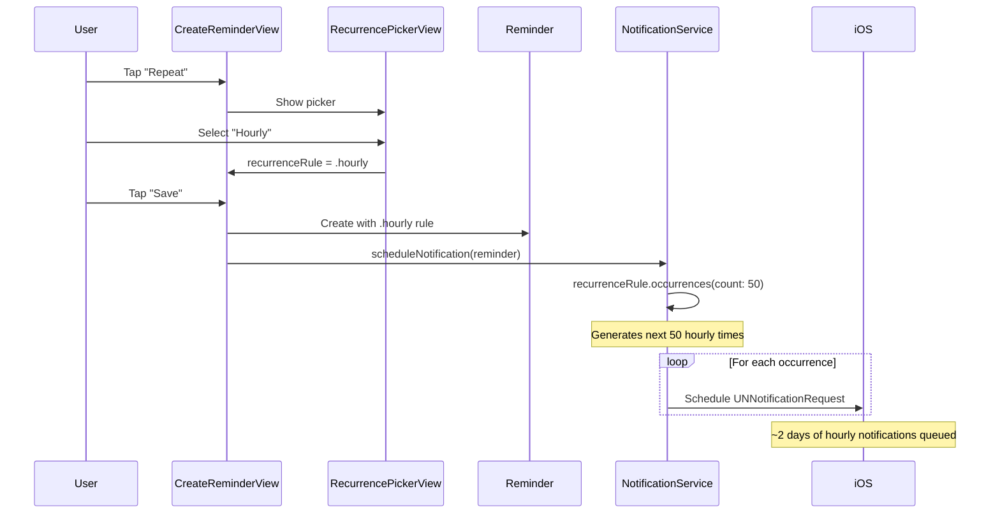

# feat: Hourly Recurrence Support

**Date:** 2026-01-23
**Status:** Ready for Implementation
**Type:** Enhancement
**Priority:** High (challenge requirement from Mrwhosetheboss transcript)

---

## Overview

Add hourly recurrence to Memoss, completing the recurring reminders feature set. The transcript specifically mentions "even hourly" as a required recurrence pattern.

**Core functionality:**
- New `case hourly` in `RecurrenceRule` enum
- Hourly option in `RecurrencePickerView` UI
- Automatic notification scheduling (up to 50 occurrences = ~2 days of hourly reminders)

---

## Problem Statement / Motivation

The challenge transcript states:
> "Most of my tasks repeat weekly, every few days, every few months, **even hourly**. I need recurring tasks and I need full control of them."

**Current state:**
- Daily, Weekly, Monthly recurrence implemented
- No hourly option

**Desired state:**
- Hourly recurrence available alongside other options
- Seamlessly integrates with existing recurrence system

---

## Architecture Flow



---

## Technical Approach

### Why Simple `case hourly` (No Interval Parameter)

| Approach | Complexity | Use Case Coverage | Decision |
|----------|-----------|------------------|----------|
| `case hourly` | Low | Every hour | **Selected** |
| `case hourly(interval: Int)` | Medium | Every N hours | Future enhancement |
| `case hourly(startHour: Int, endHour: Int)` | High | Work hours only | Over-engineering |

**Rationale:** Start simple. "Every hour" covers the stated requirement. "Every N hours" can be added later if users request it.

### iOS Notification Limit Consideration

- iOS caps pending notifications at **64 per app**
- Current implementation schedules up to **50 occurrences** (buffer below limit)
- Hourly: 50 notifications = ~2 days coverage
- App refresh on foreground can reschedule more if needed (already implemented for other recurrence types)

### Files to Modify

| File | Change Type | Description |
|------|-------------|-------------|
| `Memoss/Models/RecurrenceRule.swift` | Modify | Add `case hourly` + all computed properties |
| `Memoss/Components/RecurrencePickerView.swift` | Modify | Add hourly row to picker UI |

**No changes needed:**
- `Reminder.swift` - Codable handles new enum case automatically
- `NotificationService.swift` - Uses generic `occurrences()` method
- `CreateReminderView.swift` / `EditReminderView.swift` - Use `RecurrencePickerView`

---

## Implementation Phases

| Phase | Title | Dependencies | Effort |
|-------|-------|--------------|--------|
| 1 | Add hourly case to RecurrenceRule | None | Small |
| 2 | Add hourly option to RecurrencePickerView | Phase 1 | Small |
| 3 | Testing & Validation | Phase 2 | Small |

**Total: Single PR** - This is a small, focused change.

---

### Phase 1: Add Hourly Case to RecurrenceRule

**Goal:** Extend the `RecurrenceRule` enum with hourly support.

**File:** `Memoss/Models/RecurrenceRule.swift`

#### 1.1 Add New Case (line 14)

```swift
// Memoss/Models/RecurrenceRule.swift:10-15
enum RecurrenceRule: Codable, Equatable, Hashable {
    case none
    case daily
    case hourly          // ADD THIS LINE
    case weekly(weekday: Int)
    case monthly(day: Int)
```

#### 1.2 Update displayName (after line 23)

```swift
// In displayName computed property
case .hourly:
    return "Hourly"
```

#### 1.3 Update shortDisplayName (after line 38)

```swift
// In shortDisplayName computed property
case .hourly: return "Hourly"
```

#### 1.4 Update icon (after line 47)

```swift
// In icon computed property
case .hourly: return "clock.fill"
```

#### 1.5 Update nextOccurrence (after line 64)

```swift
// In nextOccurrence(after:) method, after case .daily
case .hourly:
    return calendar.date(byAdding: .hour, value: 1, to: date)
```

**Acceptance Criteria:**
- [ ] New `case hourly` compiles without errors
- [ ] `displayName` returns "Hourly"
- [ ] `shortDisplayName` returns "Hourly"
- [ ] `icon` returns "clock.fill"
- [ ] `nextOccurrence(after:)` returns date + 1 hour
- [ ] `occurrences(startingFrom:count:)` generates correct hourly sequence

---

### Phase 2: Add Hourly Option to RecurrencePickerView

**Goal:** Add hourly selection row in the recurrence picker UI.

**File:** `Memoss/Components/RecurrencePickerView.swift`

#### 2.1 Add Hourly Row (after line 54)

```swift
// In body, after the daily option
Divider().padding(.leading, 52)
recurrenceOption(.hourly, label: "Hourly", icon: "clock.fill")
```

**Full context (lines 51-60):**
```swift
VStack(spacing: 0) {
    recurrenceOption(.none, label: "Never", icon: "arrow.forward")
    Divider().padding(.leading, 52)
    recurrenceOption(.daily, label: "Daily", icon: "sunrise.fill")
    Divider().padding(.leading, 52)
    recurrenceOption(.hourly, label: "Hourly", icon: "clock.fill")  // NEW
    Divider().padding(.leading, 52)
    recurrenceOption(.weekly(weekday: weekday), label: "Weekly on \(weekdayName)", icon: "calendar.badge.clock")
    Divider().padding(.leading, 52)
    recurrenceOption(.monthly(day: dayOfMonth), label: "Monthly on the \(dayOfMonth)\(daySuffix(dayOfMonth))", icon: "calendar")
}
```

#### 2.2 Add Preview (optional, at end of file)

```swift
#Preview("Hourly Selected") {
    RecurrencePickerView(
        recurrenceRule: .constant(.hourly),
        endDate: .constant(nil),
        scheduledDate: .now
    )
    .padding()
    .background(MemossColors.backgroundStart)
}
```

**Acceptance Criteria:**
- [ ] Hourly option appears between Daily and Weekly
- [ ] Clock icon displays correctly
- [ ] Selecting Hourly updates `recurrenceRule` binding
- [ ] End date toggle appears when Hourly is selected
- [ ] UI matches existing option styling

---

### Phase 3: Testing & Validation

**Goal:** Verify hourly recurrence works end-to-end.

#### Manual Test Cases

| Test | Steps | Expected Result |
|------|-------|-----------------|
| Create hourly reminder | Create reminder → Select Hourly → Save | Reminder saved with hourly recurrence |
| Verify notification scheduling | Create hourly reminder → Check notification settings | Multiple notifications scheduled 1 hour apart |
| Verify next occurrence | Wait for notification → Mark complete | Next notification 1 hour later |
| Edit hourly reminder | Edit existing hourly reminder → Change to Daily | Recurrence updates correctly |
| End date with hourly | Create hourly with end date 24h away | ~24 notifications scheduled, stops at end date |

#### Unit Test Cases

```swift
// RecurrenceRuleTests.swift

func test_hourly_displayName() {
    XCTAssertEqual(RecurrenceRule.hourly.displayName, "Hourly")
}

func test_hourly_shortDisplayName() {
    XCTAssertEqual(RecurrenceRule.hourly.shortDisplayName, "Hourly")
}

func test_hourly_icon() {
    XCTAssertEqual(RecurrenceRule.hourly.icon, "clock.fill")
}

func test_hourly_nextOccurrence() {
    let now = Date()
    let next = RecurrenceRule.hourly.nextOccurrence(after: now)

    XCTAssertNotNil(next)
    let interval = next!.timeIntervalSince(now)
    XCTAssertEqual(interval, 3600, accuracy: 1) // 1 hour = 3600 seconds
}

func test_hourly_occurrences_generates_correct_count() {
    let start = Date()
    let occurrences = RecurrenceRule.hourly.occurrences(startingFrom: start, count: 5)

    XCTAssertEqual(occurrences.count, 5)

    // Verify each is 1 hour apart
    for i in 1..<occurrences.count {
        let interval = occurrences[i].timeIntervalSince(occurrences[i-1])
        XCTAssertEqual(interval, 3600, accuracy: 1)
    }
}

func test_hourly_occurrences_respects_end_date() {
    let start = Date()
    let endDate = Calendar.current.date(byAdding: .hour, value: 3, to: start)!

    var occurrences = RecurrenceRule.hourly.occurrences(startingFrom: start, count: 50)
    occurrences = occurrences.filter { $0 <= endDate }

    XCTAssertLessThanOrEqual(occurrences.count, 4) // At most 4 occurrences in 3 hours
}
```

---

## Acceptance Criteria Summary

### AC1: Hourly Option in Picker
**Given** user opens recurrence picker
**When** viewing available options
**Then** "Hourly" appears between Daily and Weekly with clock icon

### AC2: Hourly Recurrence Saves Correctly
**Given** user creates reminder with Hourly recurrence
**When** reminder is saved
**Then** reminder persists with hourly recurrence rule

### AC3: Hourly Notifications Schedule Correctly
**Given** reminder with hourly recurrence
**When** notification service schedules notifications
**Then** up to 50 notifications are scheduled, each 1 hour apart

### AC4: Hourly Advances Correctly
**Given** hourly reminder notification fires
**When** user marks complete or snoozes
**Then** next occurrence is 1 hour after current

### AC5: End Date Works with Hourly
**Given** hourly reminder with end date
**When** scheduling notifications
**Then** no notifications scheduled past end date

---

## Risk Analysis & Mitigation

| Risk | Impact | Probability | Mitigation |
|------|--------|-------------|------------|
| 50 notifications = only ~2 days | Low | Certain | Acceptable - app refreshes on foreground |
| User expects "every N hours" | Low | Medium | Document as "every hour"; add interval later if needed |
| Codable migration issue | Low | Low | New enum case is additive, backward compatible |

---

## Future Enhancements (Out of Scope)

These are NOT part of this feature but could be added later:

1. **Every N Hours**: `case hourly(interval: Int)` - "Every 2 hours", "Every 4 hours"
2. **Active Hours Only**: "Hourly between 9am-5pm" (skip overnight)
3. **Smart Rescheduling**: Use repeating triggers for simple hourly (saves notification slots)

---

## References

### Apple Documentation
- [UNTimeIntervalNotificationTrigger](https://developer.apple.com/documentation/usernotifications/untimeintervalnotificationtrigger)
- [Calendar date operations](https://developer.apple.com/documentation/foundation/calendar)

### Internal References
- `Memoss/Models/RecurrenceRule.swift:10-14` - Current enum cases
- `Memoss/Models/RecurrenceRule.swift:56-130` - nextOccurrence implementation
- `Memoss/Components/RecurrencePickerView.swift:51-59` - Current picker options
- `Memoss/Services/NotificationService.swift:88-104` - Recurring notification scheduling

### Related Plans
- `plans/feat-recurring-reminders.md` - Original recurrence implementation

---

## Checklist

### Phase 1: RecurrenceRule
- [ ] Add `case hourly` to enum (between daily and weekly)
- [ ] Add `displayName` case returning "Hourly"
- [ ] Add `shortDisplayName` case returning "Hourly"
- [ ] Add `icon` case returning "clock.fill"
- [ ] Add `nextOccurrence` case using `byAdding: .hour, value: 1`
- [ ] App builds without errors

### Phase 2: RecurrencePickerView
- [ ] Add hourly row after daily in picker
- [ ] Icon displays correctly
- [ ] Selection works and updates binding
- [ ] End date toggle appears when hourly selected
- [ ] Add preview for hourly state

### Phase 3: Testing
- [ ] Manual test: create hourly reminder
- [ ] Manual test: verify notifications scheduled
- [ ] Manual test: verify next occurrence timing
- [ ] Manual test: end date limits notifications
- [ ] Unit tests pass (if added)

---

*Plan created: 2026-01-23*
*Estimated effort: Small (single PR)*
*Approach: Simple `case hourly` following existing patterns*
