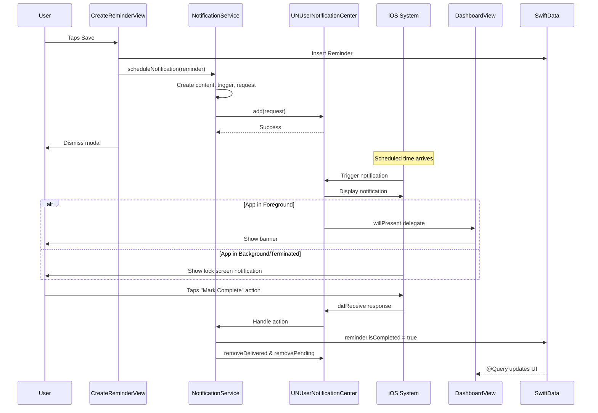

# feat: Implement Local Notifications

**Date:** 2026-01-22
**Status:** Implemented
**Type:** Enhancement
**Priority:** Critical Path (completes the reminder lifecycle)

---

## Overview

Implement local push notifications that fire when a reminder's scheduled time arrives. This is the most critical missing feature - without notifications, the reminder app doesn't fulfill its core purpose.

**Core functionality:**
- Schedule notification when creating a reminder
- Cancel notification when completing/deleting a reminder
- Re-schedule notification when uncompleting a reminder
- Handle notification actions (Mark Complete, Snooze)
- Display notifications appropriately in all app states

---

## Problem Statement / Motivation

Users can create reminders with scheduled times, but there's **no actual reminder** - no notification fires at the scheduled time. The notification permission is already requested during onboarding (`OnboardingView.swift:565-607`), but never used.

**Current state:**
- User creates reminder scheduled for 9:00 AM
- 9:00 AM arrives - nothing happens
- User must manually check the app

**Desired state:**
- User creates reminder scheduled for 9:00 AM
- At 9:00 AM, phone buzzes with notification: "Water the plants"
- User can tap notification to open app, or use quick actions to Complete/Snooze

---

## Architecture Flow



---

## Technical Approach

### Notification Service Architecture

Create a centralized `NotificationService` to encapsulate all notification logic:

```swift
// Services/NotificationService.swift
import UserNotifications

@MainActor
final class NotificationService {
    static let shared = NotificationService()

    // MARK: - Category Registration
    func registerCategories()

    // MARK: - Scheduling
    func scheduleNotification(for reminder: Reminder) async
    func cancelNotification(for reminder: Reminder)
    func cancelDeliveredNotification(for reminder: Reminder)

    // MARK: - Snooze
    func snoozeNotification(reminderId: String, duration: TimeInterval) async

    // MARK: - Permission
    func checkAuthorizationStatus() async -> UNAuthorizationStatus
}
```

### Notification Categories & Actions

```swift
enum NotificationCategory: String {
    case reminder = "REMINDER_CATEGORY"
}

enum NotificationAction: String {
    case markComplete = "MARK_COMPLETE_ACTION"
    case snooze = "SNOOZE_ACTION"
}
```

**Action Buttons:**
- **Mark Complete** - Marks reminder as complete, removes notification
- **Snooze** - Reschedules notification for 15 minutes later (does not update reminder.scheduledDate)

### Notification Content Format

| Field | Value | Example |
|-------|-------|---------|
| Title | "Memoss" | "Memoss" |
| Body | `reminder.title` | "Water the plants" |
| Sound | System default | `.default` |
| Badge | Not managed | N/A |
| Category | `REMINDER_CATEGORY` | Enables actions |

### Notification Identifier Strategy

Use `reminder.id.uuidString` as the notification identifier:
- Guaranteed unique per reminder
- Enables precise cancellation
- Survives app restarts (SwiftData persists UUID)

### iOS 64 Notification Limit

iOS restricts apps to 64 pending local notifications at any time. For MVP, this is acceptable since most users won't have 64+ future reminders. If needed later:
- Schedule only the 64 soonest notifications
- Store overflow reminders in SwiftData with `notificationScheduled: Bool` flag
- Re-sync on app launch by calling `removeAllPendingNotificationRequests()` then re-scheduling the 64 nearest
(See: [Todoist's notification scheduler implementation](https://www.doist.dev/implementing-a-local-notification-scheduler-in-todoist-ios/))

```swift
let request = UNNotificationRequest(
    identifier: reminder.id.uuidString,  // e.g., "550e8400-e29b-41d4-a716-446655440000"
    content: content,
    trigger: trigger
)
```

### File Structure

```
Memoss/
├── MemossApp.swift                              # MODIFY: Add delegate setup, share ModelContainer
├── Services/                                    # CREATE: New directory
│   └── NotificationService.swift                # CREATE: Notification scheduling
├── Features/
│   ├── CreateReminder/
│   │   └── CreateReminderView.swift             # MODIFY: Schedule on save
│   └── Dashboard/
│       └── DashboardView.swift                  # MODIFY: Cancel on complete
└── Extensions/
    └── AppDelegate+Notifications.swift          # CREATE: UNUserNotificationCenterDelegate
```

**Note:** The `Services/` directory does not exist and must be created.

---

## Implementation Phases

| Phase | Title | Dependencies | Status |
|-------|-------|--------------|--------|
| 1 | NotificationService + Scheduling | None | ✅ COMPLETED |
| 2 | Completion Cancellation | Phase 1 | ✅ COMPLETED |
| 3 | Notification Actions | Phase 2 | ✅ COMPLETED |
| 4 | Edge Cases & Polish | Phase 3 | ✅ COMPLETED |

---

### Phase 1: NotificationService + Scheduling

**Goal:** When user saves a reminder, schedule a notification that fires at the scheduled time.

**Files to create:**
- `Memoss/Services/NotificationService.swift`

**Files to modify:**
- `Memoss/Features/CreateReminder/CreateReminderView.swift` - Call NotificationService on save

#### NotificationService.swift

```swift
// Memoss/Services/NotificationService.swift
import UserNotifications
import Foundation

@MainActor
final class NotificationService {
    static let shared = NotificationService()

    private init() {}

    // MARK: - Scheduling

    /// Schedule a notification for the given reminder
    /// - Parameter reminder: The reminder to schedule a notification for
    func scheduleNotification(for reminder: Reminder) async {
        // Skip if scheduled date is in the past
        guard reminder.scheduledDate > Date.now else { return }

        let content = UNMutableNotificationContent()
        content.title = "Memoss"
        content.body = reminder.title
        content.sound = .default
        content.categoryIdentifier = NotificationCategory.reminder.rawValue
        content.userInfo = ["reminderTitle": reminder.title]  // Preserve title for snooze

        let calendar = Calendar.current
        let components = calendar.dateComponents(
            [.year, .month, .day, .hour, .minute],
            from: reminder.scheduledDate
        )
        let trigger = UNCalendarNotificationTrigger(dateMatching: components, repeats: false)

        let request = UNNotificationRequest(
            identifier: reminder.id.uuidString,
            content: content,
            trigger: trigger
        )

        do {
            try await UNUserNotificationCenter.current().add(request)
        } catch {
            // Notification scheduling failed - reminder still saved
            // Could log error for debugging
        }
    }

    /// Cancel a pending notification for the given reminder
    /// - Parameter reminder: The reminder whose notification should be cancelled
    func cancelNotification(for reminder: Reminder) {
        UNUserNotificationCenter.current().removePendingNotificationRequests(
            withIdentifiers: [reminder.id.uuidString]
        )
    }

    /// Cancel a delivered (shown) notification for the given reminder
    /// - Parameter reminder: The reminder whose notification should be removed from Notification Center
    func cancelDeliveredNotification(for reminder: Reminder) {
        UNUserNotificationCenter.current().removeDeliveredNotifications(
            withIdentifiers: [reminder.id.uuidString]
        )
    }
}

// MARK: - Constants

enum NotificationCategory: String {
    case reminder = "REMINDER_CATEGORY"
}

enum NotificationAction: String {
    case markComplete = "MARK_COMPLETE_ACTION"
    case snooze = "SNOOZE_ACTION"
}
```

#### CreateReminderView.swift Changes

```swift
// In saveReminder() function, after modelContext.insert(reminder):
private func saveReminder() {
    hasAttemptedSave = true
    guard isTitleValid else { return }

    let reminder = Reminder(
        title: title.trimmingCharacters(in: .whitespaces),
        scheduledDate: scheduledDate
    )

    modelContext.insert(reminder)

    // Schedule notification then dismiss (await ensures scheduling completes)
    Task {
        await NotificationService.shared.scheduleNotification(for: reminder)
        await MainActor.run {
            UIImpactFeedbackGenerator(style: .light).impactOccurred()
            dismiss()
        }
    }
}
```

**Note:** `UNCalendarNotificationTrigger` uses DateComponents to match the exact time. The trigger respects the device's current timezone - if the user travels, notifications fire at the original local time in the new timezone. For a reminder app, this is typically the desired behavior (a 9 AM reminder should always fire at 9 AM local time).

**Acceptance Criteria:**
- [ ] NotificationService.swift created with scheduleNotification method
- [ ] CreateReminderView calls scheduleNotification after insert
- [ ] Notifications scheduled with reminder UUID as identifier
- [ ] Notifications use UNCalendarNotificationTrigger for exact time
- [ ] Past dates are gracefully skipped (no notification scheduled)
- [ ] Notification content shows "Memoss" title and reminder.title body

**Validation Steps:**
1. Create reminder for 2 minutes from now
2. Wait for scheduled time
3. Verify notification appears on device
4. Verify notification content is correct

---

### Phase 2: Completion Cancellation

**Goal:** When user marks a reminder as complete, cancel any pending notification.

**Files to modify:**
- `Memoss/Features/Dashboard/DashboardView.swift` - Cancel notification on toggle

#### DashboardView.swift Changes

```swift
private func toggleCompletion(_ reminder: Reminder) {
    withAnimation(.spring(response: 0.3, dampingFraction: 0.8)) {
        reminder.isCompleted.toggle()
    }

    if reminder.isCompleted {
        // Cancel pending and remove delivered notifications
        NotificationService.shared.cancelNotification(for: reminder)
        NotificationService.shared.cancelDeliveredNotification(for: reminder)
    } else {
        // Re-schedule notification if uncompleting and date is in future
        Task {
            await NotificationService.shared.scheduleNotification(for: reminder)
        }
    }
}
```

**Acceptance Criteria:**
- [ ] Completing a reminder cancels its pending notification
- [ ] Completing a reminder removes it from Notification Center if already delivered
- [ ] Uncompleting a reminder re-schedules notification (if future date)
- [ ] Uncompleting a reminder with past date does NOT schedule notification

**Validation Steps:**
1. Create reminder for 5 minutes from now
2. Complete the reminder before time arrives
3. Wait past the scheduled time - verify no notification
4. Uncomplete the reminder
5. If still future, verify notification is re-scheduled

---

### Phase 3: Notification Actions

**Goal:** Add "Mark Complete" and "Snooze" action buttons to notifications.

Notification actions are buttons that appear below a notification when users long-press or expand it. Actions can run code silently in the background (like "Mark Complete") or open the app to the foreground. This makes actions perfect for lightweight interactions without disrupting the user.
(See: [Custom notification actions in SwiftUI](https://tanaschita.com/ios-notifications-custom-actions/))

**Files to create:**
- `Memoss/Extensions/AppDelegate+Notifications.swift`

**Files to modify:**
- `Memoss/MemossApp.swift` - Set up notification delegate
- `Memoss/Services/NotificationService.swift` - Add category registration and snooze

**Note:** The delegate must be set in `didFinishLaunchingWithOptions` (not later) to ensure the app receives notification responses even when launched from a terminated state. Categories must also be registered before any notifications are scheduled.

#### AppDelegate+Notifications.swift

```swift
// Memoss/Extensions/AppDelegate+Notifications.swift
import SwiftUI
import UserNotifications
import SwiftData

class AppDelegate: NSObject, UIApplicationDelegate, UNUserNotificationCenterDelegate {

    /// Shared ModelContainer - set by MemossApp on launch
    var modelContainer: ModelContainer?

    func application(
        _ application: UIApplication,
        didFinishLaunchingWithOptions launchOptions: [UIApplication.LaunchOptionsKey: Any]? = nil
    ) -> Bool {
        UNUserNotificationCenter.current().delegate = self
        NotificationService.shared.registerCategories()
        return true
    }

    // MARK: - UNUserNotificationCenterDelegate

    /// Handle notification when app is in foreground - show banner
    func userNotificationCenter(
        _ center: UNUserNotificationCenter,
        willPresent notification: UNNotification,
        withCompletionHandler completionHandler: @escaping (UNNotificationPresentationOptions) -> Void
    ) {
        completionHandler([.banner, .sound])
    }

    /// Handle notification tap or action button
    func userNotificationCenter(
        _ center: UNUserNotificationCenter,
        didReceive response: UNNotificationResponse,
        withCompletionHandler completionHandler: @escaping () -> Void
    ) {
        let reminderId = response.notification.request.identifier

        Task { @MainActor in
            switch response.actionIdentifier {
            case NotificationAction.markComplete.rawValue:
                await handleMarkComplete(reminderId: reminderId)
            case NotificationAction.snooze.rawValue:
                handleSnooze(response: response)
            case UNNotificationDefaultActionIdentifier:
                // User tapped notification body - app opens to dashboard
                break
            default:
                break
            }
            completionHandler()
        }
    }

    // MARK: - Action Handlers

    @MainActor
    private func handleMarkComplete(reminderId: String) async {
        guard let uuid = UUID(uuidString: reminderId),
              let context = modelContainer?.mainContext,
              let reminder = try? context.fetch(
                FetchDescriptor<Reminder>(predicate: #Predicate { $0.id == uuid })
              ).first else {
            return
        }

        reminder.isCompleted = true
        // SwiftData auto-saves, no explicit save needed

        // Remove from notification center
        UNUserNotificationCenter.current().removeDeliveredNotifications(withIdentifiers: [reminderId])
    }

    private func handleSnooze(response: UNNotificationResponse) {
        Task {
            await NotificationService.shared.snoozeNotification(
                from: response,
                duration: 15 * 60  // 15 minutes
            )
        }
    }
}
```

#### NotificationService.swift - Add Category Registration

```swift
// Add to NotificationService class:

/// Register notification categories with action buttons
func registerCategories() {
    let markCompleteAction = UNNotificationAction(
        identifier: NotificationAction.markComplete.rawValue,
        title: "Mark Complete",
        options: [.destructive]
    )

    let snoozeAction = UNNotificationAction(
        identifier: NotificationAction.snooze.rawValue,
        title: "Snooze (15 min)",
        options: []
    )

    let category = UNNotificationCategory(
        identifier: NotificationCategory.reminder.rawValue,
        actions: [markCompleteAction, snoozeAction],
        intentIdentifiers: [],
        options: .customDismissAction
    )

    UNUserNotificationCenter.current().setNotificationCategories([category])
}

/// Snooze a notification by rescheduling it
/// - Parameters:
///   - response: The notification response containing original content with userInfo
///   - duration: How long to snooze (in seconds)
func snoozeNotification(from response: UNNotificationResponse, duration: TimeInterval) async {
    let originalContent = response.notification.request.content
    let reminderId = response.notification.request.identifier

    // Remove the delivered notification
    UNUserNotificationCenter.current().removeDeliveredNotifications(withIdentifiers: [reminderId])

    // Get original title from userInfo (stored when notification was first scheduled)
    let reminderTitle = originalContent.userInfo["reminderTitle"] as? String ?? originalContent.body

    // Schedule new notification with preserved title
    let content = UNMutableNotificationContent()
    content.title = "Memoss"
    content.body = reminderTitle
    content.sound = .default
    content.categoryIdentifier = NotificationCategory.reminder.rawValue
    content.userInfo = ["reminderTitle": reminderTitle]  // Preserve for subsequent snoozes

    let trigger = UNTimeIntervalNotificationTrigger(timeInterval: duration, repeats: false)

    // Use same identifier so cancel still works
    let request = UNNotificationRequest(
        identifier: reminderId,
        content: content,
        trigger: trigger
    )

    try? await UNUserNotificationCenter.current().add(request)
}
```

#### MemossApp.swift Changes

```swift
@main
struct MemossApp: App {
    @UIApplicationDelegateAdaptor(AppDelegate.self) var appDelegate
    @AppStorage("hasCompletedOnboarding") private var hasCompletedOnboarding = false

    let modelContainer: ModelContainer

    init() {
        do {
            modelContainer = try ModelContainer(for: Reminder.self)
        } catch {
            fatalError("Failed to create ModelContainer: \(error)")
        }
    }

    var body: some Scene {
        WindowGroup {
            if hasCompletedOnboarding {
                DashboardView()
            } else {
                OnboardingView()
            }
        }
        .modelContainer(modelContainer)
        .onAppear {
            // Share the container with AppDelegate for notification action handling
            appDelegate.modelContainer = modelContainer
        }
    }
}
```

**Acceptance Criteria:**
- [ ] Notification delegate set up in AppDelegate (in `didFinishLaunchingWithOptions`, not later)
- [ ] Categories registered on app launch before any notifications scheduled
- [ ] "Mark Complete" action marks reminder as complete in SwiftData (runs in background)
- [ ] "Snooze" action reschedules notification for 15 minutes using `UNTimeIntervalNotificationTrigger`
- [ ] Snooze does NOT update reminder.scheduledDate (keeps original)
- [ ] App shows notification banner when in foreground via `willPresent` delegate
- [ ] Tapping notification body opens app to dashboard (default action)

**Validation Steps:**
1. Create reminder for 1 minute from now
2. When notification appears, long-press to see actions
3. Verify "Mark Complete" and "Snooze (15 min)" buttons appear
4. Tap "Snooze" - verify notification fires again in 15 minutes
5. When it fires again, tap "Mark Complete"
6. Open app - verify reminder is marked complete
7. Test with app in foreground - verify banner appears
8. Test action from terminated state - force quit app, let notification fire, tap action, verify it works

---

### Phase 4: Edge Cases & Polish

**Goal:** Handle edge cases and improve robustness.

**Files to modify:**
- None required (snooze title preservation handled in Phase 3 via userInfo)

#### Edge Cases Already Handled

1. **Past dates:** `scheduleNotification` already has `guard reminder.scheduledDate > Date.now else { return }` - notifications silently skipped for past dates
2. **Snooze title preservation:** Handled in Phase 3 via userInfo pattern - no SwiftData access needed
3. **Scheduling failures:** `try?` in scheduleNotification gracefully ignores errors

#### Timezone & DST Behavior

`UNCalendarNotificationTrigger` with DateComponents uses the device's current timezone. Key behaviors:
- **User travels:** Notification fires at the same local time in the new timezone (8 AM in NYC → 8 AM in LA). This is typically desired for personal reminders.
- **DST transition:** iOS handles DST automatically when matching components. "8 AM is 8 AM" regardless of PDT/PST.
- **For timezone-absolute scheduling** (e.g., meeting reminders): Set `components.timeZone = TimeZone(identifier: "UTC")` explicitly. Not needed for Memoss MVP.
(See: [Apple Developer Forums - Timezone scheduling](https://developer.apple.com/forums/thread/63346))

#### Optional: Permission Status Check

Add permission status awareness to dashboard (visual indicator when notifications disabled). This follows Apple's 2026 guidance to "request permissions contextually and show users the value before asking."

```swift
// Optional: In DashboardView, show indicator if notifications disabled
@State private var notificationsEnabled = true

var body: some View {
    // ... existing content ...
    .task {
        let settings = await UNUserNotificationCenter.current().notificationSettings()
        notificationsEnabled = settings.authorizationStatus == .authorized
    }
}
```

**Note:** If user denies permission, the app should still function - reminders save normally, notifications are just silently skipped. Consider showing a subtle banner linking to Settings if `authorizationStatus == .denied`.

**Acceptance Criteria:**
- [ ] Past date reminders saved but notification not scheduled
- [ ] Snooze notification shows original reminder title (verified via userInfo)
- [ ] App gracefully handles notification scheduling failures
- [ ] SwiftData updates reflect immediately in UI after action button press

**Validation Steps:**
1. Create reminder with time in past - verify saved but no notification
2. Create reminder, let it fire, snooze it - verify snoozed notification shows correct title
3. Snooze again - verify title still correct (userInfo preserved)
4. Turn off notification permissions in Settings
5. Create reminder - verify no crash
6. Turn permissions back on - new reminders schedule correctly

---

## Alternative Approaches Considered

### Notification Delegate Setup

| Approach | Pros | Cons | Decision |
|----------|------|------|----------|
| **AppDelegate via @UIApplicationDelegateAdaptor** | Standard pattern, well-documented | Requires UIKit class | **Selected** |
| Singleton handler | Pure Swift | Less control over lifecycle | Rejected |
| SwiftUI App.init | No UIKit | Delegate can't be set early enough | Rejected |

### Snooze Data Model

| Approach | Pros | Cons | Decision |
|----------|------|------|----------|
| **Keep original scheduledDate, transient snooze** | Original intent preserved | Dashboard shows "wrong" time | **Selected** |
| Update scheduledDate on snooze | UI shows snooze time | Original schedule lost | Rejected |
| Separate snoozeUntil field | Both preserved | Model complexity | Consider v2 |

### Notification Identifier

| Approach | Pros | Cons | Decision |
|----------|------|------|----------|
| **reminder.id.uuidString** | Unique, persistent, simple | None | **Selected** |
| Hashed identifier | Shorter | Collision risk | Rejected |
| Auto-generated | Simple | Can't cancel precisely | Rejected |

---

## Success Metrics

| Metric | Target | Measurement |
|--------|--------|-------------|
| Notification delivery rate | 100% for future dates | Manual testing |
| Action response latency | < 500ms | Perceived performance |
| Cancellation accuracy | 100% | Verify cancelled notifications don't fire |
| Foreground banner display | 100% | Test while app open |

---

## Dependencies & Prerequisites

### Technical Dependencies
- UserNotifications framework (built into iOS)
- Existing notification permission (requested during onboarding)
- SwiftData model context access for action handlers

### Feature Dependencies
- Onboarding complete (permissions granted)
- Reminder model exists with id, title, scheduledDate fields
- CreateReminderView and DashboardView functional

### No External Dependencies
- Uses only native iOS frameworks

---

## Risk Analysis & Mitigation

| Risk | Impact | Probability | Mitigation |
|------|--------|-------------|------------|
| User denies notification permission | High | Medium | Allow reminder creation, just skip notification |
| SwiftData access race in action handler | Medium | Low | Use @MainActor, proper async/await |
| 64 notification limit hit | Low | Low | Schedule chronologically, document limit |
| DST/timezone edge cases | Medium | Low | Use UNCalendarNotificationTrigger with explicit components |
| Notification fires while app deleted | Low | Very Low | User expectation issue only |

---

## Unit Test Plan

### NotificationService Tests

| Test Name | Scenario | Expected | Priority |
|-----------|----------|----------|----------|
| `test_scheduleNotification_futureDate` | Schedule for future | Notification added to UNCenter | P1 |
| `test_scheduleNotification_pastDate` | Schedule for past | No notification added | P1 |
| `test_cancelNotification` | Cancel existing | Notification removed from pending | P1 |
| `test_snoozeNotification` | Snooze by 15 min | New notification scheduled | P1 |
| `test_registerCategories` | Register on launch | Categories set | P1 |

### Integration Tests

| Test Name | Scenario | Expected | Priority |
|-----------|----------|----------|----------|
| `test_createReminder_schedulesNotification` | Save reminder | Notification exists in pending | P1 |
| `test_completeReminder_cancelsNotification` | Toggle to complete | Notification cancelled | P1 |
| `test_uncompleteReminder_reschedulesNotification` | Toggle back | Notification re-added (if future) | P1 |
| `test_markCompleteAction_updatesSwiftData` | Action button | Reminder.isCompleted = true | P1 |

---

## References & Research

### Internal References
- `Memoss/Features/Onboarding/OnboardingView.swift:565-607` - Permission request code
- `Memoss/Models/Reminder.swift:12-23` - Model with id, title, scheduledDate
- `Memoss/Features/CreateReminder/CreateReminderView.swift:187-199` - saveReminder() function
- `Memoss/Features/Dashboard/DashboardView.swift:95-99` - toggleCompletion() function
- `Memoss/MemossApp.swift:11-25` - App entry point

### External References
- [Apple: UNUserNotificationCenter](https://developer.apple.com/documentation/usernotifications/unusernotificationcenter)
- [Apple: UNCalendarNotificationTrigger](https://developer.apple.com/documentation/usernotifications/uncalendarnotificationtrigger)
- [Apple: Declaring Actionable Notification Types](https://developer.apple.com/documentation/usernotifications/declaring-your-actionable-notification-types)
- [Hacking with Swift: Scheduling Local Notifications](https://www.hackingwithswift.com/books/ios-swiftui/scheduling-local-notifications)

### Best Practices Applied (iOS 2026)
- Use `@MainActor` for notification service (SwiftData access)
- Use `UNCalendarNotificationTrigger` for precise time-based scheduling (not `UNTimeIntervalNotificationTrigger` which is relative)
- Use reminder UUID as notification identifier for reliable cancellation
- Register categories on app launch in `didFinishLaunchingWithOptions` before any notifications are scheduled
- Set delegate early (in `didFinishLaunchingWithOptions`) to receive responses even when app launches from terminated state
- Handle foreground notifications via `willPresent` delegate with `[.banner, .sound]` options
- Use async/await for modern Swift concurrency
- Respect the 64 pending notification limit - schedule chronologically
- Allow reminders to save even if notification scheduling fails (graceful degradation)
(See: [iOS Notifications 2026 Guide](https://medium.com/@thakurneeshu280/the-complete-guide-to-ios-notifications-from-basics-to-advanced-2026-edition-48cdcba8c18c))

---

## Open Questions (Resolved)

### Resolved for Implementation

1. **Notification identifier:** Use `reminder.id.uuidString`
2. **Past date handling:** Allow save, skip notification scheduling
3. **Snooze duration:** 15 minutes fixed
4. **Snooze data model:** Keep original scheduledDate, snooze is transient
5. **Foreground handling:** Show system banner with sound
6. **Notification content:** Title = "Memoss", Body = reminder.title
7. **Deep linking on tap:** Open to dashboard (no detail view yet)

### Decide During Implementation

8. **Permission denied indicator:** Add subtle badge on dashboard?
9. **Snooze limit:** Allow unlimited snoozing for MVP?

---

## Checklist

### Phase 1: NotificationService + Scheduling
- [ ] NotificationService.swift created
- [ ] scheduleNotification method implemented with UNCalendarNotificationTrigger
- [ ] cancelNotification and cancelDeliveredNotification methods implemented
- [ ] CreateReminderView calls scheduleNotification after save
- [ ] Past dates gracefully skipped

### Phase 2: Completion Cancellation
- [ ] toggleCompletion cancels notification when completing
- [ ] toggleCompletion re-schedules notification when uncompleting (future date only)
- [ ] Delivered notifications removed from Notification Center

### Phase 3: Notification Actions
- [ ] AppDelegate created with UNUserNotificationCenterDelegate
- [ ] Categories registered on app launch
- [ ] "Mark Complete" action marks reminder complete in SwiftData
- [ ] "Snooze" action reschedules notification for 15 minutes
- [ ] Foreground notifications show as banner

### Phase 4: Edge Cases & Polish
- [ ] Verify snooze shows original reminder title (via userInfo pattern from Phase 3)
- [ ] Verify scheduling failures handled gracefully
- [ ] Optional: Add permission status indicator to dashboard
- [ ] All acceptance criteria validated

---

*Plan created: 2026-01-22*
*Last updated: 2026-01-22*
