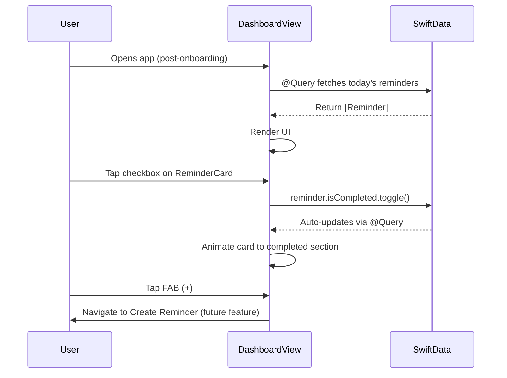
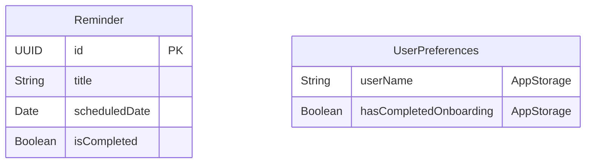

# feat: Implement Main Dashboard

**Date:** 2026-01-22
**Status:** Completed
**Type:** Enhancement
**Completed:** 2026-01-22

---

## Overview

Build the main dashboard view that users see after completing onboarding. This is the primary interface for the Memoss reminder app, replacing the current placeholder `ContentView.swift`.

The dashboard features:
- Personalized time-based greeting with animated mascot
- Horizontal scrollable date selector
- Task list organized by completion status
- Floating action button for adding reminders

---

## Problem Statement / Motivation

After completing onboarding, users currently see a placeholder "Hello, world!" screen (`ContentView.swift:10-20`). The app needs its core interface for viewing and managing reminders to be fully functional.

This is the most critical feature for the app's MVP - without it, users cannot interact with reminders.

---

## Architecture Flow



**Note:** Uses SwiftData's `@Query` directly in the view for reactive updates. No intermediate store layer needed for MVP.

---

## Technical Approach

### Data Model

Create a minimal `Reminder` model using SwiftData for MVP:

```swift
// Memoss/Models/Reminder.swift
import SwiftData
import Foundation

@Model
final class Reminder {
    var id: UUID
    var title: String
    var scheduledDate: Date
    var isCompleted: Bool

    init(title: String, scheduledDate: Date = .now, isCompleted: Bool = false) {
        self.id = UUID()
        self.title = title
        self.scheduledDate = scheduledDate
        self.isCompleted = isCompleted
    }
}
```

**Note:** Priority, recurrence, and tags are deferred to v1.1 after create/edit screens exist.

### User Profile

Store user name in `@AppStorage` for MVP simplicity:

```swift
// Access via: @AppStorage("userName") private var userName = ""
// Set during optional profile setup or remain empty for fallback greeting
```

### View Architecture

```
Features/Dashboard/
├── DashboardView.swift              # Main container view with @Query
├── Components/
│   ├── GreetingHeader.swift         # Time-based greeting + mascot placeholder
│   ├── ReminderCard.swift           # Task display card with checkbox
│   ├── FloatingActionButton.swift   # FAB for adding reminders
│   └── EmptyStateView.swift         # No reminders state
Models/
└── Reminder.swift                   # SwiftData model (4 fields only)
Extensions/
├── Color+Hex.swift                  # Existing hex extension
└── MemossColors.swift               # Shared color tokens
```

**Deferred to v1.1:** DateSelector, DatePill, MossMascot animation, DesignSystem folder

### Color System (Extract from OnboardingView.swift:14-23)

**Note:** Colors are defined in `OnboardingColors` enum at lines 14-23 of OnboardingView.swift.

```swift
// DesignSystem/MemossColors.swift
enum MemossColors {
    // Primary (Moss Green)
    static let brandPrimary = Color(hex: "#22C55E")      // primary.500
    static let brandPrimaryDark = Color(hex: "#16A34A")  // primary.600
    static let brandPrimaryLight = Color(hex: "#F0F9F4") // primary.50

    // Neutral
    static let backgroundStart = Color(hex: "#F9F7F3")   // neutral.100
    static let backgroundEnd = Color(hex: "#F0F9F4")     // primary.50
    static let textPrimary = Color(hex: "#252320")       // neutral.900
    static let textSecondary = Color(hex: "#A8A298")     // neutral.500
    static let cardBackground = Color(hex: "#FFFFFF")    // neutral.0
    static let cardBorder = Color(hex: "#F9F7F3")        // neutral.100

    // Accent
    static let accent = Color(hex: "#EAB308")            // accent.500

    // Semantic
    static let success = Color(hex: "#22C55E")
    static let warning = Color(hex: "#EAB308")
    static let error = Color(hex: "#F43F5E")
}
```

---

## Implementation Phases

| Phase | Title | Dependencies | Status |
|-------|-------|--------------|--------|
| 1 | Foundation (Data + Colors) | None | ✅ COMPLETED |
| 2 | Dashboard Shell + Greeting | Phase 1 | ✅ COMPLETED |
| 3 | Reminder Card + Task List | Phase 2 | ✅ COMPLETED |
| 4 | FAB + Polish | Phase 3 | ✅ COMPLETED |

### Phase 1: Foundation (Data + Colors) ✅ COMPLETED

**Goal:** Set up SwiftData with minimal model, extract shared color tokens

**Files to create:**
- `Memoss/Models/Reminder.swift` - SwiftData model (4 fields)
- `Memoss/Extensions/MemossColors.swift` - Shared colors

**Files to modify:**
- `Memoss/MemossApp.swift` - Add `.modelContainer(for: Reminder.self)`

**Acceptance Criteria:**
- [x] Reminder model compiles with id, title, scheduledDate, isCompleted
- [x] SwiftData container initializes without errors
- [x] MemossColors accessible throughout app

**Pseudo-code for MemossApp.swift:**
```swift
@main
struct MemossApp: App {
    @AppStorage("hasCompletedOnboarding") private var hasCompletedOnboarding = false

    var body: some Scene {
        WindowGroup {
            if hasCompletedOnboarding {
                DashboardView()
            } else {
                OnboardingView()
            }
        }
        .modelContainer(for: Reminder.self)
    }
}
```

---

### Phase 2: Dashboard Shell + Greeting ✅ COMPLETED

**Goal:** Replace ContentView with functional dashboard showing greeting and empty state

**Files to create:**
- `Memoss/Features/Dashboard/DashboardView.swift` - Main view with @Query
- `Memoss/Features/Dashboard/Components/GreetingHeader.swift` - Time-based greeting
- `Memoss/Features/Dashboard/Components/EmptyStateView.swift` - No reminders state

**Files to modify:**
- `Memoss/MemossApp.swift` - Change ContentView() to DashboardView()

**Greeting Time Boundaries:**
| Time Range | Greeting |
|------------|----------|
| 5:00 AM - 11:59 AM | Good morning |
| 12:00 PM - 4:59 PM | Good afternoon |
| 5:00 PM - 8:59 PM | Good evening |
| 9:00 PM - 4:59 AM | Good night |

**Acceptance Criteria:**
- [x] Dashboard displays after onboarding (not "Hello, world!")
- [x] Background gradient renders correctly
- [x] Greeting changes based on current time
- [x] User name displays if set, fallback to "there" if empty
- [x] Empty state shows leaf icon and encouraging message

**Validation Steps:**
1. Complete onboarding flow
2. Verify dashboard appears with correct greeting
3. Verify empty state displays (no reminders yet)

---

### Phase 3: Reminder Card + Task List ✅ COMPLETED

**Goal:** Display reminders with completion toggle, grouped by status

**Files to create:**
- `Memoss/Features/Dashboard/Components/ReminderCard.swift` - Card with checkbox

**Files to modify:**
- `Memoss/Features/Dashboard/DashboardView.swift` - Add task sections

**Card Structure (MVP):**
```
┌─────────────────────────────────────────────────┐
│ [✓] Title of the reminder                       │
│     🕐 9:00 AM                                  │
└─────────────────────────────────────────────────┘
```

**Section Structure:**
```
🌿 Today's tasks
├── ReminderCard (incomplete)
└── ReminderCard (incomplete)

✓ Completed
└── ReminderCard (completed)
```

**Acceptance Criteria:**
- [x] ReminderCard displays title and time
- [x] Checkbox toggles completion with animation
- [x] Title shows strikethrough when completed
- [x] Incomplete and completed sections separate correctly
- [x] Completed section hidden when empty
- [x] Card has elevated shadow per design system

**Validation Steps:**
1. Add test reminders via SwiftData
2. Verify cards render correctly
3. Toggle completion, verify animation and section movement

---

### Phase 4: FAB + Polish ✅ COMPLETED

**Goal:** Add FAB and accessibility polish

**Files to create:**
- `Memoss/Features/Dashboard/Components/FloatingActionButton.swift`

**Files to modify:**
- `Memoss/Features/Dashboard/DashboardView.swift` - Add FAB overlay

**Acceptance Criteria:**
- [x] FAB renders in bottom-right corner
- [x] Plus icon with green background and shadow
- [x] Tap haptic feedback (light impact)
- [x] Press animation (scale down to 0.95)
- [x] All interactive elements have accessibility labels
- [x] Dynamic Type supported throughout
- [x] Minimum 44pt tap targets

**Validation Steps:**
1. View FAB on dashboard
2. Tap FAB, verify haptic and animation
3. Test with VoiceOver enabled
4. Test with largest Dynamic Type size

---

## Deferred to v1.1

The following features are out of scope for MVP:

- **Date Selector:** Horizontal date picker with DatePill components
- **MossMascot Animation:** Animated leaf character with moods
- **Priority/Tags/Recurrence:** Additional Reminder fields
- **DesignSystem folder:** Typography and button style extraction
- **Pull-to-refresh:** Refresh greeting time

---

## Alternative Approaches Considered

### State Management

| Approach | Pros | Cons | Decision |
|----------|------|------|----------|
| **@Observable ViewModel** | Modern, simple, no Combine | Requires iOS 17+ | **Selected** - iOS 26 target |
| ObservableObject + @Published | Well-documented, familiar | More boilerplate | Rejected |
| TCA/Composable Architecture | Testable, predictable | Overkill for MVP | Rejected |

### Data Persistence

| Approach | Pros | Cons | Decision |
|----------|------|------|----------|
| **SwiftData** | Modern, SwiftUI-native, CloudKit-ready | Newer, less community content | **Selected** |
| Core Data | Mature, battle-tested | Verbose, older API | Rejected |
| UserDefaults | Simple | Not scalable for reminders | Rejected |

### MossMascot Implementation

| Approach | Pros | Cons | Decision |
|----------|------|------|----------|
| **SF Symbol placeholder (v1)** | Fast, ships quickly | Not branded | **Selected for Phase 1** |
| SwiftUI Canvas | Native, performant | Complex to match design | Phase 2 |
| Lottie animation | Easy animation | External dependency | Consider for v2 |

---

## Success Metrics

| Metric | Target | Measurement |
|--------|--------|-------------|
| Dashboard load time | < 500ms | Instruments profiling |
| Scroll performance | 60fps | Instruments profiling |
| Accessibility audit | Pass all | Xcode Accessibility Inspector |
| VoiceOver usability | Navigable | Manual testing |

---

## Dependencies & Prerequisites

### Technical Dependencies
- SwiftData framework (built into iOS 17+)
- SF Symbols 5+ for icons

### Feature Dependencies
- Onboarding flow complete (already implemented)
- No blocking dependencies for dashboard itself

### Future Integration Points
- Create Reminder screen (FAB destination)
- Edit Reminder screen (card tap destination)
- Settings screen (user profile, preferences)
- CloudKit sync (SwiftData makes this straightforward later)

---

## Risk Analysis & Mitigation

| Risk | Impact | Probability | Mitigation |
|------|--------|-------------|------------|
| SwiftData learning curve | Medium | Medium | Use official Apple docs, keep model simple |
| MossMascot complexity | Low | High | Start with SF Symbol, iterate |
| Performance with many reminders | Medium | Low | Use LazyVStack, test with 100+ items |
| Date selector edge cases | Low | Medium | Define clear bounds (7 days back, 30 forward) |

---

## References & Research

### Internal References
- `Memoss/Features/Onboarding/OnboardingView.swift:14-23` - Color tokens pattern (OnboardingColors enum)
- `Memoss/Features/Onboarding/OnboardingView.swift:604-633` - PrimaryButtonStyle pattern
- `Memoss/Extensions/Color+Hex.swift` - Hex color extension
- `Memoss/MemossApp.swift:10-23` - App entry point, navigation
- `memoss-design-system.jsx:360-401` - ReminderListScreen reference design

### External References
- [SwiftUI LazyVStack Documentation](https://developer.apple.com/documentation/swiftui/lazyvstack)
- [SwiftData Documentation](https://developer.apple.com/documentation/swiftdata)
- [Human Interface Guidelines - Lists](https://developer.apple.com/design/human-interface-guidelines/lists-and-tables)

### Design System Tokens (from memoss-design-system.jsx)
- Colors: Lines 8-63
- Typography: Lines 64-85
- Spacing: Lines 87-90
- Border Radius: Lines 91-93
- Shadows: Lines 94-98
- ReminderCard component: Lines 255-273
- DatePill component: Lines 246-253
- FAB component: Lines 275-278

---

## Open Questions (Resolved)

### Resolved for MVP

1. **User name source:** Use `@AppStorage("userName")` with fallback to "there"
2. **Date selector:** Deferred to v1.1 - MVP shows today's reminders only
3. **Recurring tasks:** Deferred to v1.1 - MVP has no recurrence field

### Decide During Implementation

4. **Completed section collapsible?** Start with always visible, iterate if needed
5. **Card tap action:** No-op for MVP (future: navigate to detail/edit)

---

## Unit Test Plan

### Reminder Model Tests

| Test Name | Scenario | Expected | Priority |
|-----------|----------|----------|----------|
| `test_reminder_init_with_required_fields` | Create with title, date | Initializes correctly | P1 |
| `test_reminder_defaults` | Create with minimal fields | Default isCompleted = false | P1 |
| `test_reminder_completion_toggle` | Toggle isCompleted | State changes correctly | P1 |

### View Tests

| Test Name | Scenario | Expected | Priority |
|-----------|----------|----------|----------|
| `test_greeting_morning` | Time is 9:00 AM | Returns "Good morning" | P1 |
| `test_greeting_afternoon` | Time is 2:00 PM | Returns "Good afternoon" | P1 |
| `test_greeting_evening` | Time is 6:00 PM | Returns "Good evening" | P1 |
| `test_greeting_night` | Time is 10:00 PM | Returns "Good night" | P1 |
| `test_reminders_sorted_by_time` | Multiple reminders | Sorted by scheduled time | P2 |
| `test_sections_computed_correctly` | Mix of complete/incomplete | Properly separated | P1 |

### Component Tests

| Test Name | Scenario | Expected | Priority |
|-----------|----------|----------|----------|
| `test_checkbox_toggle` | Tap checkbox | Calls toggle closure | P1 |
| `test_empty_state_shown` | No reminders | EmptyStateView displayed | P2 |

---

## Pseudo-code Examples

### DashboardView.swift

```swift
import SwiftUI
import SwiftData

struct DashboardView: View {
    @Environment(\.modelContext) private var modelContext
    @Query(sort: \Reminder.scheduledDate) private var reminders: [Reminder]
    @AppStorage("userName") private var userName = ""

    private var greeting: String {
        let hour = Calendar.current.component(.hour, from: .now)
        switch hour {
        case 5..<12: return "Good morning"
        case 12..<17: return "Good afternoon"
        case 17..<21: return "Good evening"
        default: return "Good night"
        }
    }

    private var incompleteReminders: [Reminder] {
        reminders.filter { !$0.isCompleted }
    }

    private var completedReminders: [Reminder] {
        reminders.filter { $0.isCompleted }
    }

    var body: some View {
        ZStack(alignment: .bottomTrailing) {
            // Background gradient
            LinearGradient(
                colors: [MemossColors.backgroundStart, MemossColors.backgroundEnd],
                startPoint: .top,
                endPoint: .bottom
            )
            .ignoresSafeArea()

            ScrollView {
                LazyVStack(spacing: 16) {
                    // Header
                    GreetingHeader(
                        greeting: greeting,
                        userName: userName.isEmpty ? "there" : userName
                    )

                    // Task Sections or Empty State
                    if reminders.isEmpty {
                        EmptyStateView()
                    } else {
                        // Today's tasks section
                        if !incompleteReminders.isEmpty {
                            TaskSection(
                                title: "Today's tasks",
                                icon: "leaf.fill",
                                reminders: incompleteReminders,
                                onToggle: toggleCompletion
                            )
                        }

                        // Completed section
                        if !completedReminders.isEmpty {
                            TaskSection(
                                title: "Completed",
                                icon: "checkmark.circle.fill",
                                reminders: completedReminders,
                                onToggle: toggleCompletion
                            )
                        }
                    }
                }
                .padding(.horizontal, 20)
            }

            // FAB
            FloatingActionButton {
                // Navigate to create reminder (future feature)
            }
            .padding(24)
        }
    }

    private func toggleCompletion(_ reminder: Reminder) {
        withAnimation(.spring(response: 0.3)) {
            reminder.isCompleted.toggle()
        }
    }
}
```

### ReminderCard.swift

```swift
struct ReminderCard: View {
    let reminder: Reminder
    let onToggle: () -> Void

    var body: some View {
        HStack(alignment: .center, spacing: 16) {
            // Checkbox
            Button(action: onToggle) {
                Image(systemName: reminder.isCompleted ? "checkmark.circle.fill" : "circle")
                    .font(.system(size: 24))
                    .foregroundStyle(reminder.isCompleted ? MemossColors.brandPrimary : MemossColors.textSecondary)
            }
            .accessibilityLabel(reminder.isCompleted ? "Mark incomplete" : "Mark complete")

            VStack(alignment: .leading, spacing: 4) {
                Text(reminder.title)
                    .font(.system(size: 16, weight: .semibold, design: .rounded))
                    .strikethrough(reminder.isCompleted)
                    .foregroundStyle(reminder.isCompleted ? MemossColors.textSecondary : MemossColors.textPrimary)

                Label(reminder.scheduledDate.formatted(date: .omitted, time: .shortened), systemImage: "clock")
                    .font(.system(size: 14))
                    .foregroundStyle(MemossColors.textSecondary)
            }

            Spacer()
        }
        .padding(20)
        .background(MemossColors.cardBackground)
        .clipShape(RoundedRectangle(cornerRadius: 24))
        .shadow(color: MemossColors.brandPrimary.opacity(0.08), radius: 12, y: 4)
    }
}
```

---

## ERD Diagram



**Note:** Additional fields (priority, recurrenceRule, tags, createdAt, completedAt) deferred to v1.1.

---

## Checklist

- [x] Reminder data model defined (4 fields: id, title, scheduledDate, isCompleted)
- [x] SwiftData container configured in MemossApp
- [x] MemossColors extracted to Extensions folder
- [x] DashboardView replaces placeholder ContentView
- [x] Greeting displays correctly for all time periods
- [x] User name displays or fallback to "there"
- [x] ReminderCard displays title and time
- [x] Checkbox toggles with animation
- [x] Task sections separate incomplete/completed
- [x] Empty state shows when no reminders
- [x] FAB positioned correctly with press animation
- [x] All interactive elements have accessibility labels
- [x] Dynamic Type supported throughout
- [x] Minimum 44pt tap targets
