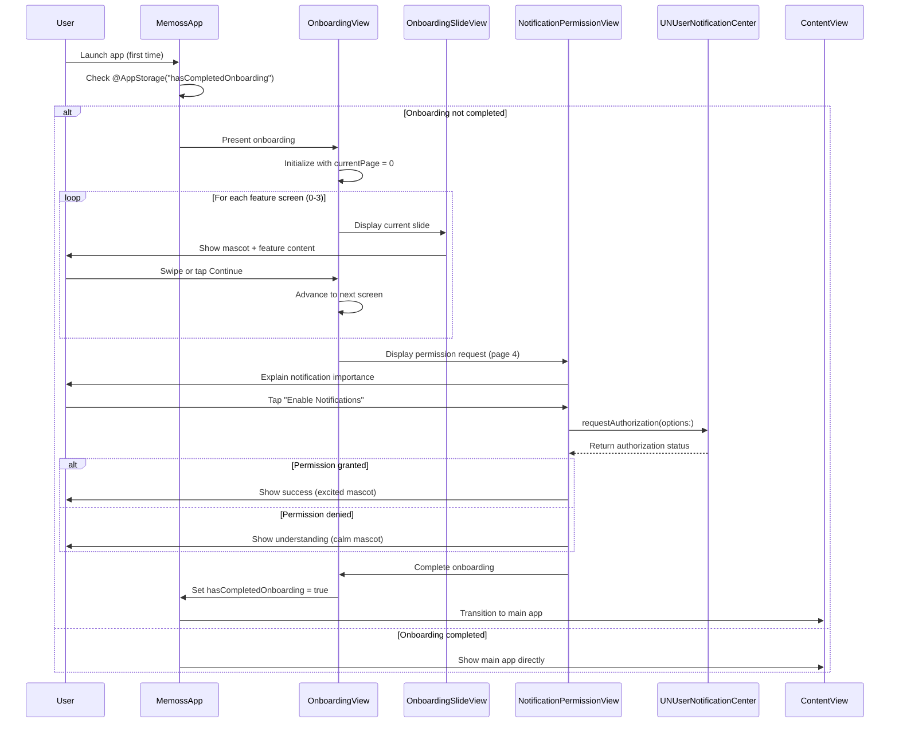

# Memoss Onboarding Screen Implementation Plan

**Date:** 2026-01-21
**Feature:** Onboarding Screen for memoss - your reminder
**Platform:** iOS (SwiftUI) - iOS 26+
**Type:** Enhancement
**Status:** Phase 1 Complete

---

## Overview

Implement a polished, nature-inspired onboarding experience for the memoss reminder app that introduces users to the brand identity and core features while optimizing notification permission acceptance rates.

## Problem Statement

First-time users need to:
1. Understand the app's unique value proposition (custom snoozing, recurring reminders, cross-device sync)
2. Connect emotionally with the brand through the Moss mascot
3. Grant notification permissions (critical for a reminder app)
4. Get started quickly without frustration

Research shows 77% of users stop using an app within the first 3 days, and poorly-timed permission requests cause 25% of users to abandon apps after a single session.

## Proposed Solution

A 5-screen carousel-style onboarding flow with progressive value demonstration before requesting notification permissions:

1. **Welcome Screen** - Brand identity, mascot introduction
2. **Custom Snooze Screen** - Key differentiator feature
3. **Recurring Reminders Screen** - Power user feature
4. **Cross-Device Sync Screen** - Reliability promise
5. **Notification Permission Screen** - Contextual permission request

---

## Architecture Flow



---

## Technical Approach

### Current Project State

The project is a fresh SwiftUI iOS 26 app with:
- **2 Swift files**: `MemossApp.swift` (app entry), `ContentView.swift` (placeholder)
- **No design system** in Swift yet
- **Design reference**: `memoss-design-system.jsx` (600 lines) containing all tokens and components
- **Bundle ID**: `com.stack4nerds.memoss`
- **Swift concurrency**: MainActor isolation enabled

### File Structure (MVP - Minimal)

```
Memoss/
├── MemossApp.swift                              # App entry point (MODIFY)
├── ContentView.swift                            # Main app view (existing)
├── Assets.xcassets/                             # Existing assets
│
├── Extensions/
│   └── Color+Hex.swift                          # CREATE: Hex color extension
│
├── Features/
│   └── Onboarding/
│       └── OnboardingView.swift                 # CREATE: Complete onboarding flow
│
└── DesignSystem/
    └── Components/
        └── MossMascot.swift                     # CREATE: Mascot component (Phase 2)
```

**Note:** Design tokens (colors, typography, spacing) are inlined in `OnboardingView.swift` for MVP. Extract to separate files when shared by 3+ features.

### Design Tokens (Inline for MVP)

Colors used in onboarding (from `memoss-design-system.jsx:8-63`):

| Purpose | Hex | Usage |
|---------|-----|-------|
| Brand Primary | #22C55E | Buttons, active states |
| Background Light | #F0F9F4 | Gradient end |
| Background Base | #F9F7F3 | Gradient start |
| Text Primary | #252320 | Headings |
| Text Secondary | #A8A298 | Descriptions, skip button |
| White | #FFFFFF | Button text |

**Implementation:** Define colors inline with `Color(hex:)` extension. Extract to `MemossColors.swift` only when 3+ features need them.

### MossMascot (Phase 2 Polish)

For MVP, use a static SF Symbol or placeholder image. The full mascot component with 4 moods (`happy`, `excited`, `calm`, `sleepy`) and animations is deferred to Phase 2 after validating the core onboarding flow works.

### Onboarding Content

| Screen | Title | Description | Mascot Mood | SF Symbol |
|--------|-------|-------------|-------------|-----------|
| 0 | Welcome to memoss | Your friendly reminder companion | happy | - (mascot only) |
| 1 | Snooze Your Way | Custom snooze times right from the notification. "22 minutes? Sure!" | excited | bell.badge.clock |
| 2 | Smart Recurring | Hourly, weekly, or every 3rd Tuesday. Your schedule, your rules. | excited | calendar.badge.clock |
| 3 | Sync Everywhere | Dismiss on one device, gone on all. True cross-device peace. | happy | icloud.and.arrow.up |
| 4 | Stay Reminded | Enable notifications to never miss a reminder | happy | bell.fill |

---

## Implementation Phases

### Phase 1: MVP Onboarding (Single PR) - COMPLETED

**Completed:** 2026-01-21
**Status:** Build successful, UI validated

**Scope:** Complete working onboarding flow with minimal file count

**Files to create:**
- `Memoss/Extensions/Color+Hex.swift`
- `Memoss/Features/Onboarding/OnboardingView.swift` (contains all onboarding logic)

**Files to modify:**
- `Memoss/MemossApp.swift`

**Key Implementation Details:**

```swift
// Color+Hex.swift
import SwiftUI

extension Color {
    init(hex: String) {
        let hex = hex.trimmingCharacters(in: CharacterSet.alphanumerics.inverted)
        var int: UInt64 = 0
        Scanner(string: hex).scanHexInt64(&int)
        let a, r, g, b: UInt64
        switch hex.count {
        case 6: (a, r, g, b) = (255, int >> 16, int >> 8 & 0xFF, int & 0xFF)
        case 8: (a, r, g, b) = (int >> 24, int >> 16 & 0xFF, int >> 8 & 0xFF, int & 0xFF)
        default: (a, r, g, b) = (255, 0, 0, 0)
        }
        self.init(.sRGB, red: Double(r) / 255, green: Double(g) / 255, blue: Double(b) / 255, opacity: Double(a) / 255)
    }
}
```

```swift
// OnboardingView.swift - Complete onboarding in single file
import SwiftUI
import UserNotifications

// MARK: - Colors (inline for MVP, extract when shared by 3+ features)
private enum OnboardingColors {
    static let brandPrimary = Color(hex: "#22C55E")
    static let backgroundStart = Color(hex: "#F9F7F3")
    static let backgroundEnd = Color(hex: "#F0F9F4")
    static let textPrimary = Color(hex: "#252320")
    static let textSecondary = Color(hex: "#A8A298")
    static let white = Color(hex: "#FFFFFF")
}

// MARK: - Main View
struct OnboardingView: View {
    @State private var currentPage = 0
    @AppStorage("hasCompletedOnboarding") private var hasCompletedOnboarding = false
    @Environment(\.accessibilityReduceMotion) private var reduceMotion

    private let slides: [(title: String, description: String, systemImage: String?)] = [
        ("Welcome to memoss", "Your friendly reminder companion", nil),
        ("Snooze Your Way", "Custom snooze times right from the notification. \"22 minutes? Sure!\"", "bell.badge.clock"),
        ("Smart Recurring", "Hourly, weekly, or every 3rd Tuesday. Your schedule, your rules.", "calendar.badge.clock"),
        ("Sync Everywhere", "Dismiss on one device, gone on all. True cross-device peace.", "icloud.and.arrow.up")
    ]

    private var totalPages: Int { slides.count + 1 }
    private var isOnPermissionScreen: Bool { currentPage == slides.count }

    var body: some View {
        ZStack(alignment: .bottom) {
            TabView(selection: $currentPage) {
                ForEach(Array(slides.enumerated()), id: \.offset) { index, slide in
                    slideView(title: slide.title, description: slide.description, systemImage: slide.systemImage)
                        .tag(index)
                }

                NotificationPermissionView(onComplete: { hasCompletedOnboarding = true })
                    .tag(slides.count)
            }
            .tabViewStyle(.page(indexDisplayMode: .always))
            .animation(reduceMotion ? .none : .easeInOut(duration: 0.3), value: currentPage)

            if !isOnPermissionScreen {
                navigationControls
            }
        }
        .background(backgroundGradient)
    }

    private func slideView(title: String, description: String, systemImage: String?) -> some View {
        VStack(spacing: 32) {
            Spacer()

            if let systemImage {
                Image(systemName: systemImage)
                    .font(.system(size: 80))
                    .foregroundStyle(OnboardingColors.brandPrimary)
            } else {
                // Placeholder for mascot (Phase 2)
                Image(systemName: "leaf.fill")
                    .font(.system(size: 100))
                    .foregroundStyle(OnboardingColors.brandPrimary)
            }

            VStack(spacing: 12) {
                Text(title)
                    .font(.largeTitle)
                    .fontWeight(.heavy)
                    .foregroundStyle(OnboardingColors.textPrimary)
                    .multilineTextAlignment(.center)

                Text(description)
                    .font(.body)
                    .foregroundStyle(OnboardingColors.textSecondary)
                    .multilineTextAlignment(.center)
                    .padding(.horizontal, 32)
            }

            Spacer()
            Spacer()
        }
    }

    private var navigationControls: some View {
        HStack {
            Button("Skip") {
                currentPage = slides.count
            }
            .foregroundStyle(OnboardingColors.textSecondary)

            Spacer()

            Button("Continue") {
                if currentPage < totalPages - 1 {
                    currentPage += 1
                }
            }
            .buttonStyle(PrimaryButtonStyle())
        }
        .padding(.horizontal, 24)
        .padding(.bottom, 48)
    }

    private var backgroundGradient: some View {
        LinearGradient(
            colors: [OnboardingColors.backgroundStart, OnboardingColors.backgroundEnd],
            startPoint: .top,
            endPoint: .bottom
        )
        .ignoresSafeArea()
    }
}

// MARK: - Notification Permission View
private struct NotificationPermissionView: View {
    let onComplete: () -> Void

    @State private var permissionState: PermissionState = .notDetermined
    @State private var isRequesting = false

    enum PermissionState {
        case notDetermined, granted, denied, error
    }

    var body: some View {
        VStack(spacing: 32) {
            Spacer()

            Image(systemName: iconForState)
                .font(.system(size: 80))
                .foregroundStyle(OnboardingColors.brandPrimary)

            VStack(spacing: 12) {
                Text(titleForState)
                    .font(.largeTitle)
                    .fontWeight(.heavy)
                    .foregroundStyle(OnboardingColors.textPrimary)
                    .multilineTextAlignment(.center)

                Text(descriptionForState)
                    .font(.body)
                    .foregroundStyle(OnboardingColors.textSecondary)
                    .multilineTextAlignment(.center)
                    .padding(.horizontal, 32)
            }

            Spacer()

            actionButton
                .padding(.horizontal, 24)
                .padding(.bottom, 120)
        }
        .task {
            await checkInitialStatus()
        }
    }

    private var iconForState: String {
        switch permissionState {
        case .notDetermined: "bell.fill"
        case .granted: "checkmark.circle.fill"
        case .denied, .error: "bell.slash.fill"
        }
    }

    private var titleForState: String {
        switch permissionState {
        case .notDetermined: "Stay Reminded"
        case .granted: "You're all set!"
        case .denied: "No worries!"
        case .error: "Something went wrong"
        }
    }

    private var descriptionForState: String {
        switch permissionState {
        case .notDetermined:
            "Enable notifications to never miss a reminder. We'll only notify you when it matters."
        case .granted:
            "Notifications are enabled. You'll never miss an important reminder."
        case .denied:
            "You can enable notifications later in Settings if you change your mind."
        case .error:
            "We couldn't request notification permissions. You can try again in Settings."
        }
    }

    @ViewBuilder
    private var actionButton: some View {
        switch permissionState {
        case .notDetermined:
            Button {
                Task { await requestPermission() }
            } label: {
                HStack {
                    Image(systemName: "bell.fill")
                    Text("Enable Notifications")
                }
                .frame(maxWidth: .infinity)
            }
            .buttonStyle(PrimaryButtonStyle())
            .disabled(isRequesting)

        case .granted, .denied, .error:
            Button("Get Started") {
                onComplete()
            }
            .buttonStyle(PrimaryButtonStyle())
        }
    }

    private func checkInitialStatus() async {
        let settings = await UNUserNotificationCenter.current().notificationSettings()
        await MainActor.run {
            switch settings.authorizationStatus {
            case .authorized, .provisional, .ephemeral:
                permissionState = .granted
            case .denied:
                permissionState = .denied
            case .notDetermined:
                permissionState = .notDetermined
            @unknown default:
                permissionState = .notDetermined
            }
        }
    }

    private func requestPermission() async {
        isRequesting = true
        do {
            let granted = try await UNUserNotificationCenter.current()
                .requestAuthorization(options: [.alert, .sound, .badge])
            await MainActor.run {
                permissionState = granted ? .granted : .denied
                isRequesting = false
                UINotificationFeedbackGenerator().notificationOccurred(granted ? .success : .warning)
            }
        } catch {
            await MainActor.run {
                permissionState = .error
                isRequesting = false
                UINotificationFeedbackGenerator().notificationOccurred(.error)
            }
        }
    }
}

// MARK: - Button Style
private struct PrimaryButtonStyle: ButtonStyle {
    @Environment(\.isEnabled) private var isEnabled

    func makeBody(configuration: Configuration) -> some View {
        configuration.label
            .font(.body.weight(.bold))
            .foregroundStyle(OnboardingColors.white)
            .padding(.horizontal, 24)
            .padding(.vertical, 16)
            .background(
                RoundedRectangle(cornerRadius: 24)
                    .fill(isEnabled ? OnboardingColors.brandPrimary : OnboardingColors.textSecondary)
            )
            .scaleEffect(configuration.isPressed ? 0.98 : 1.0)
            .animation(.easeInOut(duration: 0.15), value: configuration.isPressed)
    }
}

// MARK: - Preview
#Preview {
    OnboardingView()
}
```

```swift
// MemossApp.swift
import SwiftUI

@main
struct MemossApp: App {
    @AppStorage("hasCompletedOnboarding") private var hasCompletedOnboarding = false

    var body: some Scene {
        WindowGroup {
            if hasCompletedOnboarding {
                ContentView()
            } else {
                OnboardingView()
            }
        }
    }
}
```

**Acceptance Criteria:**
- [ ] First-time app launch displays onboarding
- [ ] Subsequent launches skip onboarding
- [ ] User can swipe between screens
- [ ] User can tap "Continue" to advance
- [ ] User can tap "Skip" to go to permission screen
- [ ] Notification permission is requested with proper error handling
- [ ] Permission granted/denied/error states handled gracefully
- [ ] Onboarding completion transitions to main app
- [ ] `@AppStorage` persists completion state
- [ ] Reduced Motion setting respected
- [ ] Previews work in Xcode canvas

**Dependencies:** None

---

### Phase 2: Polish & Mascot (Optional, After Validation)
**Scope:** Add MossMascot component, extract design tokens, add tests

**Trigger:** Only implement after Phase 1 is shipped and user feedback validates the need.

**Files to create:**
- `Memoss/DesignSystem/Components/MossMascot.swift`
- `Memoss/DesignSystem/Theme/MemossColors.swift` (extract from inline)
- `MemossTests/OnboardingTests.swift`

**Scope includes:**
- MossMascot with 4 moods (happy, excited, calm, sleepy)
- Mascot idle animations
- Extract inline colors to shared design system
- Unit tests for navigation logic
- UI tests for happy path flow

**Acceptance Criteria:**
- [ ] MossMascot renders with all 4 moods
- [ ] Mascot animations respect Reduced Motion
- [ ] Design tokens extracted and shared
- [ ] Tests pass

**Dependencies:** Phase 1 shipped and validated

---

## Unit Test Plan (Phase 2)

Tests are deferred to Phase 2 after the core flow is validated.

| Test Name | Scenario | Expected Outcome | Priority |
|-----------|----------|------------------|----------|
| `test_initialState_startsAtPageZero` | Fresh view | `currentPage == 0` | P1 |
| `test_slideCount_isFour` | Check slides array | `slides.count == 4` | P1 |
| `test_permissionScreen_isLastPage` | Navigate to end | Permission screen at index 4 | P1 |
| `test_completionPersists` | Complete onboarding | `hasCompletedOnboarding == true` | P1 |

---

## Acceptance Criteria

### Functional Requirements (Phase 1)

- [ ] First-time app launch displays onboarding
- [ ] Subsequent launches skip onboarding
- [ ] User can swipe between onboarding screens
- [ ] User can tap "Continue" to advance
- [ ] User can tap "Skip" to go directly to permission request
- [ ] Notification permission request handles success, denial, and errors
- [ ] Onboarding completion persists via @AppStorage
- [ ] Transition to main app after completion

### Non-Functional Requirements

- [ ] Page transitions complete within 300ms
- [ ] Touch targets are minimum 44pt
- [ ] Reduced Motion setting is respected

### Quality Gates (Phase 1)

- [ ] No crashes in basic usage
- [ ] Previews render in Xcode canvas
- [ ] App builds without warnings

---

## Dependencies & Prerequisites

### Technical Dependencies
- iOS 26 SDK
- Xcode 26.1+
- SwiftUI framework
- UserNotifications framework (auto-linked)

### Design Assets (Phase 1)
- **SF Symbols**: leaf.fill (mascot placeholder), bell.badge.clock, calendar.badge.clock, icloud.and.arrow.up, bell.fill, checkmark.circle.fill, bell.slash.fill
- **Font**: System fonts (no bundling needed for MVP)

### Design Assets (Phase 2)
- MossMascot SVG translated to SwiftUI Shape
- Nunito font family (optional)

---

## Risk Analysis & Mitigation

| Risk | Likelihood | Impact | Mitigation |
|------|------------|--------|------------|
| Notification permission denied at high rate | Medium | High | Value-first approach, clear explanation, graceful denial handling |
| Permission request throws error | Low | Medium | Error state added with fallback UI |
| Users skip without understanding value | Medium | Medium | Make skip button subtle, compelling value on each slide |
| Dynamic Type breaks layouts | Medium | Medium | Use system fonts, test at accessibility sizes |

---

## Future Considerations

1. **Analytics Integration** - Track screen views, skip rates, permission results
2. **A/B Testing** - Test different copy, mascot positions, skip button visibility
3. **Localization** - Prepare for multi-language support (use `LocalizedStringKey`)
4. **App Update Onboarding** - Show new features when app updates (version-based flow)
5. **Re-engage Flow** - Offer to re-request notifications if denied (deep link to Settings)
6. **Dark Mode Polish** - Ensure mascot gradients look good in dark mode

---

## References & Research

### Internal References
- Design System: `memoss-design-system.jsx:8-105` (tokens), `112-169` (mascot)
- Current ContentView: `Memoss/ContentView.swift:1-24`
- App Entry: `Memoss/MemossApp.swift:1-17`

### External References
- [SwiftUI TabView with PageTabViewStyle](https://developer.apple.com/documentation/swiftui/tabview)
- [UNUserNotificationCenter requestAuthorization](https://developer.apple.com/documentation/usernotifications/unusernotificationcenter/requestauthorization(options:))
- [SwiftUI sensoryFeedback modifier](https://developer.apple.com/documentation/swiftui/view/sensoryfeedback(_:trigger:))
- [iOS Notification Permission Best Practices](https://developer.apple.com/design/human-interface-guidelines/notifications)

### Best Practices Applied
- Progressive disclosure (reveal features step-by-step)
- Value-first approach (show benefits before asking for permissions)
- Skippable onboarding (respect user agency)
- Pre-permission priming (explain before system dialog)
- 44pt minimum touch targets
- Support for accessibility settings (VoiceOver, Dynamic Type, Reduced Motion)
- Async/await for notification authorization (no completion handlers)

---

## Appendix: Design Token Reference

### Colors (from `memoss-design-system.jsx:8-63`)

| Token | Hex | Usage |
|-------|-----|-------|
| Primary 500 | #22C55E | Main brand green, buttons |
| Primary 100 | #DCFCE7 | Light backgrounds |
| Primary 50 | #F0F9F4 | Background gradient end |
| Accent 500 | #EAB308 | Golden highlights, sparkles |
| Neutral 0 | #FFFFFF | White, button text |
| Neutral 50 | #FDFCFA | Off-white background |
| Neutral 100 | #F9F7F3 | Background gradient start |
| Neutral 500 | #A8A298 | Secondary text, skip button |
| Neutral 800 | #3D3A36 | Primary text |
| Neutral 950 | #1A1816 | Near-black |

### Typography (from `memoss-design-system.jsx:64-85`)

| Token | Value | iOS Equivalent |
|-------|-------|----------------|
| Display font | Nunito | Bundled or `.rounded` |
| Body font | Nunito Sans | Bundled or `.body` |
| Font size 4xl | 2.25rem (36pt) | `.largeTitle` |
| Font size 2xl | 1.5rem (24pt) | `.title2` |
| Font size base | 1rem (16pt) | `.body` |
| Font weight extrabold | 800 | `.heavy` |
| Font weight bold | 700 | `.bold` |

### Spacing (from `memoss-design-system.jsx:87-89`)

| Token | rem | pt |
|-------|-----|-----|
| 1 | 0.25rem | 4pt |
| 2 | 0.5rem | 8pt |
| 3 | 0.75rem | 12pt |
| 4 | 1rem | 16pt |
| 5 | 1.25rem | 20pt |
| 6 | 1.5rem | 24pt |
| 8 | 2rem | 32pt |
| 10 | 2.5rem | 40pt |
| 12 | 3rem | 48pt |

---

*Plan created: 2026-01-21*
*Last updated: 2026-01-21*
