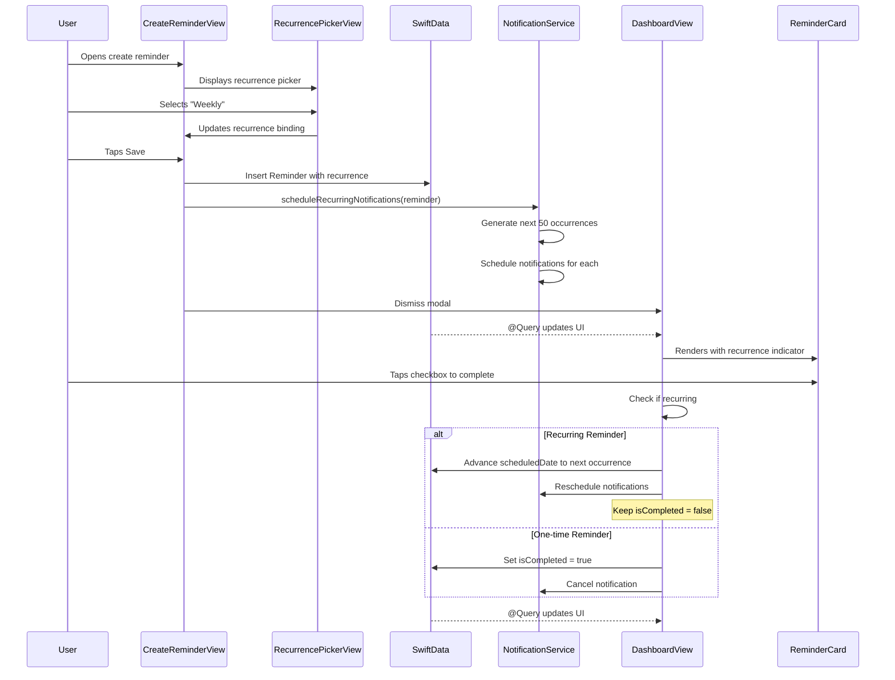

# feat: Implement Recurring Reminders

**Date:** 2026-01-23
**Status:** Implemented
**Type:** Enhancement
**Priority:** High (core feature for reminder apps)

---

## Overview

Add the ability to create reminders that repeat on a schedule. Users can set reminders to recur daily, weekly, or monthly, with notifications firing at each occurrence. This transforms Memoss from a one-time reminder app to a habit and routine tracker.

**Core functionality:**
- Select recurrence pattern when creating/editing reminders (None, Daily, Weekly, Monthly)
- Display recurrence indicator on reminder cards
- Schedule notifications for recurring reminders
- Handle "complete" action for recurring reminders (advance to next occurrence)
- Support end date for recurrence series

---

## Problem Statement / Motivation

Users need reminders for recurring tasks like medications, workouts, and weekly meetings. Currently, they must manually recreate these reminders each time.

**Current state:**
- User creates "Take vitamins" reminder for 9:00 AM
- After completing it, the reminder is marked done
- User must manually create a new reminder for tomorrow

**Desired state:**
- User creates "Take vitamins" as a daily reminder at 9:00 AM
- After completing today's occurrence, the reminder advances to tomorrow
- Notification fires again at 9:00 AM the next day automatically

This is a fundamental expectation for any reminder app.

---

## Architecture Flow



---

## Technical Approach

### Recurrence Model Design

**Decision: Use custom `RecurrenceRule` enum stored as Codable in Reminder**

| Approach | Pros | Cons | Decision |
|----------|------|------|----------|
| **Custom RecurrenceRule enum** | Works on iOS 17+, simple, Codable | Manual occurrence calculation | **Selected** |
| `Calendar.RecurrenceRule` (iOS 18+) | Native Apple solution | Requires iOS 18, too recent | Rejected for now |
| Separate RecurrenceRule model | More flexible | Over-engineered for MVP | Rejected |

### RecurrenceRule Enum

```swift
// Memoss/Models/RecurrenceRule.swift
import Foundation

enum RecurrenceRule: Codable, Equatable, Hashable {
    case none
    case daily
    case weekly(weekday: Int)  // 1=Sunday, 2=Monday, etc.
    case monthly(day: Int)     // 1-31

    var displayName: String {
        switch self {
        case .none: return "Never"
        case .daily: return "Daily"
        case .weekly: return "Weekly"
        case .monthly: return "Monthly"
        }
    }

    var icon: String {
        switch self {
        case .none: return "arrow.forward"
        case .daily: return "sunrise.fill"
        case .weekly: return "calendar.badge.clock"
        case .monthly: return "calendar"
        }
    }

    /// Calculate the next occurrence after the given date
    func nextOccurrence(after date: Date) -> Date? {
        let calendar = Calendar.current
        switch self {
        case .none:
            return nil
        case .daily:
            return calendar.date(byAdding: .day, value: 1, to: date)
        case .weekly(let weekday):
            // Find next occurrence of this weekday
            var nextDate = calendar.date(byAdding: .day, value: 1, to: date)!
            while calendar.component(.weekday, from: nextDate) != weekday {
                nextDate = calendar.date(byAdding: .day, value: 1, to: nextDate)!
            }
            return nextDate
        case .monthly(let day):
            // Find next occurrence of this day
            var components = calendar.dateComponents([.year, .month, .day, .hour, .minute], from: date)
            components.day = day
            if let sameMonth = calendar.date(from: components), sameMonth > date {
                return sameMonth
            }
            components.month = (components.month ?? 1) + 1
            return calendar.date(from: components)
        }
    }

    /// Generate next N occurrences from a start date
    func occurrences(startingFrom date: Date, count: Int) -> [Date] {
        guard self != .none else { return [date] }
        var dates: [Date] = []
        var current = date

        while dates.count < count {
            if current > Date() {
                dates.append(current)
            }
            guard let next = nextOccurrence(after: current) else { break }
            current = next
        }

        return dates
    }
}
```

### Updated Reminder Model

```swift
// Memoss/Models/Reminder.swift - Add recurrence properties
@Model
final class Reminder {
    @Attribute(.unique) var id: UUID
    var title: String
    var scheduledDate: Date
    var isCompleted: Bool

    // Recurrence - stored as Codable Data
    var recurrenceRuleData: Data?
    var recurrenceEndDate: Date?

    @Relationship(deleteRule: .nullify)
    var tags: [Tag] = []

    // Computed property for working with recurrence
    var recurrenceRule: RecurrenceRule {
        get {
            guard let data = recurrenceRuleData else { return .none }
            return (try? JSONDecoder().decode(RecurrenceRule.self, from: data)) ?? .none
        }
        set {
            recurrenceRuleData = try? JSONEncoder().encode(newValue)
        }
    }

    var isRecurring: Bool {
        recurrenceRule != .none
    }

    init(title: String, scheduledDate: Date = .now, isCompleted: Bool = false) {
        self.id = UUID()
        self.title = title
        self.scheduledDate = scheduledDate
        self.isCompleted = isCompleted
    }
}
```

**Note:** SwiftData doesn't directly support custom enums as properties, so we store the encoded `Data` and provide a computed property for convenience. This approach survives schema migrations cleanly.

### Notification Strategy

**Key constraint:** iOS limits apps to 64 pending local notifications.

**Strategy: Global notification budget with priority scheduling**

The 64 notification limit is shared across ALL reminders. With multiple recurring reminders, a naive per-reminder allocation would exceed the limit. Instead, we use a **global budget strategy**:

1. **Reserve 14 slots for one-time reminders** (reasonable buffer for most users)
2. **Distribute remaining 50 slots across all recurring reminders by date priority**
3. **Soonest dates first** - sort all future occurrences globally, schedule the 50 nearest

**Refresh triggers:**
- App enters foreground (`scenePhase` observation)
- User completes a recurring reminder
- User creates/edits/deletes any reminder

```swift
// NotificationService.swift additions
private let notificationLimit = 64
private let oneTimeReserve = 14
private var maxRecurringSlots: Int { notificationLimit - oneTimeReserve }  // 50

/// Reschedule all notifications globally (call after any reminder change)
func rescheduleAllNotifications(reminders: [Reminder]) async {
    // Cancel all existing notifications
    UNUserNotificationCenter.current().removeAllPendingNotificationRequests()

    // Separate one-time and recurring reminders
    let oneTime = reminders.filter { !$0.isRecurring && !$0.isCompleted && $0.scheduledDate > Date() }
    let recurring = reminders.filter { $0.isRecurring && !$0.isCompleted }

    // Schedule one-time reminders (up to reserve limit)
    for reminder in oneTime.prefix(oneTimeReserve) {
        await scheduleNotification(for: reminder)
    }

    // Collect all future occurrences from recurring reminders
    var allOccurrences: [(reminder: Reminder, date: Date, index: Int)] = []
    for reminder in recurring {
        let occurrences = reminder.recurrenceRule.occurrences(
            startingFrom: reminder.scheduledDate,
            count: 100  // Generate plenty, we'll filter by global budget
        ).filter { date in
            if let endDate = reminder.recurrenceEndDate {
                return date <= endDate
            }
            return true
        }
        for (index, date) in occurrences.enumerated() {
            allOccurrences.append((reminder, date, index))
        }
    }

    // Sort by date and take the soonest N
    let scheduled = allOccurrences
        .sorted { $0.date < $1.date }
        .prefix(maxRecurringSlots)

    for occurrence in scheduled {
        await scheduleNotificationInstance(
            for: occurrence.reminder,
            at: occurrence.date,
            index: occurrence.index
        )
    }
}

private func scheduleNotificationInstance(for reminder: Reminder, at date: Date, index: Int) async {
    let content = UNMutableNotificationContent()
    content.title = "Memoss"
    content.body = reminder.title
    content.sound = .default
    content.categoryIdentifier = NotificationCategory.reminder.rawValue
    content.userInfo = [
        "reminderTitle": reminder.title,
        "isRecurring": true
    ]

    let components = Calendar.current.dateComponents(
        [.year, .month, .day, .hour, .minute],
        from: date
    )
    let trigger = UNCalendarNotificationTrigger(dateMatching: components, repeats: false)

    // Use indexed identifier for recurring notifications
    let identifier = "\(reminder.id.uuidString)-\(index)"
    let request = UNNotificationRequest(
        identifier: identifier,
        content: content,
        trigger: trigger
    )

    try? await UNUserNotificationCenter.current().add(request)
}

func cancelAllNotifications(for reminder: Reminder) {
    let identifiers = (0..<64).map { "\(reminder.id.uuidString)-\($0)" }
    UNUserNotificationCenter.current().removePendingNotificationRequests(withIdentifiers: identifiers)
    // Also cancel the single notification ID (for non-recurring)
    UNUserNotificationCenter.current().removePendingNotificationRequests(
        withIdentifiers: [reminder.id.uuidString]
    )
}
```

### File Structure

```
Memoss/
├── Models/
│   ├── Reminder.swift                    # MODIFY: Add recurrence properties
│   └── RecurrenceRule.swift              # CREATE: Recurrence enum
├── Components/
│   └── RecurrencePickerView.swift        # CREATE: Recurrence selection UI
├── Features/
│   ├── CreateReminder/
│   │   └── CreateReminderView.swift      # MODIFY: Add recurrence picker
│   ├── EditReminder/
│   │   └── EditReminderView.swift        # MODIFY: Add recurrence picker
│   └── Dashboard/
│       ├── DashboardView.swift           # MODIFY: Handle recurring completion
│       └── Components/
│           └── ReminderCard.swift        # MODIFY: Show recurrence indicator
├── Services/
│   └── NotificationService.swift         # MODIFY: Handle recurring notifications
└── Extensions/
    └── AppDelegate+Notifications.swift   # MODIFY: Handle recurring mark complete
```

---

## Implementation Phases

| Phase | Title | Dependencies | Effort |
|-------|-------|--------------|--------|
| 1 | RecurrenceRule Model + Reminder Updates | None | Small |
| 2 | RecurrencePickerView Component | Phase 1 | Medium |
| 3 | Integrate Picker into Create/Edit Views | Phase 2 | Small |
| 4 | NotificationService Recurring Support | Phase 3 | Medium |
| 5 | Dashboard Completion Handling | Phase 4 | Medium |
| 6 | ReminderCard Recurrence Indicator | Phase 5 | Small |

---

### Phase 1: RecurrenceRule Model + Reminder Updates

**Goal:** Create RecurrenceRule enum and add recurrence properties to Reminder model.

**Files to create:**
- `Memoss/Models/RecurrenceRule.swift`

**Files to modify:**
- `Memoss/Models/Reminder.swift` - Add recurrence properties

#### RecurrenceRule.swift

```swift
// Memoss/Models/RecurrenceRule.swift
import Foundation

enum RecurrenceRule: Codable, Equatable, Hashable {
    case none
    case daily
    case weekly(weekday: Int)  // 1=Sunday, 2=Monday, etc.
    case monthly(day: Int)     // 1-31

    // MARK: - Display Properties

    var displayName: String {
        switch self {
        case .none: return "Never"
        case .daily: return "Daily"
        case .weekly(let weekday):
            let formatter = DateFormatter()
            formatter.locale = Locale.current
            let weekdayName = formatter.weekdaySymbols[weekday - 1]
            return "Every \(weekdayName)"
        case .monthly(let day):
            let suffix = daySuffix(for: day)
            return "Monthly on the \(day)\(suffix)"
        }
    }

    var shortDisplayName: String {
        switch self {
        case .none: return "Once"
        case .daily: return "Daily"
        case .weekly: return "Weekly"
        case .monthly: return "Monthly"
        }
    }

    var icon: String {
        switch self {
        case .none: return "arrow.forward"
        case .daily: return "sunrise.fill"
        case .weekly: return "calendar.badge.clock"
        case .monthly: return "calendar"
        }
    }

    // MARK: - Occurrence Calculation

    /// Calculate the next occurrence after the given date
    func nextOccurrence(after date: Date) -> Date? {
        let calendar = Calendar.current

        switch self {
        case .none:
            return nil

        case .daily:
            return calendar.date(byAdding: .day, value: 1, to: date)

        case .weekly(let weekday):
            // Find next occurrence of this weekday
            var nextDate = calendar.date(byAdding: .day, value: 1, to: date)!
            while calendar.component(.weekday, from: nextDate) != weekday {
                nextDate = calendar.date(byAdding: .day, value: 1, to: nextDate)!
            }
            // Preserve the time from original date
            // Note: bySettingHour can return nil on DST transitions - fallback to date components
            let timeComponents = calendar.dateComponents([.hour, .minute], from: date)
            if let result = calendar.date(
                bySettingHour: timeComponents.hour ?? 9,
                minute: timeComponents.minute ?? 0,
                second: 0,
                of: nextDate
            ) {
                return result
            }
            // DST fallback: build date from components directly
            var fallbackComponents = calendar.dateComponents([.year, .month, .day], from: nextDate)
            fallbackComponents.hour = timeComponents.hour ?? 9
            fallbackComponents.minute = timeComponents.minute ?? 0
            return calendar.date(from: fallbackComponents) ?? nextDate

        case .monthly(let day):
            var components = calendar.dateComponents([.year, .month, .hour, .minute], from: date)

            // Helper to get days in a specific year/month
            func daysInMonth(year: Int, month: Int) -> Int {
                let targetComponents = DateComponents(year: year, month: month, day: 1)
                guard let targetDate = calendar.date(from: targetComponents) else { return 28 }
                return calendar.range(of: .day, in: .month, for: targetDate)?.count ?? 28
            }

            // Try same month first - use TARGET month's day count
            let sameMonthDays = daysInMonth(year: components.year ?? 2026, month: components.month ?? 1)
            components.day = min(day, sameMonthDays)

            if let sameMonth = calendar.date(from: components), sameMonth > date {
                return sameMonth
            }

            // Move to next month
            components.month = (components.month ?? 1) + 1
            if components.month! > 12 {
                components.month = 1
                components.year = (components.year ?? 2026) + 1
            }
            // Use NEXT month's day count, not current month
            let nextMonthDays = daysInMonth(year: components.year!, month: components.month!)
            components.day = min(day, nextMonthDays)
            return calendar.date(from: components)
        }
    }

    /// Generate next N occurrences from a start date
    func occurrences(startingFrom date: Date, count: Int) -> [Date] {
        guard self != .none else {
            return date > Date() ? [date] : []
        }

        var dates: [Date] = []
        var current = date

        // Include the start date if it's in the future
        if current > Date() {
            dates.append(current)
        }

        while dates.count < count {
            guard let next = nextOccurrence(after: current) else { break }
            current = next
            dates.append(current)
        }

        return dates
    }

    // MARK: - Helpers

    private func daySuffix(for day: Int) -> String {
        switch day {
        case 1, 21, 31: return "st"
        case 2, 22: return "nd"
        case 3, 23: return "rd"
        default: return "th"
        }
    }

    private func daysInMonth(for date: Date, calendar: Calendar) -> Int {
        calendar.range(of: .day, in: .month, for: date)?.count ?? 28
    }

    private func daysInNextMonth(from date: Date, calendar: Calendar) -> Int {
        guard let nextMonth = calendar.date(byAdding: .month, value: 1, to: date) else { return 28 }
        return daysInMonth(for: nextMonth, calendar: calendar)
    }
}

// MARK: - Preset Helpers

extension RecurrenceRule {
    /// Common recurrence presets for the picker
    static var presets: [RecurrenceRule] {
        [.none, .daily]
    }

    /// Create a weekly rule for the current weekday
    static func weeklyOnCurrentDay(from date: Date = .now) -> RecurrenceRule {
        let weekday = Calendar.current.component(.weekday, from: date)
        return .weekly(weekday: weekday)
    }

    /// Create a monthly rule for the current day of month
    static func monthlyOnCurrentDay(from date: Date = .now) -> RecurrenceRule {
        let day = Calendar.current.component(.day, from: date)
        return .monthly(day: day)
    }
}
```

#### Reminder.swift Changes

```swift
// Memoss/Models/Reminder.swift
import SwiftData
import Foundation

@Model
final class Reminder {
    @Attribute(.unique) var id: UUID
    var title: String
    var scheduledDate: Date
    var isCompleted: Bool

    // Recurrence - stored as Codable Data for SwiftData compatibility
    var recurrenceRuleData: Data?
    var recurrenceEndDate: Date?

    @Relationship(deleteRule: .nullify)
    var tags: [Tag] = []

    // MARK: - Computed Properties

    /// Access recurrence rule with automatic encoding/decoding
    var recurrenceRule: RecurrenceRule {
        get {
            guard let data = recurrenceRuleData else { return .none }
            return (try? JSONDecoder().decode(RecurrenceRule.self, from: data)) ?? .none
        }
        set {
            recurrenceRuleData = try? JSONEncoder().encode(newValue)
        }
    }

    /// Convenience property to check if this reminder recurs
    var isRecurring: Bool {
        recurrenceRule != .none
    }

    // MARK: - Initialization

    init(title: String, scheduledDate: Date = .now, isCompleted: Bool = false) {
        self.id = UUID()
        self.title = title
        self.scheduledDate = scheduledDate
        self.isCompleted = isCompleted
    }

    // MARK: - Recurrence Helpers

    /// Advance to the next occurrence (for completing recurring reminders)
    func advanceToNextOccurrence() {
        guard let nextDate = recurrenceRule.nextOccurrence(after: scheduledDate) else { return }

        // Check if we've passed the end date
        if let endDate = recurrenceEndDate, nextDate > endDate {
            // Series complete - mark as done
            isCompleted = true
            return
        }

        scheduledDate = nextDate
    }
}
```

**Acceptance Criteria:**
- [ ] RecurrenceRule enum created with .none, .daily, .weekly, .monthly cases
- [ ] RecurrenceRule has displayName, shortDisplayName, icon computed properties
- [ ] RecurrenceRule.nextOccurrence(after:) correctly calculates next date
- [ ] RecurrenceRule.occurrences(startingFrom:count:) generates correct sequence
- [ ] Reminder model has recurrenceRuleData (Data) and recurrenceEndDate (Date?) properties
- [ ] Reminder.recurrenceRule computed property handles encoding/decoding
- [ ] Reminder.isRecurring convenience property works
- [ ] Reminder.advanceToNextOccurrence() updates scheduledDate correctly
- [ ] App builds and runs without migration errors
- [ ] Existing reminders survive schema migration (recurrence defaults to .none)

**Validation Steps:**
1. Build and run app
2. Create a reminder (without recurrence)
3. Verify it appears on dashboard as before
4. Edit reminder - verify no crash (recurrence is .none)

---

### Phase 2: RecurrencePickerView Component

**Goal:** Create reusable UI component for selecting recurrence pattern.

**Files to create:**
- `Memoss/Components/RecurrencePickerView.swift`

#### RecurrencePickerView.swift

```swift
// Memoss/Components/RecurrencePickerView.swift
import SwiftUI

struct RecurrencePickerView: View {
    @Binding var recurrenceRule: RecurrenceRule
    @Binding var endDate: Date?
    let scheduledDate: Date

    @State private var showingEndDatePicker = false
    @State private var hasEndDate = false

    private var weekday: Int {
        Calendar.current.component(.weekday, from: scheduledDate)
    }

    private var dayOfMonth: Int {
        Calendar.current.component(.day, from: scheduledDate)
    }

    private var weekdayName: String {
        let formatter = DateFormatter()
        formatter.locale = Locale.current
        return formatter.weekdaySymbols[weekday - 1]
    }

    var body: some View {
        VStack(alignment: .leading, spacing: 16) {
            // Section header
            Text("Repeat")
                .font(.system(size: 14, weight: .semibold, design: .rounded))
                .foregroundStyle(MemossColors.textSecondary)

            // Recurrence options
            VStack(spacing: 0) {
                recurrenceOption(.none, label: "Never", icon: "arrow.forward")
                Divider().padding(.leading, 52)
                recurrenceOption(.daily, label: "Daily", icon: "sunrise.fill")
                Divider().padding(.leading, 52)
                recurrenceOption(.weekly(weekday: weekday), label: "Weekly on \(weekdayName)", icon: "calendar.badge.clock")
                Divider().padding(.leading, 52)
                recurrenceOption(.monthly(day: dayOfMonth), label: "Monthly on the \(dayOfMonth)\(daySuffix(dayOfMonth))", icon: "calendar")
            }
            .background(MemossColors.cardBackground)
            .clipShape(RoundedRectangle(cornerRadius: 24))
            .shadow(color: MemossColors.brandPrimary.opacity(0.08), radius: 12, y: 4)

            // End date toggle (only show if recurring)
            if recurrenceRule != .none {
                endDateSection
            }
        }
    }

    // MARK: - Subviews

    private func recurrenceOption(_ rule: RecurrenceRule, label: String, icon: String) -> some View {
        let isSelected = recurrenceRule.shortDisplayName == rule.shortDisplayName

        return Button {
            withAnimation(.spring(response: 0.3, dampingFraction: 0.8)) {
                recurrenceRule = rule
                if rule == .none {
                    hasEndDate = false
                    endDate = nil
                }
            }
            UIImpactFeedbackGenerator(style: .light).impactOccurred()
        } label: {
            HStack(spacing: 12) {
                ZStack {
                    RoundedRectangle(cornerRadius: 10)
                        .fill(isSelected ? MemossColors.brandPrimary.opacity(0.15) : MemossColors.backgroundStart)
                        .frame(width: 40, height: 40)
                    Image(systemName: icon)
                        .font(.system(size: 16))
                        .foregroundStyle(isSelected ? MemossColors.brandPrimary : MemossColors.textSecondary)
                }

                Text(label)
                    .font(.system(size: 16, weight: isSelected ? .semibold : .regular, design: .rounded))
                    .foregroundStyle(isSelected ? MemossColors.textPrimary : MemossColors.textSecondary)

                Spacer()

                if isSelected {
                    Image(systemName: "checkmark")
                        .font(.system(size: 14, weight: .semibold))
                        .foregroundStyle(MemossColors.brandPrimary)
                }
            }
            .padding(.horizontal, 16)
            .padding(.vertical, 12)
            .contentShape(Rectangle())
        }
        .buttonStyle(.plain)
        .accessibilityLabel(label)
        .accessibilityAddTraits(isSelected ? [.isSelected] : [])
    }

    private var endDateSection: some View {
        VStack(alignment: .leading, spacing: 12) {
            Toggle(isOn: $hasEndDate) {
                HStack(spacing: 12) {
                    ZStack {
                        RoundedRectangle(cornerRadius: 10)
                            .fill(MemossColors.accent.opacity(0.1))
                            .frame(width: 40, height: 40)
                        Image(systemName: "flag.fill")
                            .font(.system(size: 16))
                            .foregroundStyle(MemossColors.accent)
                    }

                    Text("End Date")
                        .font(.system(size: 16, weight: .regular, design: .rounded))
                        .foregroundStyle(MemossColors.textPrimary)
                }
            }
            .tint(MemossColors.brandPrimary)
            .padding(16)
            .background(MemossColors.cardBackground)
            .clipShape(RoundedRectangle(cornerRadius: 24))
            .shadow(color: MemossColors.brandPrimary.opacity(0.08), radius: 12, y: 4)
            .onChange(of: hasEndDate) { _, newValue in
                if newValue {
                    // Default to 1 month from now
                    endDate = Calendar.current.date(byAdding: .month, value: 1, to: scheduledDate)
                } else {
                    endDate = nil
                }
            }

            if hasEndDate {
                HStack(spacing: 16) {
                    ZStack {
                        RoundedRectangle(cornerRadius: 12)
                            .fill(MemossColors.accent.opacity(0.1))
                            .frame(width: 44, height: 44)
                        Image(systemName: "calendar.badge.exclamationmark")
                            .font(.system(size: 20))
                            .foregroundStyle(MemossColors.accent)
                    }

                    VStack(alignment: .leading, spacing: 2) {
                        Text("Ends On")
                            .font(.system(size: 14, design: .rounded))
                            .foregroundStyle(MemossColors.textSecondary)

                        DatePicker(
                            "",
                            selection: Binding(
                                get: { endDate ?? Calendar.current.date(byAdding: .month, value: 1, to: scheduledDate)! },
                                set: { endDate = $0 }
                            ),
                            in: scheduledDate...,
                            displayedComponents: .date
                        )
                        .datePickerStyle(.compact)
                        .labelsHidden()
                        .tint(MemossColors.brandPrimary)
                    }

                    Spacer()
                }
                .padding(20)
                .background(MemossColors.cardBackground)
                .clipShape(RoundedRectangle(cornerRadius: 24))
                .shadow(color: MemossColors.brandPrimary.opacity(0.08), radius: 12, y: 4)
                .transition(.asymmetric(
                    insertion: .opacity.combined(with: .move(edge: .top)),
                    removal: .opacity
                ))
            }
        }
        .animation(.spring(response: 0.3, dampingFraction: 0.8), value: hasEndDate)
    }

    // MARK: - Helpers

    private func daySuffix(_ day: Int) -> String {
        switch day {
        case 1, 21, 31: return "st"
        case 2, 22: return "nd"
        case 3, 23: return "rd"
        default: return "th"
        }
    }
}

#Preview("No Recurrence") {
    RecurrencePickerView(
        recurrenceRule: .constant(.none),
        endDate: .constant(nil),
        scheduledDate: .now
    )
    .padding()
    .background(MemossColors.backgroundStart)
}

#Preview("Daily Selected") {
    RecurrencePickerView(
        recurrenceRule: .constant(.daily),
        endDate: .constant(nil),
        scheduledDate: .now
    )
    .padding()
    .background(MemossColors.backgroundStart)
}

#Preview("Weekly with End Date") {
    RecurrencePickerView(
        recurrenceRule: .constant(.weekly(weekday: 2)),
        endDate: .constant(Calendar.current.date(byAdding: .month, value: 1, to: .now)),
        scheduledDate: .now
    )
    .padding()
    .background(MemossColors.backgroundStart)
}
```

**Acceptance Criteria:**
- [ ] RecurrencePickerView shows 4 options: Never, Daily, Weekly, Monthly
- [ ] Weekly option displays current weekday name from scheduledDate
- [ ] Monthly option displays current day of month with proper suffix
- [ ] Selected option shows checkmark and highlighted styling
- [ ] Tapping option updates binding with animation
- [ ] End Date toggle appears only when recurrence is selected
- [ ] End Date picker shows when toggle is on
- [ ] End Date defaults to 1 month from scheduled date
- [ ] End Date minimum is the scheduled date
- [ ] Haptic feedback on selection
- [ ] Previews render correctly

---

### Phase 3: Integrate Picker into Create/Edit Views

**Goal:** Add RecurrencePickerView to both form views.

**Files to modify:**
- `Memoss/Features/CreateReminder/CreateReminderView.swift`
- `Memoss/Features/EditReminder/EditReminderView.swift`

#### CreateReminderView.swift Changes

```swift
// Add state after selectedTags:
@State private var recurrenceRule: RecurrenceRule = .none
@State private var recurrenceEndDate: Date?

// Add in body after TagPickerView (around line 44):
RecurrencePickerView(
    recurrenceRule: $recurrenceRule,
    endDate: $recurrenceEndDate,
    scheduledDate: scheduledDate
)

// Update saveReminder() (around line 190):
private func saveReminder() {
    hasAttemptedSave = true
    guard isTitleValid else { return }

    let reminder = Reminder(
        title: title.trimmingCharacters(in: .whitespaces),
        scheduledDate: scheduledDate
    )
    reminder.tags = selectedTags
    reminder.recurrenceRule = recurrenceRule
    reminder.recurrenceEndDate = recurrenceEndDate

    modelContext.insert(reminder)

    Task { @MainActor in
        await NotificationService.shared.scheduleNotifications(for: reminder)
        UIImpactFeedbackGenerator(style: .light).impactOccurred()
        dismiss()
    }
}
```

#### EditReminderView.swift Changes

```swift
// Add state after selectedTags:
@State private var recurrenceRule: RecurrenceRule
@State private var recurrenceEndDate: Date?

// Update init:
init(reminder: Reminder) {
    self.reminder = reminder
    _title = State(initialValue: reminder.title)
    _scheduledDate = State(initialValue: reminder.scheduledDate)
    _selectedTags = State(initialValue: reminder.tags)
    _recurrenceRule = State(initialValue: reminder.recurrenceRule)
    _recurrenceEndDate = State(initialValue: reminder.recurrenceEndDate)
}

// Add in body after TagPickerView:
RecurrencePickerView(
    recurrenceRule: $recurrenceRule,
    endDate: $recurrenceEndDate,
    scheduledDate: scheduledDate
)

// Update hasUnsavedChanges:
private var hasUnsavedChanges: Bool {
    title != reminder.title ||
    scheduledDate != reminder.scheduledDate ||
    Set(selectedTags.map(\.id)) != Set(reminder.tags.map(\.id)) ||
    recurrenceRule != reminder.recurrenceRule ||
    recurrenceEndDate != reminder.recurrenceEndDate
}

// Update saveChanges():
private func saveChanges() {
    hasAttemptedSave = true
    guard isTitleValid else { return }

    reminder.title = title.trimmingCharacters(in: .whitespaces)
    reminder.scheduledDate = scheduledDate
    reminder.tags = selectedTags
    reminder.recurrenceRule = recurrenceRule
    reminder.recurrenceEndDate = recurrenceEndDate

    // Reschedule notifications
    if !reminder.isCompleted {
        NotificationService.shared.cancelAllNotifications(for: reminder)
        Task {
            await NotificationService.shared.scheduleNotifications(for: reminder)
        }
    }

    UIImpactFeedbackGenerator(style: .light).impactOccurred()
    dismiss()
}
```

**Acceptance Criteria:**
- [ ] RecurrencePickerView appears in CreateReminderView after TagPickerView
- [ ] RecurrencePickerView appears in EditReminderView after TagPickerView
- [ ] New reminders save with recurrence rule
- [ ] Editing reminders pre-populates recurrence state
- [ ] hasUnsavedChanges detects recurrence changes
- [ ] Recurrence and end date saved when editing

---

### Phase 4: NotificationService Recurring Support

**Goal:** Update NotificationService to schedule multiple notifications for recurring reminders.

**Files to modify:**
- `Memoss/Services/NotificationService.swift`

#### NotificationService.swift Changes

```swift
// Memoss/Services/NotificationService.swift
import Foundation
import UserNotifications

@MainActor
final class NotificationService {
    static let shared = NotificationService()

    private let maxRecurringNotifications = 50  // Leave buffer under 64 limit

    private init() {}

    // MARK: - Public API

    /// Schedule notification(s) for a reminder
    /// For one-time reminders: schedules a single notification
    /// For recurring reminders: schedules next N occurrences
    func scheduleNotifications(for reminder: Reminder) async {
        // Skip if completed
        guard !reminder.isCompleted else { return }

        if reminder.isRecurring {
            await scheduleRecurringNotifications(for: reminder)
        } else {
            await scheduleNotification(for: reminder)
        }
    }

    /// Schedule a single notification for a one-time reminder
    func scheduleNotification(for reminder: Reminder) async {
        // Skip if scheduled date is in the past
        guard reminder.scheduledDate > Date.now else { return }

        let content = makeNotificationContent(for: reminder)

        let components = Calendar.current.dateComponents(
            [.year, .month, .day, .hour, .minute],
            from: reminder.scheduledDate
        )
        let trigger = UNCalendarNotificationTrigger(dateMatching: components, repeats: false)

        let request = UNNotificationRequest(
            identifier: reminder.id.uuidString,
            content: content,
            trigger: trigger
        )

        do {
            try await UNUserNotificationCenter.current().add(request)
        } catch {
            // Notification scheduling failed - reminder still saved
        }
    }

    /// Cancel all pending notifications for a reminder (both recurring and single)
    func cancelAllNotifications(for reminder: Reminder) {
        // Cancel indexed notifications (recurring)
        let recurringIdentifiers = (0..<64).map { "\(reminder.id.uuidString)-\($0)" }
        UNUserNotificationCenter.current().removePendingNotificationRequests(withIdentifiers: recurringIdentifiers)

        // Cancel single notification ID (non-recurring)
        cancelNotification(for: reminder)
    }

    /// Cancel a single pending notification for the given reminder
    func cancelNotification(for reminder: Reminder) {
        UNUserNotificationCenter.current().removePendingNotificationRequests(
            withIdentifiers: [reminder.id.uuidString]
        )
    }

    /// Cancel a delivered notification
    func cancelDeliveredNotification(for reminder: Reminder) {
        // Cancel both single and indexed delivered notifications
        var identifiers = [reminder.id.uuidString]
        identifiers.append(contentsOf: (0..<64).map { "\(reminder.id.uuidString)-\($0)" })
        UNUserNotificationCenter.current().removeDeliveredNotifications(withIdentifiers: identifiers)
    }

    // MARK: - Recurring Notifications

    private func scheduleRecurringNotifications(for reminder: Reminder) async {
        // Generate occurrences
        var occurrences = reminder.recurrenceRule.occurrences(
            startingFrom: reminder.scheduledDate,
            count: maxRecurringNotifications
        )

        // Filter by end date if set
        if let endDate = reminder.recurrenceEndDate {
            occurrences = occurrences.filter { $0 <= endDate }
        }

        // Schedule each occurrence
        for (index, date) in occurrences.enumerated() {
            await scheduleNotificationInstance(for: reminder, at: date, index: index)
        }
    }

    private func scheduleNotificationInstance(for reminder: Reminder, at date: Date, index: Int) async {
        let content = makeNotificationContent(for: reminder, isRecurring: true)

        let components = Calendar.current.dateComponents(
            [.year, .month, .day, .hour, .minute],
            from: date
        )
        let trigger = UNCalendarNotificationTrigger(dateMatching: components, repeats: false)

        let identifier = "\(reminder.id.uuidString)-\(index)"
        let request = UNNotificationRequest(
            identifier: identifier,
            content: content,
            trigger: trigger
        )

        try? await UNUserNotificationCenter.current().add(request)
    }

    // MARK: - Notification Content

    private func makeNotificationContent(for reminder: Reminder, isRecurring: Bool = false) -> UNMutableNotificationContent {
        let content = UNMutableNotificationContent()
        content.title = "Memoss"
        content.body = reminder.title
        content.sound = .default
        content.categoryIdentifier = NotificationCategory.reminder.rawValue
        content.userInfo = [
            "reminderTitle": reminder.title,
            "isRecurring": isRecurring
        ]
        return content
    }

    // MARK: - Categories

    func registerCategories() {
        let markCompleteAction = UNNotificationAction(
            identifier: NotificationAction.markComplete.rawValue,
            title: "Mark Complete",
            options: [.destructive]
        )

        let snoozeAction = UNNotificationAction(
            identifier: NotificationAction.snooze.rawValue,
            title: "Snooze (15 min)",
            options: []
        )

        let category = UNNotificationCategory(
            identifier: NotificationCategory.reminder.rawValue,
            actions: [markCompleteAction, snoozeAction],
            intentIdentifiers: [],
            options: .customDismissAction
        )

        UNUserNotificationCenter.current().setNotificationCategories([category])
    }

    // MARK: - Snooze

    func snoozeNotification(from response: UNNotificationResponse, duration: TimeInterval) async {
        let originalContent = response.notification.request.content
        let reminderId = response.notification.request.identifier

        UNUserNotificationCenter.current().removeDeliveredNotifications(withIdentifiers: [reminderId])

        let reminderTitle = originalContent.userInfo["reminderTitle"] as? String ?? originalContent.body
        let isRecurring = originalContent.userInfo["isRecurring"] as? Bool ?? false

        let content = UNMutableNotificationContent()
        content.title = "Memoss"
        content.body = reminderTitle
        content.sound = .default
        content.categoryIdentifier = NotificationCategory.reminder.rawValue
        content.userInfo = [
            "reminderTitle": reminderTitle,
            "isRecurring": isRecurring
        ]

        let trigger = UNTimeIntervalNotificationTrigger(timeInterval: duration, repeats: false)

        let request = UNNotificationRequest(
            identifier: reminderId,
            content: content,
            trigger: trigger
        )

        try? await UNUserNotificationCenter.current().add(request)
    }
}

// MARK: - Constants

enum NotificationCategory: String {
    case reminder = "REMINDER_CATEGORY"
}

enum NotificationAction: String {
    case markComplete = "MARK_COMPLETE_ACTION"
    case snooze = "SNOOZE_ACTION"
}
```

**Acceptance Criteria:**
- [ ] rescheduleAllNotifications(reminders:) handles global budget correctly
- [ ] One-time reminders get priority up to 14 slots
- [ ] Recurring notifications sorted by date, soonest 50 scheduled
- [ ] Each recurring notification has indexed identifier (uuid-0, uuid-1, etc.)
- [ ] End date is respected when scheduling recurring notifications
- [ ] Notification content includes isRecurring flag in userInfo
- [ ] Snooze preserves isRecurring flag

---

### Phase 5: Dashboard Completion Handling + Foreground Refresh

**Goal:** Handle "complete" action for recurring reminders and refresh notifications on app foreground.

**Files to modify:**
- `Memoss/Features/Dashboard/DashboardView.swift`
- `Memoss/Extensions/AppDelegate+Notifications.swift`
- `Memoss/MemossApp.swift` (add scenePhase observation)

#### MemossApp.swift - Add Foreground Refresh

```swift
// Add to MemossApp struct
@Environment(\.scenePhase) private var scenePhase
@Query private var reminders: [Reminder]

// Add onChange modifier to WindowGroup content
.onChange(of: scenePhase) { _, newPhase in
    if newPhase == .active {
        Task {
            await NotificationService.shared.rescheduleAllNotifications(reminders: reminders)
        }
    }
}
```

#### DashboardView.swift Changes

```swift
private func toggleCompletion(_ reminder: Reminder) {
    if reminder.isRecurring && !reminder.isCompleted {
        // Recurring reminder: advance to next occurrence
        handleRecurringCompletion(reminder)
    } else {
        // Non-recurring or uncompleting: standard toggle
        handleStandardToggle(reminder)
    }
}

private func handleRecurringCompletion(_ reminder: Reminder) {
    withAnimation(.spring(response: 0.3, dampingFraction: 0.8)) {
        // Advance to next occurrence
        reminder.advanceToNextOccurrence()
    }

    // Reschedule notifications for remaining occurrences
    NotificationService.shared.cancelAllNotifications(for: reminder)
    if !reminder.isCompleted {
        Task {
            await NotificationService.shared.scheduleNotifications(for: reminder)
        }
    }

    UIImpactFeedbackGenerator(style: .medium).impactOccurred()
}

private func handleStandardToggle(_ reminder: Reminder) {
    withAnimation(.spring(response: 0.3, dampingFraction: 0.8)) {
        reminder.isCompleted.toggle()
    }

    if reminder.isCompleted {
        NotificationService.shared.cancelAllNotifications(for: reminder)
        NotificationService.shared.cancelDeliveredNotification(for: reminder)
    } else {
        Task {
            await NotificationService.shared.scheduleNotifications(for: reminder)
        }
    }
}
```

#### AppDelegate+Notifications.swift Changes

Update handleMarkComplete to support recurring reminders:

```swift
@MainActor
private func handleMarkComplete(reminderId: String) async {
    // Extract base UUID (remove index suffix if present)
    let baseId = reminderId.components(separatedBy: "-").prefix(5).joined(separator: "-")

    guard let uuid = UUID(uuidString: baseId),
          let context = modelContainer?.mainContext,
          let reminder = try? context.fetch(
            FetchDescriptor<Reminder>(predicate: #Predicate { $0.id == uuid })
          ).first else {
        return
    }

    if reminder.isRecurring {
        // Advance to next occurrence instead of marking complete
        reminder.advanceToNextOccurrence()

        // Reschedule if not completed (series not ended)
        if !reminder.isCompleted {
            NotificationService.shared.cancelAllNotifications(for: reminder)
            await NotificationService.shared.scheduleNotifications(for: reminder)
        }
    } else {
        reminder.isCompleted = true
    }

    // Remove from notification center
    UNUserNotificationCenter.current().removeDeliveredNotifications(withIdentifiers: [reminderId])
}
```

**Acceptance Criteria:**
- [ ] Completing a recurring reminder advances scheduledDate to next occurrence
- [ ] Recurring reminder stays isCompleted = false after completion
- [ ] Notifications are rescheduled after advancing (using global reschedule)
- [ ] If past recurrenceEndDate, reminder is marked isCompleted = true
- [ ] Non-recurring reminders work as before
- [ ] Mark Complete from notification action works for recurring
- [ ] Haptic feedback differentiates recurring (medium) from non-recurring (light)
- [ ] App foreground triggers notification refresh via scenePhase

---

### Phase 6: ReminderCard Recurrence Indicator

**Goal:** Show recurrence indicator on reminder cards.

**Files to modify:**
- `Memoss/Features/Dashboard/Components/ReminderCard.swift`

#### ReminderCard.swift Changes

Add recurrence indicator after the time label:

```swift
// In the VStack content area, after the Label with clock:
HStack(spacing: 8) {
    Label {
        Text(reminder.scheduledDate, format: .dateTime.hour().minute())
            .font(.system(size: 14, design: .rounded))
    } icon: {
        Image(systemName: "clock")
            .font(.system(size: 12))
    }
    .foregroundStyle(MemossColors.textSecondary)

    // Recurrence indicator
    if reminder.isRecurring {
        Label {
            Text(reminder.recurrenceRule.shortDisplayName)
                .font(.system(size: 12, weight: .medium, design: .rounded))
        } icon: {
            Image(systemName: "arrow.trianglehead.2.clockwise.rotate.90")
                .font(.system(size: 10))
        }
        .foregroundStyle(MemossColors.brandPrimary.opacity(reminder.isCompleted ? 0.5 : 1))
        .padding(.horizontal, 8)
        .padding(.vertical, 4)
        .background(
            Capsule()
                .fill(MemossColors.brandPrimary.opacity(0.1))
        )
    }
}

// Update accessibility label to include recurrence:
.accessibilityLabel(
    reminder.isRecurring
        ? "\(reminder.title), \(reminder.recurrenceRule.displayName), \(reminder.scheduledDate.formatted(.dateTime.hour().minute()))"
        : "\(reminder.title), \(reminder.scheduledDate.formatted(.dateTime.hour().minute()))"
)
```

**Acceptance Criteria:**
- [ ] Recurring reminders show recurrence badge next to time
- [ ] Badge shows short display name (Daily, Weekly, Monthly)
- [ ] Badge uses branded styling (moss green background, white text)
- [ ] Completed recurring reminders show muted badge
- [ ] Non-recurring reminders show no badge
- [ ] Accessibility label includes recurrence info

---

## Acceptance Criteria Summary

### AC1: Create Recurring Reminder
**Given** user opens create reminder modal
**When** user selects "Daily" recurrence and saves
**Then** reminder is saved with recurrence rule and notifications are scheduled

**Validation Steps:**
1. [ ] Create reminder with title "Take vitamins" for 9:00 AM
2. [ ] Select "Daily" recurrence
3. [ ] Save reminder
4. [ ] Verify recurrence badge shows on card
5. [ ] Complete the reminder
6. [ ] Verify it advances to tomorrow at 9:00 AM

### AC2: Edit Recurrence
**Given** a recurring reminder exists
**When** user opens edit and changes to "Weekly"
**Then** recurrence is updated and notifications are rescheduled

**Validation Steps:**
1. [ ] Edit the daily reminder
2. [ ] Change to "Weekly on [current day]"
3. [ ] Save changes
4. [ ] Verify badge updates to "Weekly"

### AC3: Complete Recurring Reminder
**Given** a daily reminder exists
**When** user taps the checkbox
**Then** reminder advances to next day, not marked complete

**Validation Steps:**
1. [ ] Create daily reminder for today at 2:00 PM
2. [ ] Tap checkbox to complete
3. [ ] Verify date updates to tomorrow at 2:00 PM
4. [ ] Verify checkbox is unchecked
5. [ ] Verify new notification is scheduled

### AC4: End Date Behavior
**Given** a weekly reminder with end date
**When** user completes past the end date
**Then** reminder is marked as completed

**Validation Steps:**
1. [ ] Create weekly reminder with end date next week
2. [ ] Complete it each occurrence
3. [ ] Verify after end date, reminder is marked complete

### AC5: Notification from Lock Screen
**Given** a recurring reminder notification appears
**When** user taps "Mark Complete" action
**Then** reminder advances to next occurrence

**Validation Steps:**
1. [ ] Create daily reminder for 1 minute from now
2. [ ] Lock phone, wait for notification
3. [ ] Long press notification, tap "Mark Complete"
4. [ ] Open app, verify reminder advanced to tomorrow

---

## Unit Test Plan

### RecurrenceRule Tests

| Test Name | Scenario | Expected | Priority |
|-----------|----------|----------|----------|
| `test_daily_nextOccurrence` | Calculate next day | Returns tomorrow same time | P1 |
| `test_weekly_nextOccurrence` | Calculate next week | Returns same weekday next week | P1 |
| `test_monthly_nextOccurrence` | Calculate next month | Returns same day next month | P1 |
| `test_monthly_handles_31st` | Month with 30 days | Adjusts to valid day | P1 |
| `test_occurrences_generates_correct_count` | Generate 10 occurrences | Returns 10 dates | P1 |
| `test_displayName_formats_correctly` | Check display strings | Correct human-readable text | P2 |

### Reminder Model Tests

| Test Name | Scenario | Expected | Priority |
|-----------|----------|----------|----------|
| `test_recurrenceRule_encoding` | Set and retrieve rule | Survives encode/decode | P1 |
| `test_isRecurring_computed_property` | Check .none vs .daily | Returns correct boolean | P1 |
| `test_advanceToNextOccurrence_daily` | Advance daily reminder | Date moves to tomorrow | P1 |
| `test_advanceToNextOccurrence_with_endDate` | Past end date | Sets isCompleted true | P1 |

### NotificationService Tests

| Test Name | Scenario | Expected | Priority |
|-----------|----------|----------|----------|
| `test_scheduleRecurring_creates_multiple` | Schedule daily for 5 days | 5 notifications created | P1 |
| `test_cancelAllNotifications` | Cancel recurring | All indexed IDs cancelled | P1 |
| `test_endDate_limits_occurrences` | End date in 3 days | Only 3 notifications | P1 |

---

## Alternative Approaches Considered

### Recurrence Storage

| Approach | Pros | Cons | Decision |
|----------|------|------|----------|
| **Custom enum stored as Data** | Works iOS 17+, simple | Manual calculation | **Selected** |
| Calendar.RecurrenceRule (iOS 18+) | Native, battle-tested | Requires iOS 18 | Consider for future |
| Separate SwiftData model | Most flexible | Overengineered | Rejected |
| String-based RRULE | Standard format | Complex parsing | Rejected |

### Completion Behavior

| Approach | Pros | Cons | Decision |
|----------|------|------|----------|
| **Advance scheduledDate** | Single reminder, clean | Loses history | **Selected** |
| Create new reminder instances | Full history | Many reminders, cluttered | Rejected |
| Track completed occurrences set | Can skip/complete any | Complex | Consider v2 |

### Notification Strategy

| Approach | Pros | Cons | Decision |
|----------|------|------|----------|
| **Schedule next N individually** | Works around 64 limit | Must refresh | **Selected** |
| UNCalendarNotificationTrigger repeats:true | Simple | Only exact patterns | Hybrid for simple cases |
| Background refresh | Always current | Unreliable | Rejected |

---

## Success Metrics

| Metric | Target | Measurement |
|--------|--------|-------------|
| Recurrence selection time | < 3 seconds | User testing |
| Notification accuracy | 100% | Manual testing |
| Completion flow clarity | Users understand behavior | User testing |
| Schema migration success | No data loss | Test on existing data |

---

## Dependencies & Prerequisites

### Technical Dependencies
- SwiftData Codable property support (iOS 17+)
- Existing notification infrastructure
- Existing form patterns

### Feature Dependencies
- Reminder model with tags
- NotificationService with scheduling
- Create/Edit views functional

### No External Dependencies
- Uses only native iOS frameworks

---

## Risk Analysis & Mitigation

| Risk | Impact | Probability | Mitigation |
|------|--------|-------------|------------|
| 64 notification limit hit | Medium | Medium | Rolling window scheduling, limit to 50 |
| Schema migration issues | High | Low | Test on device with existing data, optional property |
| Timezone/DST edge cases | Medium | Low | Use Calendar.current consistently |
| User confusion about completion | Medium | Medium | Clear UI feedback, consider tooltip |
| Monthly on 31st edge case | Low | Medium | Adjust to last valid day of month |

---

## References & Research

### Internal References
- `Memoss/Models/Reminder.swift:11-27` - Current Reminder model
- `Memoss/Services/NotificationService.swift:21-51` - Current scheduling
- `Memoss/Features/CreateReminder/CreateReminderView.swift:44` - Form structure
- `Memoss/Features/Dashboard/DashboardView.swift:101-114` - Completion handling

### External References
- [UNCalendarNotificationTrigger](https://developer.apple.com/documentation/usernotifications/uncalendarnotificationtrigger)
- [Calendar.RecurrenceRule (iOS 18+)](https://developer.apple.com/documentation/foundation/calendar/recurrencerule)
- [SwiftData Codable Properties](https://developer.apple.com/documentation/swiftdata/model())
- [Todoist Notification Scheduler](https://www.doist.dev/implementing-a-local-notification-scheduler-in-todoist-ios/)

### Best Practices Applied
- Store Codable enum as Data for SwiftData compatibility
- Use indexed notification identifiers for recurring (uuid-0, uuid-1, etc.)
- Cancel before reschedule to avoid orphan notifications
- Respect 64 notification limit with rolling window
- Preserve time components when calculating next occurrence
- Handle month length edge cases (31st)

---

## Checklist

### Phase 1: RecurrenceRule Model
- [x] RecurrenceRule.swift created with all cases
- [x] nextOccurrence(after:) implemented correctly
- [x] occurrences(startingFrom:count:) works
- [x] Reminder.swift updated with recurrence properties
- [x] App builds without migration errors

### Phase 2: RecurrencePickerView
- [x] Shows 4 recurrence options
- [x] Selection updates binding
- [x] End date toggle appears when recurring
- [x] End date picker works
- [x] Styling matches design system

### Phase 3: Form Integration
- [x] RecurrencePickerView in CreateReminderView
- [x] RecurrencePickerView in EditReminderView
- [x] Recurrence saved on create
- [x] Recurrence pre-populated on edit
- [x] hasUnsavedChanges detects recurrence changes

### Phase 4: NotificationService Updates
- [x] scheduleNotifications(for:) handles both types
- [x] Recurring schedules multiple indexed notifications
- [x] cancelAllNotifications(for:) cancels indexed IDs
- [x] End date respected
- [x] Snooze preserves isRecurring flag

### Phase 5: Dashboard Completion
- [x] Recurring completion advances date
- [x] Non-recurring completion marks done
- [x] Notifications rescheduled correctly
- [x] Mark Complete from notification works
- [x] Haptic feedback differentiates

### Phase 6: ReminderCard Indicator
- [x] Recurrence badge displays
- [x] Shows correct short name
- [x] Muted when completed
- [x] Accessibility label includes recurrence

---

## Review Notes

**Review Date:** 2026-01-23
**Reviewers:** DDD Reviewer, Pragmatic Programmer Reviewer, Architecture Strategist

### Issues Fixed in This Revision

| Issue | Severity | Fix Applied |
|-------|----------|-------------|
| No global notification budget | HIGH | Changed from per-reminder 50 to global budget strategy with priority scheduling |
| Monthly 31st calculation bug | MEDIUM | Fixed to use target month's day count, not source month |
| Weekly DST nil-handling | MEDIUM | Added fallback when `calendar.date(bySettingHour:...)` returns nil |
| Missing foreground refresh | MEDIUM | Added `scenePhase` observation in MemossApp.swift |

### Validated Correct (No Changes Needed)

- RecurrenceRule as Value Object (DDD approved)
- Reminder aggregate boundary (recurrence as properties, not separate entity)
- Completion behavior encapsulation in `advanceToNextOccurrence()`
- Thread safety via `@MainActor` on NotificationService
- Codable enum stored as Data pattern for SwiftData

### Future Considerations (Not Blocking)

- Consider returning result type from `advanceToNextOccurrence()` for explicit behavior
- Add indexed property `recurrenceTypeRaw: String?` if querying by recurrence type needed
- Add decode failure logging in development builds

---

*Plan created: 2026-01-23*
*Last updated: 2026-01-23*
*Review completed: 2026-01-23*
