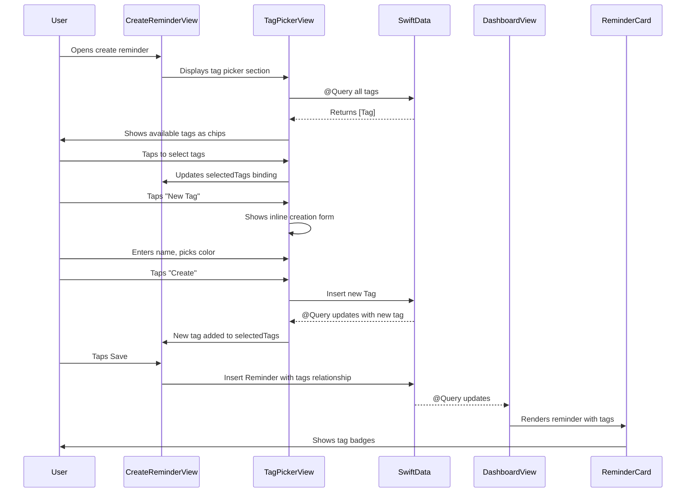

# feat: Implement Tags System

**Date:** 2026-01-23
**Status:** Completed
**Type:** Enhancement
**Priority:** High (enhances organization and matches design system)
**Completed:** 2026-01-23
**Branch:** feat/tags-system

---

## Overview

Add a tagging system that allows users to categorize reminders with colored tags. Users can select from preset tags or create custom ones. Tags appear on reminder cards and can be used for future filtering capabilities.

**Core functionality:**
- Create and manage tags with custom names and colors
- Assign multiple tags to reminders during creation/editing
- Display tag badges on reminder cards
- Store tags in SwiftData with many-to-many relationship
- Seed default tags on first launch (Personal, Work, Health, Shopping)

---

## Problem Statement / Motivation

The design system (`memoss-design-system.jsx:269, 444-452`) shows tags as a core feature, but they're not yet implemented. Users need a way to categorize reminders for better organization.

**Current state:**
- Reminders have only title, scheduled date, and completion status
- No way to categorize or group reminders by context

**Desired state:**
- User can assign tags like "Work", "Personal", "Health" to reminders
- Tags display as colored chips on reminder cards
- User can create custom tags with chosen colors
- Foundation ready for future tag-based filtering

---

## Architecture Flow



---

## Technical Approach

### Data Model Strategy

**Decision: Use separate `Tag` model with many-to-many relationship**

| Approach | Pros | Cons | Decision |
|----------|------|------|----------|
| **Separate Tag model** | Reusable across reminders, metadata per tag, efficient queries | More complex setup | **Selected** |
| `[String]` array | Simple to implement | Duplicate strings, no colors, hard to rename | Rejected |

### Tag Model

```swift
// Memoss/Models/Tag.swift
import SwiftData
import SwiftUI

@Model
final class Tag {
    @Attribute(.unique) var id: UUID
    var name: String
    var colorHex: String
    var createdAt: Date

    @Relationship(inverse: \Reminder.tags)
    var reminders: [Reminder] = []

    var color: Color {
        Color(hex: colorHex)
    }

    init(name: String, colorHex: String) {
        self.id = UUID()
        self.name = name
        self.colorHex = colorHex
        self.createdAt = Date()
    }
}
```

**Note:** SwiftData automatically handles lightweight schema migrations when adding new models or optional properties with defaults. The `inverse:` parameter creates an explicit bidirectional relationship that SwiftData can traverse in both directions.

### Updated Reminder Model

```swift
// Memoss/Models/Reminder.swift - Add relationship
@Relationship(deleteRule: .nullify)
var tags: [Tag] = []
```

**Delete Rule:** `.nullify` ensures when a Tag is deleted, it's removed from any Reminder's tags array. Deleting a Reminder leaves Tags unaffected.

### FlowLayout for Tag Display

SwiftUI's `Layout` protocol enables proper tag wrapping:

```swift
// Memoss/Components/FlowLayout.swift
struct FlowLayout: Layout {
    var horizontalSpacing: CGFloat = 8
    var verticalSpacing: CGFloat = 8

    func sizeThatFits(proposal: ProposedViewSize, subviews: Subviews, cache: inout ()) -> CGSize { ... }
    func placeSubviews(in bounds: CGRect, proposal: ProposedViewSize, subviews: Subviews, cache: inout ()) { ... }
}
```

### SwiftData Query Considerations

**Important:** SwiftData has a known limitation where using `.contains()` on to-many relationships in `#Predicate` causes a runtime crash with the error "SQLCore dispatchRequest: exception handling request: to-many key not allowed here." This is a SQLite/Core Data translation limitation.

```swift
// ❌ This will CRASH at runtime:
// #Predicate<Reminder> { reminder in
//     reminder.tags.contains { $0.id == selectedTagId }
// }

// ✅ In-memory filtering (recommended approach)
var filteredReminders: [Reminder] {
    guard let selectedTag else { return reminders }
    return reminders.filter { $0.tags.contains { $0.id == selectedTag.id } }
}
```

For the MVP with typical reminder counts (< 500), in-memory filtering is performant and avoids the SwiftData limitation. If future scale requires database-level filtering, consider a join table with explicit queries.

### File Structure

```
Memoss/
├── Models/
│   ├── Reminder.swift                    # MODIFY: Add tags relationship
│   └── Tag.swift                         # CREATE: Tag model
├── Components/                           # CREATE: Cross-feature reusable components
│   ├── FlowLayout.swift                  # CREATE: Layout for wrapping tags
│   ├── TagChip.swift                     # CREATE: Individual tag badge
│   └── TagPickerView.swift               # CREATE: Tag selection component
├── Extensions/
│   ├── MemossColors.swift                # MODIFY: Add tag color presets
│   └── Color+Hex.swift                   # MODIFY: Add toHex() method
├── Features/
│   ├── CreateReminder/
│   │   └── CreateReminderView.swift      # MODIFY: Add tag picker section
│   ├── EditReminder/
│   │   └── EditReminderView.swift        # MODIFY: Add tag picker section
│   └── Dashboard/
│       └── Components/
│           └── ReminderCard.swift        # MODIFY: Display tag badges
└── MemossApp.swift                       # MODIFY: Add Tag.self to ModelContainer, seed defaults
```

**Convention:** `Memoss/Components/` is for cross-feature reusable components (used by 3+ features). Feature-specific components remain in `Features/{Feature}/Components/`.

### Default Tags

Seed on first launch:

| Name | Color | Hex |
|------|-------|-----|
| Personal | Moss Green | #22C55E |
| Work | Blue | #3B82F6 |
| Health | Pink | #EC4899 |
| Shopping | Orange | #F97316 |

---

## Implementation Phases

| Phase | Title | Dependencies | Effort |
|-------|-------|--------------|--------|
| 1 | Tag Model + Migration | None | Small |
| 2 | FlowLayout + TagChip Components | Phase 1 | Medium |
| 3 | TagPickerView + Create Flow | Phase 2 | Medium |
| 4 | Integrate into Create/Edit Views | Phase 3 | Medium |
| 5 | Display Tags on ReminderCard | Phase 4 | Small |

---

### Phase 1: Tag Model + Migration

**Goal:** Create Tag model, update Reminder, seed default tags.

**Files to create:**
- `Memoss/Models/Tag.swift`

**Files to modify:**
- `Memoss/Models/Reminder.swift` - Add tags relationship
- `Memoss/MemossApp.swift` - Add Tag to ModelContainer, seed defaults
- `Memoss/Extensions/Color+Hex.swift` - Add toHex() method

#### Tag.swift

```swift
// Memoss/Models/Tag.swift
import SwiftData
import SwiftUI

@Model
final class Tag {
    @Attribute(.unique) var id: UUID
    var name: String
    var colorHex: String
    var createdAt: Date

    @Relationship(inverse: \Reminder.tags)
    var reminders: [Reminder] = []

    var color: Color {
        Color(hex: colorHex)
    }

    init(name: String, colorHex: String) {
        self.id = UUID()
        self.name = name
        self.colorHex = colorHex
        self.createdAt = Date()
    }
}
```

#### Reminder.swift Changes

```swift
// Add after isCompleted property:
@Relationship(deleteRule: .nullify)
var tags: [Tag] = []
```

**Delete Rule Behavior:** `.nullify` on `Reminder.tags` means when a Tag is deleted, it is automatically removed from any Reminder's tags array. When a Reminder is deleted, the associated Tags remain in the database unaffected.

#### MemossApp.swift Changes

```swift
// Update ModelContainer
static let sharedModelContainer: ModelContainer = {
    do {
        return try ModelContainer(for: Reminder.self, Tag.self)
    } catch {
        fatalError("Failed to create ModelContainer: \(error)")
    }
}()

// Update body to wrap content in Group and add .task modifier:
var body: some Scene {
    WindowGroup {
        Group {
            if hasCompletedOnboarding {
                DashboardView()
            } else {
                OnboardingView()
            }
        }
        .task {
            await Self.seedDefaultTags()
        }
    }
    .modelContainer(Self.sharedModelContainer)
}

// Add static function:
@MainActor
private static func seedDefaultTags() async {
    let context = sharedModelContainer.mainContext

    // Check if tags already exist
    let descriptor = FetchDescriptor<Tag>()
    guard (try? context.fetchCount(descriptor)) == 0 else { return }

    let defaults: [(name: String, hex: String)] = [
        ("Personal", "#22C55E"),
        ("Work", "#3B82F6"),
        ("Health", "#EC4899"),
        ("Shopping", "#F97316")
    ]

    for tag in defaults {
        context.insert(Tag(name: tag.name, colorHex: tag.hex))
    }
}
```

#### Color+Hex.swift Addition

```swift
// Add to existing Color extension:
func toHex() -> String? {
    // Convert SwiftUI Color to UIColor, then extract CGColor components
    let uiColor = UIColor(self)
    guard let components = uiColor.cgColor.components, components.count >= 3 else {
        return nil
    }
    // Use lroundf for proper rounding to avoid off-by-one errors
    let r = lroundf(Float(components[0]) * 255)
    let g = lroundf(Float(components[1]) * 255)
    let b = lroundf(Float(components[2]) * 255)
    return String(format: "#%02lX%02lX%02lX", r, g, b)
}
```

**Note:** Using `lroundf` ensures proper rounding (e.g., 254.6 → 255) instead of truncation. Some system colors may have different color space components; this implementation handles standard RGB colors used in the tag palette.

**Acceptance Criteria:**
- [ ] Tag model created with id, name, colorHex, createdAt, reminders relationship
- [ ] Reminder model updated with tags relationship
- [ ] ModelContainer includes Tag.self
- [ ] Default tags seeded on first launch (Personal, Work, Health, Shopping)
- [ ] Color toHex() extension added
- [ ] App builds and runs without migration errors
- [ ] Existing reminders survive schema migration without data loss (test on device with existing data)

---

### Phase 2: FlowLayout + TagChip Components

**Goal:** Create reusable UI components for displaying tags.

**Files to create:**
- `Memoss/Components/FlowLayout.swift`
- `Memoss/Components/TagChip.swift`

**Files to modify:**
- `Memoss/Extensions/MemossColors.swift` - Add tagColors array

#### FlowLayout.swift

The `Layout` protocol (iOS 16+) provides full control over child view positioning. This implementation wraps items horizontally to new lines when they exceed container width.

```swift
// Memoss/Components/FlowLayout.swift
import SwiftUI

/// A layout that arranges views horizontally, wrapping to new lines as needed.
/// Uses the Layout protocol for precise control over positioning.
struct FlowLayout: Layout {
    var horizontalSpacing: CGFloat = 8
    var verticalSpacing: CGFloat = 8

    func sizeThatFits(proposal: ProposedViewSize, subviews: Subviews, cache: inout ()) -> CGSize {
        let containerWidth = proposal.width ?? .infinity
        var currentX: CGFloat = 0
        var currentY: CGFloat = 0
        var lineHeight: CGFloat = 0
        var totalHeight: CGFloat = 0

        for subview in subviews {
            let size = subview.sizeThatFits(.unspecified)

            // Wrap to next line if item doesn't fit (but not for first item on line)
            if currentX + size.width > containerWidth && currentX > 0 {
                currentX = 0
                currentY += lineHeight + verticalSpacing
                lineHeight = 0
            }

            lineHeight = max(lineHeight, size.height)
            currentX += size.width + horizontalSpacing
            totalHeight = currentY + lineHeight
        }

        return CGSize(width: containerWidth, height: max(totalHeight, lineHeight))
    }

    func placeSubviews(in bounds: CGRect, proposal: ProposedViewSize, subviews: Subviews, cache: inout ()) {
        var currentX: CGFloat = bounds.minX
        var currentY: CGFloat = bounds.minY
        var lineHeight: CGFloat = 0

        for subview in subviews {
            let size = subview.sizeThatFits(.unspecified)

            if currentX + size.width > bounds.maxX && currentX > bounds.minX {
                currentX = bounds.minX
                currentY += lineHeight + verticalSpacing
                lineHeight = 0
            }

            subview.place(
                at: CGPoint(x: currentX, y: currentY),
                proposal: ProposedViewSize(size)
            )

            lineHeight = max(lineHeight, size.height)
            currentX += size.width + horizontalSpacing
        }
    }
}
```

**Note:** For future optimization with many tags, consider implementing the optional `makeCache(subviews:)` method to pre-compute sizes once per layout pass. The current implementation is efficient for typical tag counts (< 20 items).

#### TagChip.swift

```swift
// Memoss/Components/TagChip.swift
import SwiftUI

struct TagChip: View {
    let tag: Tag
    var isSelected: Bool = false
    var isCompact: Bool = false
    var onTap: (() -> Void)?
    var onRemove: (() -> Void)?

    var body: some View {
        Button(action: { onTap?() }) {
            HStack(spacing: isCompact ? 4 : 6) {
                Circle()
                    .fill(tag.color)
                    .frame(width: isCompact ? 6 : 8, height: isCompact ? 6 : 8)

                Text(tag.name)
                    .font(.system(size: isCompact ? 12 : 14, weight: .medium, design: .rounded))

                if let onRemove, isSelected {
                    Button(action: onRemove) {
                        Image(systemName: "xmark")
                            .font(.system(size: 10, weight: .bold))
                            .foregroundStyle(tag.color.opacity(0.6))
                    }
                    .buttonStyle(.plain)
                }
            }
            .padding(.horizontal, isCompact ? 8 : 12)
            .padding(.vertical, isCompact ? 4 : 6)
            .background(
                Capsule()
                    .fill(isSelected ? tag.color.opacity(0.15) : MemossColors.cardBackground)
            )
            .overlay(
                Capsule()
                    .stroke(isSelected ? tag.color : MemossColors.cardBorder, lineWidth: 1.5)
            )
            .foregroundStyle(isSelected ? tag.color : MemossColors.textPrimary)
        }
        .buttonStyle(.plain)
        .accessibilityLabel("\(tag.name) tag")
        .accessibilityHint(isSelected ? "Selected. Double tap to remove" : "Double tap to select")
        .accessibilityAddTraits(isSelected ? [.isSelected] : [])
    }
}

#Preview("Selected") {
    TagChip(
        tag: Tag(name: "Personal", colorHex: "#22C55E"),
        isSelected: true
    )
    .modelContainer(for: Tag.self, inMemory: true)
}

#Preview("Unselected") {
    TagChip(
        tag: Tag(name: "Work", colorHex: "#3B82F6"),
        isSelected: false
    )
    .modelContainer(for: Tag.self, inMemory: true)
}

#Preview("Compact") {
    TagChip(
        tag: Tag(name: "Health", colorHex: "#EC4899"),
        isSelected: true,
        isCompact: true
    )
    .modelContainer(for: Tag.self, inMemory: true)
}
```

#### MemossColors.swift Addition

```swift
// Add to MemossColors enum:
static let tagColors: [Color] = [
    brandPrimary,               // Moss Green #22C55E
    Color(hex: "#3B82F6"),      // Blue
    Color(hex: "#EC4899"),      // Pink
    Color(hex: "#F97316"),      // Orange
    Color(hex: "#8B5CF6"),      // Purple
    Color(hex: "#14B8A6"),      // Teal
    accent,                     // Yellow #EAB308
    Color(hex: "#6B7280"),      // Gray
]
```

**Acceptance Criteria:**
- [ ] FlowLayout correctly wraps tags to new lines
- [ ] TagChip displays color dot, name, and optional remove button
- [ ] TagChip has selected/unselected visual states
- [ ] TagChip has compact variant for ReminderCard
- [ ] All components have accessibility labels and hints
- [ ] Previews render correctly in Xcode

---

### Phase 3: TagPickerView + Inline Creation

**Goal:** Create tag picker component with ability to create new tags.

**Files to create:**
- `Memoss/Components/TagPickerView.swift`

#### TagPickerView.swift

```swift
// Memoss/Components/TagPickerView.swift
import SwiftData
import SwiftUI

struct TagPickerView: View {
    @Environment(\.modelContext) private var modelContext
    @Query(sort: \Tag.name) private var allTags: [Tag]
    @Binding var selectedTags: [Tag]

    @State private var isCreatingTag = false
    @State private var newTagName = ""
    @State private var selectedColorIndex = 0  // Use index instead of Color for reliable comparison

    private var unselectedTags: [Tag] {
        allTags.filter { tag in
            !selectedTags.contains { $0.id == tag.id }
        }
    }

    var body: some View {
        VStack(alignment: .leading, spacing: 16) {
            // Section header
            Text("Tags")
                .font(.system(size: 14, weight: .semibold, design: .rounded))
                .foregroundStyle(MemossColors.textSecondary)

            // Selected tags
            if !selectedTags.isEmpty {
                FlowLayout(horizontalSpacing: 8, verticalSpacing: 8) {
                    ForEach(selectedTags, id: \.id) { tag in
                        TagChip(
                            tag: tag,
                            isSelected: true,
                            onRemove: { removeTag(tag) }
                        )
                    }
                }
            }

            // Available tags + New button
            FlowLayout(horizontalSpacing: 8, verticalSpacing: 8) {
                ForEach(unselectedTags, id: \.id) { tag in
                    TagChip(
                        tag: tag,
                        isSelected: false,
                        onTap: { addTag(tag) }
                    )
                }

                addTagButton
            }

            // Inline creation form
            if isCreatingTag {
                tagCreationForm
            }
        }
        .padding(20)
        .background(MemossColors.cardBackground)
        .clipShape(RoundedRectangle(cornerRadius: 24))
        .shadow(color: MemossColors.brandPrimary.opacity(0.08), radius: 12, y: 4)
    }

    // MARK: - Subviews

    private var addTagButton: some View {
        Button {
            withAnimation(.spring(response: 0.3, dampingFraction: 0.8)) {
                isCreatingTag = true
            }
        } label: {
            HStack(spacing: 4) {
                Image(systemName: "plus")
                    .font(.system(size: 12, weight: .semibold))
                Text("New")
                    .font(.system(size: 14, weight: .medium, design: .rounded))
            }
            .padding(.horizontal, 12)
            .padding(.vertical, 6)
            .background(
                Capsule()
                    .strokeBorder(style: StrokeStyle(lineWidth: 1.5, dash: [4]))
                    .foregroundStyle(MemossColors.textSecondary.opacity(0.4))
            )
            .foregroundStyle(MemossColors.textSecondary)
        }
        .buttonStyle(.plain)
        .accessibilityLabel("Create new tag")
    }

    private var tagCreationForm: some View {
        VStack(alignment: .leading, spacing: 12) {
            // Name input
            HStack {
                TextField("Tag name", text: $newTagName)
                    .font(.system(size: 16, design: .rounded))
                    .textFieldStyle(.plain)
                    .submitLabel(.done)
                    .onSubmit(createTag)

                Button { cancelCreation() } label: {
                    Image(systemName: "xmark.circle.fill")
                        .foregroundStyle(MemossColors.textSecondary)
                }
                .buttonStyle(.plain)
            }
            .padding(12)
            .background(MemossColors.backgroundStart)
            .clipShape(RoundedRectangle(cornerRadius: 12))

            // Color picker - uses index-based selection to avoid Color equality issues
            HStack(spacing: 12) {
                Text("Color")
                    .font(.system(size: 12, weight: .medium, design: .rounded))
                    .foregroundStyle(MemossColors.textSecondary)

                HStack(spacing: 8) {
                    ForEach(Array(MemossColors.tagColors.enumerated()), id: \.offset) { index, color in
                        Circle()
                            .fill(color)
                            .frame(width: 28, height: 28)
                            .overlay(
                                Circle()
                                    .stroke(.white, lineWidth: 2)
                                    .opacity(selectedColorIndex == index ? 1 : 0)
                            )
                            .shadow(color: selectedColorIndex == index ? color.opacity(0.4) : .clear, radius: 4)
                            .onTapGesture {
                                selectedColorIndex = index
                                UIImpactFeedbackGenerator(style: .light).impactOccurred()
                            }
                    }
                }
            }

            // Preview + Create
            HStack {
                if !newTagName.isEmpty {
                    let previewColor = MemossColors.tagColors[selectedColorIndex]
                    TagChip(
                        tag: Tag(name: newTagName, colorHex: previewColor.toHex() ?? "#22C55E"),
                        isSelected: true
                    )
                }

                Spacer()

                Button(action: createTag) {
                    Text("Create")
                        .font(.system(size: 14, weight: .semibold, design: .rounded))
                        .foregroundStyle(.white)
                        .padding(.horizontal, 16)
                        .padding(.vertical, 8)
                        .background(
                            Capsule()
                                .fill(newTagName.isEmpty ? MemossColors.textSecondary : MemossColors.brandPrimary)
                        )
                }
                .buttonStyle(.plain)
                .disabled(newTagName.isEmpty)
            }
        }
        .padding(12)
        .background(MemossColors.backgroundStart.opacity(0.5))
        .clipShape(RoundedRectangle(cornerRadius: 16))
    }

    // MARK: - Computed Properties

    private var selectedColor: Color {
        MemossColors.tagColors[selectedColorIndex]
    }

    // MARK: - Actions

    private func addTag(_ tag: Tag) {
        withAnimation(.spring(response: 0.3, dampingFraction: 0.8)) {
            selectedTags.append(tag)
        }
        UIImpactFeedbackGenerator(style: .light).impactOccurred()
    }

    private func removeTag(_ tag: Tag) {
        withAnimation(.spring(response: 0.3, dampingFraction: 0.8)) {
            selectedTags.removeAll { $0.id == tag.id }
        }
        UIImpactFeedbackGenerator(style: .light).impactOccurred()
    }

    private func createTag() {
        guard !newTagName.trimmingCharacters(in: .whitespaces).isEmpty else { return }

        let tag = Tag(
            name: newTagName.trimmingCharacters(in: .whitespaces),
            colorHex: selectedColor.toHex() ?? "#22C55E"
        )
        modelContext.insert(tag)
        selectedTags.append(tag)

        UIImpactFeedbackGenerator(style: .medium).impactOccurred()
        cancelCreation()
    }

    private func cancelCreation() {
        withAnimation(.spring(response: 0.3, dampingFraction: 0.8)) {
            isCreatingTag = false
            newTagName = ""
            selectedColorIndex = 0
        }
    }
}

#Preview {
    TagPickerView(selectedTags: .constant([]))
        .padding()
        .modelContainer(for: [Tag.self, Reminder.self], inMemory: true)
}
```

**Acceptance Criteria:**
- [ ] Shows available tags in FlowLayout
- [ ] Tapping tag adds to selected list
- [ ] Selected tags show with remove button
- [ ] "New" button opens inline creation form
- [ ] Color picker shows 8 preset colors
- [ ] Live preview of new tag
- [ ] Create button inserts tag into SwiftData
- [ ] Haptic feedback on interactions
- [ ] Animations respect reduce motion preference

---

### Phase 4: Integrate into Create/Edit Views

**Goal:** Add TagPickerView to CreateReminderView and EditReminderView.

**Files to modify:**
- `Memoss/Features/CreateReminder/CreateReminderView.swift`
- `Memoss/Features/EditReminder/EditReminderView.swift`

#### CreateReminderView.swift Changes

```swift
// Add state:
@State private var selectedTags: [Tag] = []

// Add in body after timePickerCard:
TagPickerView(selectedTags: $selectedTags)

// Update saveReminder():
private func saveReminder() {
    hasAttemptedSave = true
    guard isTitleValid else { return }

    let reminder = Reminder(
        title: title.trimmingCharacters(in: .whitespaces),
        scheduledDate: scheduledDate
    )
    reminder.tags = selectedTags  // Add tags

    modelContext.insert(reminder)

    Task {
        await NotificationService.shared.scheduleNotification(for: reminder)
        await MainActor.run {
            UIImpactFeedbackGenerator(style: .light).impactOccurred()
            dismiss()
        }
    }
}
```

#### EditReminderView.swift Changes

```swift
// Add state (initialized from reminder):
@State private var selectedTags: [Tag]

// Update init:
init(reminder: Reminder) {
    self.reminder = reminder
    _title = State(initialValue: reminder.title)
    _scheduledDate = State(initialValue: reminder.scheduledDate)
    _selectedTags = State(initialValue: reminder.tags)
}

// Add in body after timePickerCard:
TagPickerView(selectedTags: $selectedTags)

// Update saveChanges():
private func saveChanges() {
    hasAttemptedSave = true
    guard isTitleValid else { return }

    reminder.title = title.trimmingCharacters(in: .whitespaces)
    reminder.scheduledDate = scheduledDate
    reminder.tags = selectedTags  // Update tags

    // ... rest unchanged
}

// Update hasUnsavedChanges:
private var hasUnsavedChanges: Bool {
    title != reminder.title ||
    scheduledDate != reminder.scheduledDate ||
    Set(selectedTags.map(\.id)) != Set(reminder.tags.map(\.id))
}
```

**Acceptance Criteria:**
- [ ] TagPickerView appears in CreateReminderView below time picker
- [ ] TagPickerView appears in EditReminderView below time picker
- [ ] Selected tags saved with reminder on create
- [ ] Existing tags pre-populated when editing
- [ ] Tags updated when saving edits
- [ ] hasUnsavedChanges detects tag changes

---

### Phase 5: Display Tags on ReminderCard

**Goal:** Show tag badges on reminder cards in dashboard.

**Files to modify:**
- `Memoss/Features/Dashboard/Components/ReminderCard.swift`

#### ReminderCard.swift Changes

```swift
// Update VStack content area:
VStack(alignment: .leading, spacing: 4) {
    Text(reminder.title)
        .font(.system(size: 16, weight: .semibold, design: .rounded))
        .foregroundStyle(reminder.isCompleted ? MemossColors.textSecondary : MemossColors.textPrimary)
        .strikethrough(reminder.isCompleted)
        .lineLimit(2)

    Label {
        Text(reminder.scheduledDate, style: .time)
            .font(.system(size: 14, design: .rounded))
    } icon: {
        Image(systemName: "clock")
            .font(.system(size: 12))
    }
    .foregroundStyle(MemossColors.textSecondary)

    // Add tags display
    if !reminder.tags.isEmpty {
        HStack(spacing: 6) {
            ForEach(reminder.tags.prefix(3), id: \.id) { tag in
                TagChip(tag: tag, isCompact: true)
            }

            if reminder.tags.count > 3 {
                Text("+\(reminder.tags.count - 3)")
                    .font(.system(size: 10, weight: .medium, design: .rounded))
                    .foregroundStyle(MemossColors.textSecondary)
                    .padding(.horizontal, 6)
                    .padding(.vertical, 2)
                    .background(MemossColors.backgroundStart)
                    .clipShape(Capsule())
            }
        }
        .padding(.top, 4)
    }
}
```

**Acceptance Criteria:**
- [ ] Tags display as compact chips below time
- [ ] Maximum 3 tags shown with "+N" overflow indicator
- [ ] Tags respect completion state (muted when completed)
- [ ] Card expands gracefully to accommodate tags
- [ ] Tapping tag area doesn't interfere with card tap

---

## Acceptance Criteria Summary

### AC1: Create Reminder with Tags
**Given** user opens create reminder modal
**When** user selects tags and saves
**Then** reminder is saved with tag relationships

### AC2: Edit Reminder Tags
**Given** a reminder exists with tags
**When** user opens edit and modifies tags
**Then** tag changes are persisted

### AC3: Create Custom Tag
**Given** user is in tag picker
**When** user creates a new tag with name and color
**Then** tag is saved and immediately available for selection

### AC4: Display Tags on Cards
**Given** a reminder has tags assigned
**When** dashboard displays the reminder
**Then** tags appear as compact colored chips

### AC5: Default Tags on First Launch
**Given** app is freshly installed
**When** user opens create reminder
**Then** default tags (Personal, Work, Health, Shopping) are available

---

## Unit Test Plan

### Tag Model Tests

| Test Name | Scenario | Expected | Priority |
|-----------|----------|----------|----------|
| `test_tag_creation` | Create tag with name and color | Tag persisted with correct values | P1 |
| `test_tag_color_property` | Access color computed property | Returns correct Color from hex | P1 |
| `test_reminder_tags_relationship` | Add tags to reminder | Tags accessible via reminder.tags | P1 |
| `test_delete_reminder_nullifies` | Delete reminder with tags | Tags still exist, relationship cleared | P1 |

### TagPickerView Tests

| Test Name | Scenario | Expected | Priority |
|-----------|----------|----------|----------|
| `test_select_tag` | Tap available tag | Tag moves to selected | P1 |
| `test_deselect_tag` | Tap remove on selected tag | Tag moves to available | P1 |
| `test_create_tag` | Enter name, pick color, tap create | New tag created and selected | P1 |
| `test_empty_name_disabled` | Try create with empty name | Button disabled | P1 |

### Integration Tests

| Test Name | Scenario | Expected | Priority |
|-----------|----------|----------|----------|
| `test_save_reminder_with_tags` | Create reminder, select tags, save | Reminder.tags populated | P1 |
| `test_edit_reminder_tags` | Edit reminder, change tags, save | Tags updated in SwiftData | P1 |
| `test_default_tags_seeded` | First launch | 4 default tags exist | P1 |

---

## Alternative Approaches Considered

### Tag Storage

| Approach | Pros | Cons | Decision |
|----------|------|------|----------|
| **Separate Tag model** | Reusable, metadata, efficient | More complex | **Selected** |
| `[String]` array | Simple | No colors, duplicates | Rejected |
| Enum with fixed tags | Type-safe | Not extensible | Rejected |

### Tag Selection UI

| Approach | Pros | Cons | Decision |
|----------|------|------|----------|
| **Inline picker with FlowLayout** | Fits form pattern, expandable | Slightly complex | **Selected** |
| Separate picker sheet | Isolated | Extra navigation | Rejected |
| Dropdown/Menu | Compact | Not visual for colors | Rejected |

### Tag Display on Card

| Approach | Pros | Cons | Decision |
|----------|------|------|----------|
| **Compact chips with overflow** | Shows context, clean | Limited to 3 visible | **Selected** |
| Full chips | All visible | Card too tall | Rejected |
| Icon only | Minimal | Not readable | Rejected |

---

## Success Metrics

| Metric | Target | Measurement |
|--------|--------|-------------|
| Tag creation time | < 3 seconds | User testing |
| Tags per reminder (avg) | 1-2 | Analytics (future) |
| Custom tags created | Tracked | SwiftData query |
| UI responsiveness | No jank | 60fps profiling |

---

## Dependencies & Prerequisites

### Technical Dependencies
- SwiftData relationships (iOS 17+)
- SwiftUI `Layout` protocol (iOS 16+)
- Existing form patterns from CreateReminderView

### Feature Dependencies
- Reminder model exists
- CreateReminderView and EditReminderView functional
- MemossColors design system

### No External Dependencies
- Uses only native iOS frameworks

---

## Risk Analysis & Mitigation

| Risk | Impact | Probability | Mitigation |
|------|--------|-------------|------------|
| SwiftData migration issues | High | Medium | Test on device with existing data |
| Query performance with many tags | Low | Low | In-memory filtering for MVP |
| Color accessibility | Medium | Low | Dot + text ensures readability |
| Tag name collisions | Low | Medium | @Attribute(.unique) on name (future) |

---

## Key Implementation Insights

### SwiftData Relationship Pattern
From Apple Documentation:
- Use `@Relationship(deleteRule: .nullify, inverse: \Reminder.tags)` for explicit bidirectional relationships
- `.nullify` sets the relationship to `nil` when the source object is deleted (default behavior)
- `.cascade` would delete related objects - NOT wanted for tags (we want tags to persist when reminders are deleted)

### Color Comparison in SwiftUI
SwiftUI `Color` type has inconsistent equality behavior due to color space conversions. Solution:
- Use **index-based selection** for color pickers instead of comparing Color values directly
- Store colors as hex strings in the model, not Color objects
- Example: `selectedColorIndex: Int` instead of `selectedColor: Color`

### FlowLayout Performance
The `Layout` protocol's `sizeThatFits` and `placeSubviews` methods are called on every layout pass:
- For typical tag counts (< 20), no caching needed
- If performance becomes an issue, implement `makeCache(subviews:)` to pre-compute sizes

### Color Hex Conversion
Use `lroundf` for proper rounding in `toHex()`:
```swift
let r = lroundf(Float(components[0]) * 255)  // Rounds 254.6 → 255
```
Truncation would cause `Int(254.9)` → 254, which can cause color mismatches.

---

## References & Research

### Internal References
- `Memoss/Features/CreateReminder/CreateReminderView.swift` - Form card patterns
- `Memoss/Features/Dashboard/Components/ReminderCard.swift` - Card layout
- `Memoss/Extensions/MemossColors.swift` - Color tokens
- `memoss-design-system.jsx:269, 444-452` - Tag design reference

### External References
- [SwiftData Relationships](https://developer.apple.com/documentation/swiftdata/modelrelation)
- [SwiftUI Layout Protocol](https://developer.apple.com/documentation/swiftui/layout)
- [fatbobman: SwiftData Relationships](https://fatbobman.com/en/posts/mastering-relationships-in-swiftdata/)

### Best Practices Applied
- Use `@Relationship(inverse:)` for explicit bidirectional relationships
- Use `.nullify` delete rule for tag references
- Filter in-memory for to-many queries (SwiftData limitation)
- Use `Layout` protocol for custom tag wrapping
- Minimum 44pt touch targets for accessibility
- Haptic feedback on all interactions

---

## Checklist

### Phase 1: Tag Model + Migration
- [ ] Tag.swift created with all properties
- [ ] Reminder.swift updated with tags relationship
- [ ] ModelContainer includes Tag.self
- [ ] Default tags seeded on first launch
- [ ] Color.toHex() extension added
- [ ] App builds and runs without errors

### Phase 2: FlowLayout + TagChip Components
- [ ] FlowLayout correctly wraps content
- [ ] TagChip renders in both states
- [ ] TagChip compact variant works
- [ ] MemossColors.tagColors added
- [ ] Previews render correctly

### Phase 3: TagPickerView
- [ ] Shows available tags
- [ ] Selection works bidirectionally
- [ ] Inline creation form works
- [ ] New tags persist to SwiftData
- [ ] Animations smooth

### Phase 4: Create/Edit Integration
- [ ] TagPickerView in CreateReminderView
- [ ] TagPickerView in EditReminderView
- [ ] Tags saved on create
- [ ] Tags pre-populated on edit
- [ ] hasUnsavedChanges detects tag changes

### Phase 5: ReminderCard Display
- [ ] Compact tags display on cards
- [ ] Overflow indicator for 3+ tags
- [ ] Completion state respected
- [ ] Card layout stable

---

*Plan created: 2026-01-23*
*Last updated: 2026-01-23*
